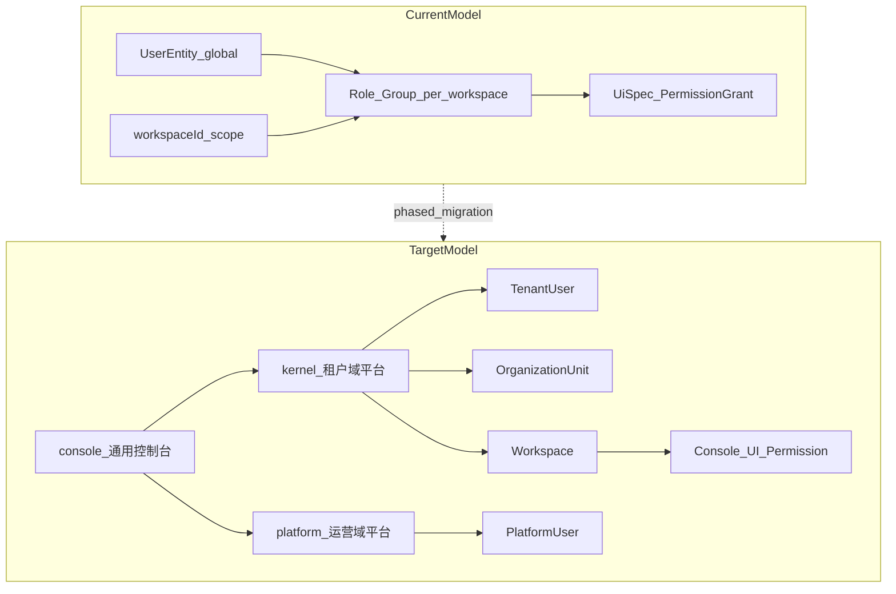
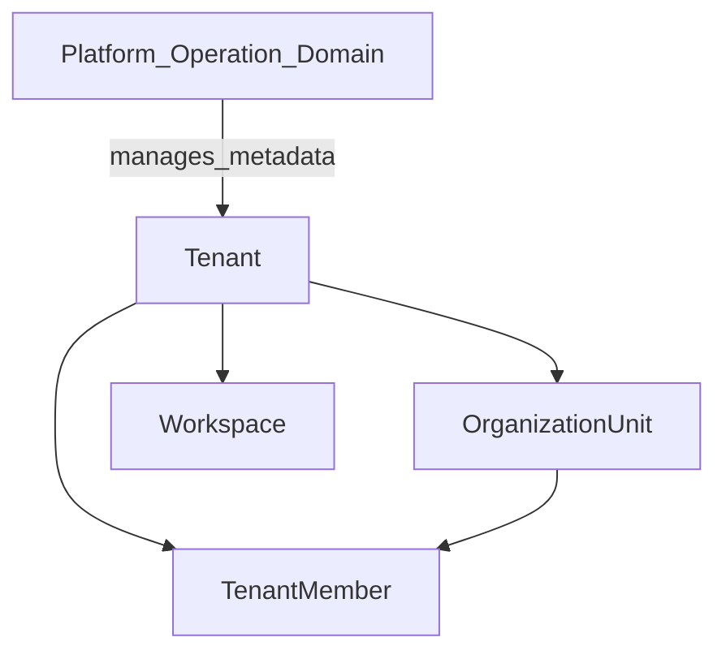
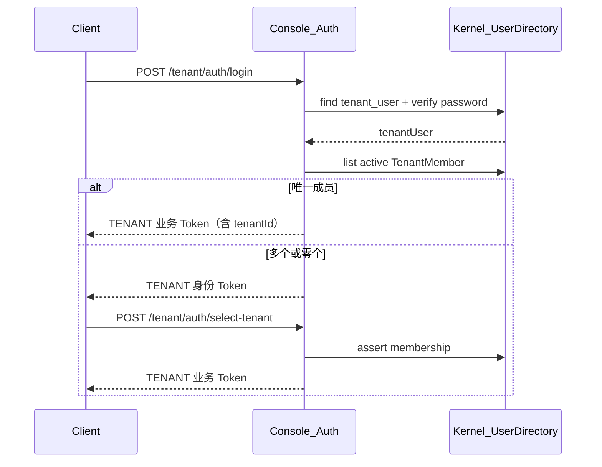
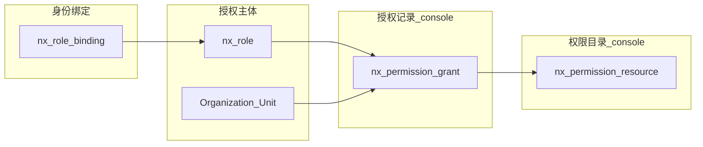
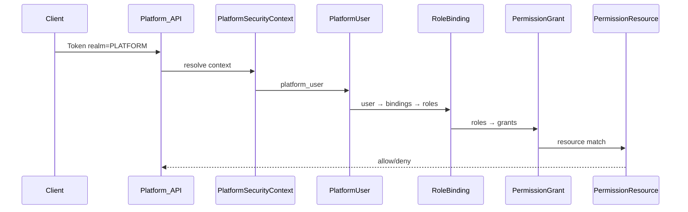
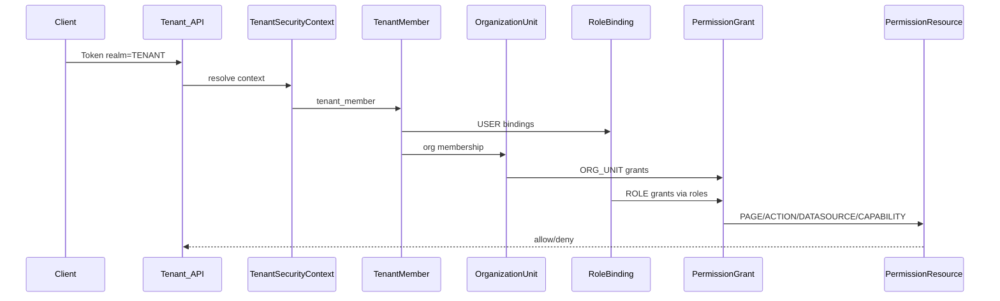
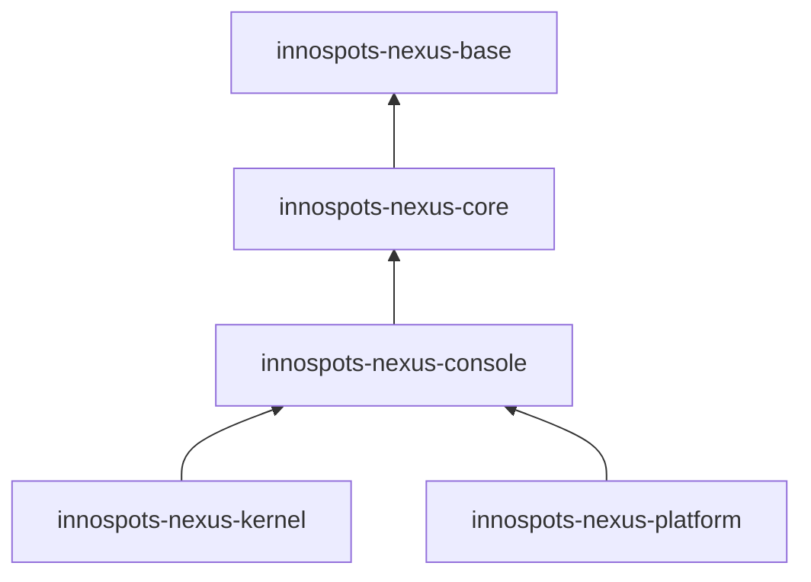
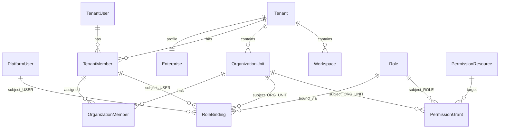
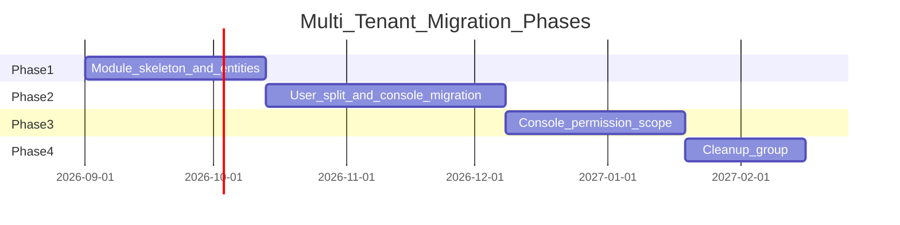

# Nexus 多租户治理方案设计

## 1. 文档定位

本文定义 Innospots Nexus 平台的多租户治理架构，覆盖 Platform 运营域、Tenant 客户域、
Organization 组织结构、Workspace 业务协作空间，以及在此层级下的用户身份、角色、权限与安全边界。

工程上采用 **console 通用控制台 + kernel 租户域平台 + platform 运营域平台** 结构：

```text
innospots-nexus-console     ← 通用控制台能力（认证机制、菜单、角色、权限、扩展、日志、字典…）
    ↑               ↑
kernel            platform
（租户域平台）      （运营域平台）
```

- **console**：两个平台共同继承的公共层，不含 Tenant/Platform 业务域逻辑。
- **kernel**：租户域（TENANT Realm）管理平台，承载租户用户、组织、Workspace。
- **platform**：运营域（PLATFORM Realm）管理平台，承载运营用户、Tenant 生命周期。
- **运营用户与租户用户分表**，不使用 Group，批量授权主体仅为 Organization Unit。

本文是**可落地的开发设计方案**，基于当前 `innospots-nexus` 工程现状编写。Console UI
权限实现细节见 [`innospots-nexus-kernel/docs/permission-design.md`](../../innospots-nexus-kernel/docs/permission-design.md)（迁移目标：console 模块）。

### 1.1 设计目标

1. 建立 Platform 运营域与 Tenant 客户域的**严格授权隔离**。
2. 引入 Tenant → Organization → Workspace 业务结构。
3. **运营用户（platform user）与租户用户（tenant user）分表**，凭证与 OAuth 各自独立。
4. 将通用控制台能力**上移至 console 模块**；kernel、platform 均依赖 console。
5. **kernel 定义为租户域平台**；**platform 定义为运营域平台**。
6. **删除 Group**，Organization Unit 作为唯一批量授权主体。
7. **角色等级跟随层级归属**（PLATFORM / TENANT / WORKSPACE），不设固定治理档位。
8. 隔离键使用 `tenantId` + `workspaceId`。**不使用** `ProjectBaseEntity` / `projectId`。
9. **注册与登录分 Realm**：机制在 console，用户表在 platform / kernel；运营无公开注册。
10. 给出从现有 kernel 单体实现到目标模块拆分的**分阶段迁移路径**。

### 1.2 不在 V1 范围

- Resource 级 ACL。
- DENY 规则、ABAC、动态策略引擎。
- 跨 Realm 单点登录、MFA。
- 具体业务资源模块的实现。
- Workspace 之下的嵌套容器（如某类「项目」）——仅为层级示例，**不是本方案功能**。
- 计费、套餐、用量的完整产品实现（Platform 模块预留元数据接口）。

---

## 2. 现状分析与差距

### 2.1 当前工程基线

当前 Nexus 采用六模块 Maven 结构，依赖方向为：

```text
innospots-nexus-base
    ↑
innospots-nexus-core
    ↑
innospots-nexus-console
    ↑
innospots-nexus-kernel          ← 当前 monolith，目标：通用能力迁至 console，kernel 收敛为租户域平台
```

**现状问题**：kernel 同时承载通用控制台能力与租户域业务；缺少 platform 模块；Group 需删除。

| 维度 | 当前实现 | 关键代码/表 | 目标归属 |
|------|----------|-------------|----------|
| 隔离边界 | `workspaceId` + `tenantId` | `WorkspaceBaseEntity`、`TenantBaseEntity`、`TLC` | core + kernel |
| 用户 | 全局 `nx_user` | `UserEntity` | **拆分**：`nx_platform_user` / `nx_tenant_user` |
| 凭证/OAuth | 全局 | `nx_user_password`、`nx_user_oauth` | platform / kernel 各自独立 |
| 角色 | project 级 | `nx_role` | console（引擎）+ platform/kernel（域绑定） |
| 用户组 | Group | `nx_group` | **删除** → Organization Unit |
| 菜单/权限/扩展 | kernel | permission/menu/extension | **迁至 console** |
| 日志/字典 | kernel（部分） | logger | **迁至 console** |
| 租户业务 | 无 | — | kernel（Workspace / Org） |
| 平台运营 | 无 | — | platform |

### 2.2 目标差距

| 维度 | 当前 | 目标 |
|------|------|------|
| 隔离边界 | `ProjectBaseEntity.projectId`（已删除） | `tenantId` + `workspaceId`（`TenantBaseEntity` / `WorkspaceBaseEntity`） |
| 组织 | DTO only | `OrganizationUnit` 树 + `OrganizationMember` |
| 用户 | 全局 User | `nx_platform_user` + `nx_tenant_user`（分表） |
| 批量授权 | Group | Organization Unit（Group 删除） |
| RBAC | 按 workspace 隔离的 Role（现状） | `owner_type` = PLATFORM / TENANT / WORKSPACE |
| 模块结构 | kernel monolith | console（公共）+ kernel（租户域）+ platform（运营域） |
| 语义 | project ≈ 一切 | Workspace = 协作与授权边界；不引入新的 Project 业务实体 |

### 2.3 现状与目标模型对比



---

## 3. 核心概念与层级关系

### 3.1 总体层级

**业务域层级**（Platform 运营域与 Tenant 客户域）：

```text
Platform Operation Domain                    ← innospots-nexus-platform（运营平台）
│
└── Tenant                                   ← 客户/数据/安全/计费/审计边界
    │
    ├── Tenant User                            ← innospots-nexus-kernel（nx_tenant_user）
    │
    ├── Organization Unit                    ← innospots-nexus-kernel
    │   └── Organization Member
    │
    ├── Tenant Role / Binding                ← kernel + console 角色引擎
    │
    └── Workspace                            ← innospots-nexus-kernel
        └── （下层容器仅为示例，不在本方案功能范围）
```

**工程模块层级**：

```text
innospots-nexus-console（通用控制台 · 两个平台共同继承）
├── 认证/登录机制、凭证/OAuth 处理框架
├── 菜单、角色、Console UI 权限、扩展运行时
├── 日志、字典
│
├── innospots-nexus-platform（运营域平台 · PLATFORM Realm）
│   ├── nx_platform_user（运营用户，独立表）
│   ├── Platform 凭证/OAuth
│   ├── Tenant 生命周期、企业档案、Platform RBAC、Support Access
│
└── innospots-nexus-kernel（租户域平台 · TENANT Realm）
    ├── nx_tenant_user（租户用户，独立表）
    ├── Tenant 凭证/OAuth、TenantMember
    ├── Organization、Workspace
    └── Tenant RBAC、Tenant 初始化
```

### 3.2 概念定义

| 概念 | 含义 | 模块归属 | 边界职责 |
|------|------|----------|----------|
| **Console** | 通用控制台公共层 | `innospots-nexus-console` | 菜单/角色/权限/扩展/日志/字典/认证机制；**域无关** |
| **Platform** | 运营域平台 | `innospots-nexus-platform` | 运营用户、Tenant 生命周期、Platform RBAC |
| **Kernel** | 租户域平台 | `innospots-nexus-kernel` | 租户用户、Organization、Workspace、Tenant RBAC |
| **Platform User** | 运营人员登录身份 | platform | `nx_platform_user`，与租户用户**分表** |
| **Tenant User** | 企业客户登录身份 | kernel | `nx_tenant_user`，与运营用户**分表** |
| **Tenant** | SaaS 客户边界 | platform（元数据 + 企业信息）+ kernel（成员与内部组织） | 数据/安全/计费边界 |
| **Enterprise** | 企业主体档案 | platform | 开通租户时填写的客户/企业信息，**不是**组织树 |
| **Organization Unit** | 租户内部组织节点 | kernel | 部门/团队树；人员归属；批量授权 |
| **Workspace** | 业务协作空间 | kernel | Console RBAC 主边界（workspace 作用域） |

### 3.3 关键设计决策

1. **Tenant ≠ Enterprise ≠ Organization**：Tenant 是 SaaS 客户边界；Enterprise 是运营侧企业档案；Organization 是租户内部部门树。
2. **kernel = 租户域平台**；**platform = 运营域平台**；二者**均依赖 console**，平级互不依赖。
3. **通用控制台能力在 console**：从 kernel 迁出 menu/role/permission/extension/logger/dictionary/auth。
4. **运营用户与租户用户分表**：`nx_platform_user` 与 `nx_tenant_user` 完全独立，各自凭证/OAuth。
5. **Group 删除**：不再使用；Organization Unit 替代批量授权；Permission 主体仅 `ROLE | ORG_UNIT`。
6. **Workspace 是 Console RBAC 主边界**：console 权限数据按 `realm + workspaceId` 隔离。
7. **V1 不做 Resource ACL**。

### 3.4 层级关系图



---

## 4. Platform 运营域设计

### 4.1 职责边界

Platform 运营域服务于 Innospots 平台内部人员，管理对象限于：

```text
Tenant 元数据与生命周期
企业主体信息（客户档案）
平台级配置与产品开关
模型 Provider 与平台公共能力
Platform RBAC
Support Access 临时协助授权
Platform 审计
```

Platform 运营人员**不能**因为持有 Platform 层管理角色就直接读取 Tenant 的业务数据或业务 Secret。

### 4.2 Platform 与 Tenant 核心区别

| 对象 | Platform 运营域 | Tenant 客户域 |
|------|-----------------|---------------|
| 服务对象 | 平台运营方内部人员 | 企业客户人员 |
| 用户来源 | 平台内部账号 | Tenant 企业用户 |
| 管理对象 | Tenant、企业信息、平台配置 | Workspace、内部组织、租户业务 |
| Role | 归属 PLATFORM 的角色 | 归属 TENANT / WORKSPACE 等的角色 |
| Permission | console 权限目录 + grant（realm=PLATFORM） | console 权限目录 + grant（realm=TENANT） |
| 数据访问 | 平台管理数据 | Tenant 自身数据 |
| 跨 Tenant | 可管理 Tenant 元数据 | 不允许 |
| 读取租户业务数据 | **不允许**（除 Support Access） | 当前 Tenant 范围 |

### 4.3 Platform 层角色

角色**等级由归属层级决定**，不是一套写死的角色码。Platform 域角色的
`owner_type = PLATFORM`，其等级即为 Platform 层。

系统可预置若干 seed 角色（可增删改，不是封闭枚举）：

| 预置示例 | 职责（由 permission_grant 决定，非角色码决定） |
|----------|-----------------------------------------------|
| Admin | Tenant 生命周期、平台配置、Platform IAM |
| Operator | Tenant 日常运营、套餐、模型 Provider |
| Auditor | 只读：平台审计、生命周期与权限变更 |

运营方可在 Platform 层创建自定义角色并分配 grant。Platform 层角色**不能**绑定到
Workspace；也不能因角色名含 Admin 而获得 Tenant 业务数据访问权。

### 4.4 Platform 层 grant 示例

Platform 层角色通过 `nx_permission_grant` 获得目录中的 CAPABILITY / PAGE 等资源。
这些 resource 的 `security_realm=PLATFORM`，**不能**授权给 Tenant 域角色：

```text
platform.tenant.read
platform.tenant.create
platform.tenant.suspend
platform.product.manage
platform.model.manage
platform.operation.read
platform.audit.read
platform.iam.manage
```

### 4.5 Support Access 机制

平台人员需要协助客户排查问题时，不使用 Platform 层角色越权，而使用独立的
**Support Access** 临时授权：

```text
support_access_grant
--------------------
tenant_id
platform_user_id
reason
approved_by          -- 可选：TenantAdmin 确认
expire_at
status
```

要求：临时授权、明确原因、过期时间、全过程审计、可要求 TenantAdmin 确认。

### 4.6 企业信息 vs 内部组织（分模块保存）

**需要这样拆。** 企业主体信息跟着「开通租户」走 platform；部门与人员关系走 kernel。不要用 Organization Unit 当营业执照/客户档案。

| 数据 | 表 | 模块 | 谁维护 | 用途 |
|------|-----|------|--------|------|
| 租户生命周期 | `nx_tenant` | **platform** | 运营 | 开通/停用/套餐、tenant_code |
| 企业主体档案 | `nx_enterprise` | **platform** | 运营 | 公司名称、证件、联系人、行业等 |
| 租户登录用户 | `nx_tenant_user` | **kernel** | 租户侧注册/邀请 | 能登录的身份 |
| 是否属于该租户 | `nx_tenant_member` | **kernel** | 邀请/开通绑定 | 成员关系 |
| 内部组织树 | `nx_organization_unit` | **kernel** | 租户管理员 | 部门/团队，**不是**企业档案 |
| 人在哪个部门 | `nx_organization_member` | **kernel** | 租户管理员 | 成员 ↔ 部门 |

```text
platform（运营可见、开通时写入）
  nx_tenant 1:1 nx_enterprise     ← 客户是谁、公司叫什么
        │
        │  TenantCreatedEvent（带 tenant_id，不复制整份企业档案到 kernel）
        ▼
kernel（租户自己管理，运营默认不可读）
  nx_tenant_member
  nx_organization_unit / nx_organization_member
  nx_workspace
```

开通租户时：

1. 运营填写企业信息 + 租户编码/套餐 → 写入 `nx_tenant` + `nx_enterprise`。
2. 事件通知 kernel：创建 Owner 的 `TenantMember`、默认 Workspace、可选一棵空的内部组织树。
3. kernel **不保存**证件号、工商信息等企业档案；租户控制台若要展示公司名，读 platform 提供的只读视图或事件快照中的显示名，**不以 OrgUnit 为事实源**。

Organization Unit 的 `unit_type` 只描述**内部树节点**（如总行/分行/部门），即使类型叫 COMPANY，也只是组织根，**不是** `nx_enterprise`。

---

## 5. Tenant 客户域设计

### 5.1 Tenant 业务含义

Tenant 表示一个独立的企业客户，是以下边界的最小单元：

```text
客户边界 / 数据边界 / 安全边界
组织边界 / 计费边界 / 审计边界
角色可归属 Tenant / Workspace 等节点
```

### 5.2 Organization（内部组织，kernel）

Organization **只表示租户内部人员结构**，不是企业主体信息（主体在 platform 的 `nx_enterprise`）。

统一使用 **Organization Unit** 树：

```text
Unit Type: COMPANY | BRANCH | DEPARTMENT | TEAM
```

此处 `COMPANY` = 内部组织树的根节点（如「总行」），**不是**营业执照上的企业档案。

Organization Unit 可以直接作为授权主体（批量授权），不引入额外的 Group 模型。

示例：

```text
Tenant: XX银行
├── 总行 (COMPANY)
│   ├── 风险管理部 (DEPARTMENT)
│   ├── 信息科技部 (DEPARTMENT)
│   └── 数据管理部 (DEPARTMENT)
└── 北京分行 (BRANCH)
    └── 风险管理部 (DEPARTMENT)
```

Organization Unit 绑定 Role 示例：

```text
风险管理部 → Developer @ Risk Workspace
```

表示该部门成员默认拥有 Risk Workspace 的 Developer 权限。

### 5.3 Workspace

Workspace 是 Tenant 内长期存在的业务协作和共享资源空间，职责包括：

```text
业务成员管理
部门/组织批量授权
本层角色定义与绑定（owner_type = WORKSPACE）

共享业务资源
```

Workspace = 人员协作边界 + 业务权限边界 + 共享资源边界 + **本层角色归属节点**。

**约束**：

- 每个 Workspace 至少保留一个具备本层管理 grant 的角色绑定（通常为 seed `Admin`）。
- Workspace 创建者默认绑定该管理角色。
- 禁止删除最后一个本层管理角色绑定。

### 5.4 下层容器不是本方案功能

「Workspace 之下还可以有一层（例如某类项目）」只是**层级可扩展的示例**，不是功能设计。
本方案 **V1 业务结构止于 Workspace**，不引入 Project 实体、表或 API。
隔离基类是 `TenantBaseEntity` / `WorkspaceBaseEntity`，不使用 `ProjectBaseEntity`。

### 5.5 角色归属与预置（非固定等级）

**角色没有独立的等级枚举**（不存在 Owner > Admin > Auditor 的硬编码档位）。
角色属于哪个层级节点，它就是那一层的角色。

V1 的 `owner_type`：

| owner_type | 归属节点 | 典型用途 | 模块 |
|------------|----------|----------|------|
| `PLATFORM` | 运营平台 | 运营控制台角色 | platform |
| `TENANT` | 租户 | 成员、组织、Workspace 创建、租户配置 | kernel |
| `WORKSPACE` | 业务空间 | 空间内协作与授权 | kernel |

集合可扩展；扩展项由后续业务方案定义，**不在本文设计**。
现有 kernel Role 按 Workspace 隔离（`WorkspaceBaseEntity`），归属为 **WORKSPACE**。

Tenant 层 seed 示例（权限仍由 grant 决定）：

| 预置示例 | 典型 grant 范围 |
|----------|-----------------|
| Owner | 所有权转移、租户注销、本层角色管理 |
| Admin | 成员、Organization、Workspace、SSO、租户配置 |
| Auditor | 只读：租户审计、权限变更 |

层级隔离：

- `TENANT` 层角色 **不自动**获得各 Workspace 业务数据读取权。
- `WORKSPACE` 层角色只在该 Workspace 内有效。

---

## 6. 用户身份模型

### 6.1 分表原则

**运营用户与租户用户完全分表**，不共用 `nx_user` / Account，凭证与 OAuth 各自独立：

```text
Platform Realm                         Tenant Realm
      │                                      │
      ▼                                      ▼
nx_platform_user                    nx_tenant_user
      │                                      │
      ├─ nx_platform_user_password           ├─ nx_tenant_user_password
      ├─ nx_platform_user_oauth              ├─ nx_tenant_user_oauth
      ▼                                      ▼
Platform 层角色                         TenantMember → 各层角色绑定
（owner_type=PLATFORM）                  （TENANT / WORKSPACE）
```

- 同一自然人若既是运营人员又是某 Tenant 用户，在系统中体现为**两条独立用户记录**。
- **注册与登录按 Realm 分入口、分用户表**；console 提供机制，不持有用户记录。详见 §6.6。

### 6.2 Platform User（运营用户）

归属 **platform** 模块：

```text
nx_platform_user
----------------
platform_user_id    PK   前缀 pus
login_name          UNIQUE（platform 域内）
email / mobile
display_name
employee_no
status
+ BaseEntity 审计字段

nx_platform_user_password     platform_user_id FK
nx_platform_user_oauth        platform_user_id FK
```

### 6.3 Tenant User（租户用户）

归属 **kernel** 模块。资料字段**各自独立**，不把登录名、邮箱、手机号混成一个「账号」列。

```text
nx_tenant_user
--------------
tenant_user_id      PK   前缀 tus
user_name           UNIQUE     登录用户名（Tenant Realm 内全局唯一）
display_name                   显示用户名（界面展示，可与 user_name 不同）
email                          独立字段；非空时 Realm 内唯一
mobile                         独立字段；非空时 Realm 内唯一
region                         区域设定（如 CN、US、APAC；用于默认时区/语言/号码区号）
time_zone                      IANA 时区，如 Asia/Shanghai
language                       UI 语言，如 zh-CN、en-US
status
register_source
email_verified / mobile_verified
last_login_time / last_login_ip
+ BaseEntity 审计字段

nx_tenant_user_password       tenant_user_id FK
nx_tenant_user_oauth          tenant_user_id FK
```

| 字段 | 约束 | 说明 |
|------|------|------|
| `user_name` | 必填，UNIQUE | 登录用户名，不是显示名 |
| `display_name` | 可空 | 列表、评论、成员页展示；空则回退 `user_name` |
| `email` | 可空，非空 UNIQUE | 登录、邀请、找回密码均可使用 |
| `mobile` | 可空，非空 UNIQUE | 同上 |
| `region` | 可空 | 用户区域偏好；注册时可按门户默认填入 |
| `time_zone` | 可空 | 未设时可由 `region` 推导默认值 |
| `language` | 可空 | 未设时可由 `region` 推导默认值 |

登录标识：`user_name` **或** `email` **或** `mobile` 三者任一（按提交值匹配），密码校验走凭证表。
一人一个租户身份，可加入多个 Tenant。

### 6.4 TenantMember

租户用户与 Tenant 的成员关系（一用户可属多 Tenant）：

```text
nx_tenant_member
----------------
tenant_member_id    PK
tenant_id           FK
tenant_user_id      FK → nx_tenant_user
status
joined_at
```

Organization Unit 通过 `nx_organization_member` 关联 `tenant_member_id`。

### 6.5 与现有 UserEntity 的迁移

| 现有（kernel） | 目标 | 模块 | Phase |
|----------------|------|------|-------|
| `UserEntity` / `nx_user` | 按 Realm 拆分 | platform + kernel | 2 |
| `UserPasswordCredentialEntity` | `nx_platform_user_password` / `nx_tenant_user_password` | platform + kernel | 2 |
| `UserOauthIdentityEntity` | `nx_platform_user_oauth` / `nx_tenant_user_oauth` | platform + kernel | 2 |
| `GroupEntity` / `nx_group` | **删除** | — | 2 |
| `GroupMemberEntity` | **删除** → OrganizationUnit | kernel | 2 |

### 6.6 注册与登录：归属

职责拆成 **机制** 与 **身份存储**，禁止 console 落用户表，禁止 kernel/platform 各自实现一套 Token。

| 能力 | 归属 | 说明 |
|------|------|------|
| 密码加解密、哈希、强度校验 | **console** | 从现有 kernel `UserPasswordDecryptor` / `CryptoUtils` 上移 |
| 密码校验、锁定、失败次数 | **console** | 读写各 Realm 的 CredentialStore |
| Token 签发 / 刷新 / 注销 | **console** | 按 `security_realm` 签发，两套 Token 不能混用 |
| OAuth 协议流程（授权跳转、callback、换票） | **console** | 提供商配置按 Realm 隔离 |
| 验证码校验 SPI | **console** | `PasswordVerificationOperator`；默认实现可在应用层 |
| 运营用户 CRUD、凭证行 | **platform** | `nx_platform_user` + `_password` + `_oauth` |
| 租户用户 CRUD、凭证行 | **kernel** | `nx_tenant_user` + `_password` + `_oauth` |
| 加入/邀请 Tenant | **kernel** | `nx_tenant_member`，不是注册身份 |
| 开通 Tenant（客户入驻） | **platform** | 写 `nx_tenant`，再发事件让 kernel 建 Owner 成员 |
| 公开自助注册（租户身份） | **kernel** | 只创建 `nx_tenant_user`，**不**自动成为某 Tenant 成员 |
| 运营侧公开自助注册 | **不做** | 运营账号仅管理员创建或安装引导 |

```text
浏览器 / 客户端
        │
        ▼
console AuthFacade（登录、发 Token、OAuth 协议）
        │  CredentialStore / UserDirectory 端口
        ├──────────────────┐
        ▼                  ▼
   platform             kernel
   运营用户表            租户用户表 + TenantMember
```

console 端口（由 platform / kernel 实现）：

```text
UserDirectory          按 user_name / email / mobile / oauth subject 查找用户
CredentialStore        读写 password / oauth 凭证
MembershipDirectory    仅 TENANT：列出/校验 TenantMember（登录后选租户）
```

### 6.7 注册设计

注册分成三件不同的事，不要混在一个 API：

| 动作 | 含义 | 谁调用 | 结果 |
|------|------|--------|------|
| **注册身份** | 创建可登录的用户 | 租户门户自助 / OAuth 首次 | `nx_tenant_user`（或运营侧管理员写 `nx_platform_user`） |
| **加入租户** | 身份成为某 Tenant 的成员 | 邀请接受 / 开通租户时绑定 Owner | `nx_tenant_member` |
| **开通租户** | 新建客户边界 + 企业档案 | 仅 Platform | `nx_tenant` + `nx_enterprise`，再事件通知 kernel |

#### 6.7.1 运营域（platform）

**无公开注册。** 入口不是 `/platform/auth/register`。

```text
安装引导（空库）     → 创建首个 Platform 用户（seed），绑定 PLATFORM 层 Admin 角色
已登录运营管理员     → POST /platform/users  创建后续运营账号（密码或先发邀请）
```

规则：

- 创建运营用户需要 PLATFORM 层对应 grant（用户管理）。
- 可同时写入 `nx_platform_user_password`，或只建用户并 `force_reset=true` 待首次登录改密。
- 不支持「注册即成为 PlatformAdmin」。
- OAuth：仅绑定已存在的运营用户，或仅管理员在后台把 IdP subject 绑到已有账号；**不**用 OAuth 公开开户。

#### 6.7.2 租户身份注册（kernel）

租户门户允许创建 **登录身份**，与是否已有 Tenant 无关：

```text
POST /tenant/auth/register
  user_name / display_name
  email / mobile          （独立字段，至少提供一种联系方式，产品可再收紧）
  region / time_zone / language
  encryptedPassword
→ 创建 nx_tenant_user + nx_tenant_user_password
→ 不创建 Tenant，不创建 TenantMember
```

OAuth 首次：

```text
GET  /tenant/auth/oauth/{provider}/callback
→ 按 provider + subject 查找 nx_tenant_user_oauth
→ 无则创建 nx_tenant_user + oauth 绑定（register_source=OAUTH）
→ 进入登录态（身份 Token），再选租户或等待邀请
```

规则：

- `user_name` 在 **Tenant Realm 全局唯一**；`email`、`mobile` 非空时同样全局唯一。
- `display_name` 仅用于展示，不参与登录唯一性。
- `region` / `time_zone` / `language` 为用户资料；未传时按门户默认 region 推导时区与语言。
- 密码前端加密传输，console 解密后哈希入库（沿用现有 kernel 注册路径，上移 console）。
- 注册成功不发带 `tenantId` 的业务 Token；最多发「仅身份」Token，用于接受邀请、改资料。
- 现有 `UserOperator.registerWithPassword` / `UserOauthOperator.registerWithOauth` 迁到 kernel 用户存储，由 console 注册编排调用。

#### 6.7.3 加入租户（kernel）

```text
Tenant 管理员  POST /tenant/members/invite   { email | user_name | mobile, 本层角色 }
        → 生成邀请（有效期、tenant_id）
被邀请人      POST /tenant/invites/{token}/accept
        → 已有 nx_tenant_user：只插 TenantMember
        → 尚无身份：先走注册身份，再插 TenantMember
        → 绑定 TENANT 层 seed 角色（由邀请指定）
```

开通租户（platform，不是注册 API）：

```text
运营用户  POST /platform/tenants
          { tenant_code, plan, enterprise: 公司名/证件/联系人…, owner_login 或 owner_email }
        → nx_tenant + nx_enterprise
        → TenantCreatedEvent（tenant_id, 显示名, owner 标识）
kernel    若 Owner 身份不存在则创建 nx_tenant_user
        → 创建 TenantMember（Owner）
        → seed 默认 Workspace 与角色
        → 可选：空的内部组织树（不把企业档案写成 OrgUnit）
```

一人多租户：同一 `nx_tenant_user` 多条 `nx_tenant_member`。登录后选择当前 Tenant。

#### 6.7.4 不做的注册

- 运营门户公开自助注册。
- 一次请求同时注册运营身份和租户身份。
- 注册时自选「我是 PlatformAdmin / TenantOwner」之类固定档位。
- 无邀请、无开通流程就自动进入某个 Tenant。

### 6.8 登录设计

两个登录入口，两套用户表，两套 Token。**不能**用一个登录框靠参数切换后发万能票。

| 入口 | API | 用户表 | 成功后 Token realm |
|------|-----|--------|-------------------|
| 运营门户 | `POST /platform/auth/login` | `nx_platform_user` | `PLATFORM` |
| 租户门户 | `POST /tenant/auth/login` | `nx_tenant_user` | `TENANT` |

#### 6.8.1 密码登录（两 Realm 同流程，存储不同）

```text
1. 客户端提交 user_name（或 email / mobile）+ 前端加密密码
2. console 按 realm 调 UserDirectory 找用户
3. CredentialStore 取哈希；解密明文后校验
4. 失败：累加 failed_attempts，超限锁定 locked_until
5. 成功：清失败计数，记 last_login_at / last_login_ip
6. 签发该 Realm 的 Token（见 §6.8.3 / §8.2）
```

运营域：一步完成，Token 含 `platformUserId`。

租户域：先认证身份，再确定当前 Tenant：

```text
身份校验成功
    ├─ 0 个 ACTIVE TenantMember → 仅身份 Token；前端进入「等待邀请 / 无租户」
    ├─ 1 个 ACTIVE TenantMember → Token 带上 tenantId + tenantMemberId
    └─ N 个                    → 仅身份 Token；POST /tenant/auth/select-tenant
                                  校验成员后换发带 tenantId 的业务 Token
```

切换 Workspace 不换用户身份，只改请求上下文 / Token 中的 `workspaceId`（或 Header），且该 Workspace 必须属于当前 Tenant。

#### 6.8.2 OAuth 登录

```text
GET /{realm}/auth/oauth/{provider}/authorize  → 跳转 IdP
GET /{realm}/auth/oauth/{provider}/callback   → console 换票
        → CredentialStore 按 provider+subject 查找
        → 找到：走与密码登录相同的后续（运营直接进；租户再选 Tenant）
        → 未找到：
              PLATFORM → 拒绝（不公开开户）
              TENANT   → 走 §6.7.2 首次注册再登录
```

运营 IdP 与租户 IdP **配置分离**（不同 client、不同回调 URL），避免把运营账号签进租户门户。

#### 6.8.3 Token 与会话

console 签发，claim **禁止**再使用已废弃的 `accountId`。

| Realm | 必有 claim | 可选 / 后续补齐 |
|-------|------------|-----------------|
| PLATFORM | `realm=PLATFORM`, `platformUserId` | — |
| TENANT 身份票 | `realm=TENANT`, `tenantUserId` | 无 tenantId |
| TENANT 业务票 | `realm=TENANT`, `tenantUserId`, `tenantId`, `tenantMemberId` | `workspaceId` |

- 业务 API：PLATFORM 票只打 `/platform/**`；TENANT 业务票打 `/tenant/**`、`/workspaces/**`。
- TENANT 身份票只允许：选租户、接受邀请、改自己的资料/密码、登出。
- Refresh：`POST /{realm}/auth/refresh`；注销：`POST /{realm}/auth/logout`（吊销 refresh）。
- 两 Realm 的 refresh **不能**互换。

#### 6.8.4 改密与找回

机制在 console（现有 kernel `PasswordOperator` 上移），存储走对应 CredentialStore：

| API | 说明 |
|-----|------|
| `POST /{realm}/auth/password/change` | 已登录，校验旧密码 |
| `POST /{realm}/auth/password/reset` | 验证码 SPI + 身份（user_name / email / mobile） |

运营与租户各自重置，互不查找对方用户表。

#### 6.8.5 登录时序（租户密码）



### 6.9 与现有 kernel 代码的映射

| 现有 | 去向 |
|------|------|
| `UserOperator.registerWithPassword` | kernel 实现 UserDirectory 的创建；由 console `/tenant/auth/register` 编排。运营创建走 platform，不复用公开注册 |
| `UserOauthOperator.registerWithOauth` | kernel oauth 存储 + console OAuth 回调编排 |
| `PasswordOperator` / `PasswordValidator` / Decryptor | **上移 console** |
| `UserRegisterSource` | 保留在各用户表 `register_source`：PASSWORD / OAUTH |
| 尚无 Login Endpoint | console 新增 Auth 端点；kernel/platform 不各自签发 Token |

V1 不做：跨 Realm 单点登录、MFA、社交账号把运营与租户合成一人。

---

## 7. 角色与权限体系

Nexus 采用 **「资源目录 + 授权记录」单一权限模型**，与
[`permission-design.md`](../../innospots-nexus-kernel/docs/permission-design.md) 一致：

```text
nx_permission_resource   ← 权限目录（可授权能力的唯一事实源）
nx_permission_grant      ← 授权记录（角色/部门 → 资源）
```

**不再单独保留** `nx_tenant_permission`、`nx_platform_permission` 及对应的
`*_role_permission` 表。每个稳定资源本身就是可授权能力；`nx_permission_grant`
即「角色/部门对该资源具有的权限」。

### 7.1 模型总览



| 概念 | 表 | 回答的问题 |
|------|-----|-----------|
| **权限目录** | `nx_permission_resource` | 系统里有哪些可授权资源 |
| **授权** | `nx_permission_grant` | 哪个角色/部门对哪个资源有权限 |
| **角色定义** | `nx_role` | 某层级节点上有哪些角色 |
| **角色绑定** | `nx_role_binding` | 哪个用户/成员/部门拥有哪个角色 |

### 7.2 权限目录（resource = permission）

`nx_permission_resource` 收录 **所有** 可授权项，按 `resourceType` 区分：

| resourceType | 来源 | 示例 stable key | 用途 |
|--------------|------|-----------------|------|
| MODULE | 扩展模块 | `module:sales` | 管理树根 |
| MENU | 菜单声明 | `menu:sales.order` | 导航可见性 |
| PAGE | 页面声明 | `page:sales.order-list` | 页面进入 |
| ACTION | UiSpec action | `action:sales.order-list.export` | 按钮可见性 |
| DATASOURCE | UiSpec datasource | `datasource:sales.order-list.order-query` | 接口调用 + 数据条件 |
| **CAPABILITY** | 产品/扩展注册 | `capability:tenant.member.invite` | 无 UI 的治理/API 能力 |
| | | `capability:platform.tenant.suspend` | Platform 运营 API |

与 `permission-design.md` §10.1 一致：**删除中间 Permission 层**，不再先定义
`permissionCode` 再映射到 resource。

隔离：`security_realm`（`PLATFORM | TENANT`）+ `workspace_id`（TENANT 域）。

### 7.3 授权记录（grant = 权限分配）

`nx_permission_grant` 表示 **某主体对某资源的一条授权**（记录存在即生效）：

```text
nx_permission_grant
-------------------
grant_id            PK
security_realm      PLATFORM | TENANT
workspace_id        TENANT 域作用域（PLATFORM 域可为 null）
subject_type        ROLE | ORG_UNIT
subject_id          role_id 或 organization_unit_id
resource_id         FK → nx_permission_resource
constraint_definition  DATASOURCE 附加查询条件（可选）
```

- **角色权限**：`subject_type=ROLE`，对角色做权限全量替换（`PUT .../roles/{id}/permissions`）。
- **部门权限**：`subject_type=ORG_UNIT`，部门成员继承并集。
- **有效权限** = 用户所有启用角色的 grant ∪ 所属 OrgUnit 的 grant。

**不存在** `*_role_permission` 表——角色与资源的关联 **就是** `nx_permission_grant`。

### 7.4 角色等级 = 层级归属（非固定档位）

角色**不按 Owner / Admin / Auditor 分固定等级**。等级跟随角色定义时所挂的层级节点：

```text
nx_role.owner_type + nx_role.owner_id  →  该角色的等级与生效范围
```

```text
nx_role（console）
-----------------
role_id             PK
security_realm      PLATFORM | TENANT
owner_type          PLATFORM | TENANT | WORKSPACE | …（扩展不在本文）
owner_id            归属节点 ID；PLATFORM 可为 null
role_code           归属节点内唯一
role_name
built_in            seed 预置则为 true（仍允许调整 grant，除非产品锁定）
description
status
```

**规则**：

1. **定义位置即等级**：在 Platform 上创建的角色是 Platform 级；在 Workspace 上创建的是 Workspace 级。
2. **绑定范围跟随归属**：`nx_role_binding` **不再单独写 scope_type**；绑定的生效范围 = 角色的 `owner_type + owner_id`。
3. **不能跨级错绑**：Platform 角色不能绑到 Workspace 成员；Workspace 角色不能绑到其他 Workspace。
4. **各归属层均可自定义角色**；seed 只是创建节点时的默认模板。
5. 现有按 `project_id` 隔离的 Role 迁到 Workspace，不新增下层角色归属。

```text
nx_role_binding
---------------
binding_id          PK
role_id             FK → nx_role（范围已由角色归属决定）
subject_type        USER | ORG_UNIT
subject_id          platform_user_id / tenant_member_id / organization_unit_id
```

| owner_type | 谁可以拥有该角色 | 主体表 |
|------------|------------------|--------|
| PLATFORM | 运营用户 | nx_platform_user |
| TENANT | 租户成员 / OrgUnit | nx_tenant_member |
| WORKSPACE | 同上 | 同上 |

### 7.5 与旧「三层权限」说法的对照

早期草案曾拆出「Tenant Permission + Console UI Permission」两层，**与现有
permission-design 冲突，已废弃**：

| 已废弃 | 统一后 |
|--------|--------|
| `nx_tenant_permission` | `nx_permission_resource`（含 CAPABILITY 类型） |
| `nx_tenant_role_permission` | `nx_permission_grant`（subject=ROLE） |
| `nx_platform_permission` | 同上，`security_realm=PLATFORM` |
| `nx_platform_role_permission` | 同上 |

UI 菜单/页面/按钮/API 调用、无 UI 的治理能力，**全部走同一目录 + 同一 grant 表**。

### 7.6 权限检查链路（统一）

#### Platform 请求



#### Tenant 请求



页面加载走 PAGE/ACTION grant 裁剪 UiSpec；datasource 请求走 DATASOURCE grant；
纯 REST 治理接口走 CAPABILITY grant。**单一授权快照，一条检查链路**。

---

## 8. 安全域、Token 与 API 边界

### 8.1 Security Context 分离

存在两个独立的 Security Context，禁止设计万能 Context：

```text
PlatformSecurityContext     ← 仅 Platform User + Platform Role
TenantSecurityContext       ← 仅 Tenant Member + OrgUnit + RoleBinding
```

### 8.2 Token / Session Realm

| Realm | Token Claim | 可访问 API |
|-------|-------------|------------|
| `PLATFORM` | `realm=PLATFORM`, `platformUserId` | `/platform/**` |
| `TENANT` 身份票 | `realm=TENANT`, `tenantUserId` | 选租户、接受邀请、本人资料/密码 |
| `TENANT` 业务票 | `realm=TENANT`, `tenantUserId`, `tenantId`, `tenantMemberId` | `/tenant/**`, `/workspaces/**` |

Platform Token **不能**调用 Tenant Business API。Tenant Token **不能**调用 Platform API。

Workspace 级操作额外要求 Token 或请求上下文携带 `workspaceId`（或通过路径参数解析后
注入 TLC）。

### 8.3 TLC 扩展

现有 [`TLC`](../../innospots-nexus-base/src/main/java/com/innospots/nexus/base/thread/TLC.java)
需扩展：

| 键 | 类型 | 说明 | Phase |
|----|------|------|-------|
| `tenantId` | String | 已有 | 1 |
| `workspaceId` | String | 替代原 projectId | 1 |
| `securityRealm` | String | `PLATFORM` / `TENANT` | 2 |
| `tenantMemberId` | String | Tenant 授权身份 | 2 |
| `platformUserId` | String | Platform 授权身份 | 2 |

### 8.4 API 分域

| API 前缀 | Realm | 模块 | 说明 |
|----------|-------|------|------|
| `/platform/auth/**` | PLATFORM | console 机制 + platform 用户表 | 运营登录 / 刷新 / 改密；**无公开注册** |
| `/platform/users` | PLATFORM | platform | 管理员创建运营用户 |
| `/platform/**` | PLATFORM | platform | Tenant 生命周期、Platform IAM、Support Access |
| `/tenant/auth/register` | 公开（限租户门户） | console + kernel | 只注册 `nx_tenant_user` |
| `/tenant/auth/**` | TENANT | console 机制 + kernel 用户表 | 租户登录 / 选租户 / OAuth / 改密 |
| `/tenant/invites/**` | TENANT 身份或业务票 | kernel | 接受邀请 → TenantMember |
| `/tenant/**` | TENANT 业务票 | kernel | Tenant 配置、成员、Organization |
| `/workspaces/{id}/**` | TENANT 业务票 + workspace | kernel | Workspace 管理、角色绑定 |
| Console 权限同步/鉴权 | TENANT 业务票 + workspace | console | PermissionCatalog、Grant、RequestAuthorizer |

Tenant 识别方式：Token claim 中的 `tenantId`，或请求 Header `X-Tenant-Id`（仅 TENANT
Realm Token 有效）。

---

## 9. 模块划分与依赖关系


### 9.1 模块模型

```text
innospots-nexus-base
    ↑
innospots-nexus-core
    ↑
innospots-nexus-console          ← 通用控制台（认证机制、菜单、角色、权限、扩展、日志、字典）
    ↑               ↑
    │               │
kernel            platform
租户域平台         运营域平台
(TENANT Realm)    (PLATFORM Realm)
```

**核心原则**：

1. **console 是两个平台的公共父层**，承载可复用的控制台实现；kernel 与 platform **均依赖 console**。
2. **kernel = 租户域平台**；**platform = 运营域平台**；二者平级，互不依赖。
3. **运营用户与租户用户分表**；console 提供登录/凭证处理机制，不持有业务用户记录。
4. **Group 删除**；Organization Unit 为唯一批量授权主体。
5. platform 与 kernel 通过领域事件（如 `TenantCreatedEvent`）协作。

### 9.2 目标模块依赖



| 模块 | 定位 | 依赖 |
|------|------|------|
| `innospots-nexus-console` | 通用控制台 | core |
| `innospots-nexus-kernel` | 租户域平台 | console |
| `innospots-nexus-platform` | 运营域平台 | console |

### 9.3 innospots-nexus-console（通用控制台）

#### 职责（从 kernel 迁入）

```text
认证 / 登录机制（Session、Token 签发/刷新/注销、选租户）
凭证与 OAuth 处理框架（UserDirectory / CredentialStore 端口）
密码解密、哈希、改密/找回编排（PasswordOperator）
注册编排（仅调用 kernel/platform 存储，自身不落用户表）
菜单（MenuEntity、导航合并、权限裁剪）
角色（Role 引擎，按 SecurityRealm 隔离）
Console UI 权限（PermissionResource、PermissionGrant、RequestAuthorizer）
扩展运行时（ExtensionRegistry、安装、激活）
日志 / 审计（@AuditLog、LogExecutor）
字典（Dictionary CRUD、i18n）
```

控制台持久化数据通过 **`security_realm`**（`PLATFORM | TENANT`）及 **`workspace_id`**
（TENANT 域）隔离。

#### 包结构

```text
com.innospots.nexus.console
├── auth/            登录、注册编排、Token、OAuth 协议、选租户
├── credential/      密码解密/哈希/校验 SPI
├── role/
├── menu/
├── permission/
├── extension/
├── logger/
├── dictionary/
└── endpoint/
```

### 9.4 innospots-nexus-kernel（租户域平台）

#### 职责

```text
nx_tenant_user + 凭证/OAuth（租户用户，独立表）
TenantMember、Organization Unit / Member（无 Group）
Workspace
Tenant RBAC（console `nx_role`，owner=TENANT/WORKSPACE）
Tenant 配置与审计、Tenant 初始化
/tenant/**、/workspaces/** API
```

#### 包结构

```text
com.innospots.nexus.kernel
├── user/
├── member/
├── organization/
├── workspace/
├── iam/
├── provisioning/
└── endpoint/
```

### 9.5 innospots-nexus-platform（运营域平台）

#### 职责

```text
nx_platform_user + 凭证/OAuth（运营用户，独立表）
Tenant 生命周期（nx_tenant）
企业主体档案（nx_enterprise）
Platform RBAC（console `nx_role`，owner=PLATFORM）
Support Access、Platform 审计
/platform/** API
```

#### 包结构

```text
com.innospots.nexus.platform
├── user/
├── tenant/
├── enterprise/
├── iam/
├── support/
├── audit/
└── endpoint/
```

#### 与 kernel 协作

Platform 发布 `TenantCreatedEvent` → kernel `provisioning` 初始化默认数据；无编译期互依赖。

### 9.6 innospots-nexus-core 扩展

新增 `TenantBaseEntity`、`WorkspaceBaseEntity`、`SecurityContext` 端口、
`ScopeMetaObjectHandler`（详见前文 core 包结构）。

### 9.7 根 pom.xml（目标态）

```xml
<module>innospots-nexus-console</module>
<module>innospots-nexus-kernel</module>
<module>innospots-nexus-platform</module>   <!-- 与 kernel 平级，均依赖 console -->
```

### 9.8 能力归属矩阵

| 能力 | console | platform | kernel |
|------|---------|----------|--------|
| 登录 / Token / OAuth 协议 | ✓ | 实现 UserDirectory | 实现 UserDirectory |
| 公开自助注册 | | **禁止** | ✓ 仅 `nx_tenant_user` |
| 创建运营用户 | | ✓ 管理员 | |
| 邀请加入 Tenant | | | ✓ TenantMember |
| 运营用户表 + 凭证 | | ✓ | |
| 租户用户表 + 凭证 | | | ✓ |
| 权限目录 + 授权（resource/grant） | ✓（唯一存储） | realm=PLATFORM | realm=TENANT |
| 角色定义 + 绑定 | ✓ `nx_role` / `nx_role_binding` | owner=PLATFORM | owner=TENANT/WORKSPACE |
| 扩展/字典/日志 | ✓ | | |
| Organization / Workspace | | | ✓ |
| Tenant 生命周期 + 企业档案 | | ✓ | |
| Group | **删除** | | |


---

## 10. 库表设计

### 10.1 表前缀规范

| 域 | 前缀 | 核心表 | 模块 |
|----|------|--------|------|
| 运营用户 | `nx_platform_` | `nx_platform_user`, `_password`, `_oauth` | platform |
| 租户用户 | `nx_tenant_` | `nx_tenant_user`, `_password`, `_oauth` | kernel |
| 角色（按归属层级） | `nx_` | `nx_role`, `nx_role_binding` | console |
| Platform 元数据 | `nx_` | `nx_tenant`, `nx_enterprise`, `nx_support_access_grant` | platform |
| Tenant 治理 | `nx_` | `nx_tenant_member`, `nx_organization_unit`, `nx_organization_member` | kernel |
| 业务结构 | `nx_` | `nx_workspace` | kernel |
| **权限（唯一）** | `nx_` | `nx_permission_resource`, `nx_permission_grant`, `nx_menu` | console |
| 字典/扩展 | `nx_` / `nexus_` | dictionary 表、`nexus_extension_installation` | console |
| 审计 | `nx_` / `nx_platform_` | `nx_tenant_audit_log`, `nx_platform_audit_log` | kernel / platform |

### 10.2 用户表（分表）

#### nx_platform_user（platform 模块）

| 字段 | 类型 | 说明 |
|------|------|------|
| platform_user_id | VARCHAR(32) PK | 前缀 `pus` |
| login_name | VARCHAR(64) UNIQUE | 运营域登录名 |
| email / mobile / display_name | | |
| employee_no | VARCHAR(64) | |
| status | VARCHAR(32) | |
| + BaseEntity | | |

**Scope**: global（Platform Realm）

#### nx_platform_user_password / nx_platform_user_oauth

`platform_user_id` FK，结构同现有 `nx_user_password` / `nx_user_oauth`。

#### nx_tenant_user（kernel 模块）

| 字段 | 类型 | 说明 |
|------|------|------|
| tenant_user_id | VARCHAR(32) PK | 前缀 `tus` |
| user_name | VARCHAR(64) NOT NULL UNIQUE | 登录用户名 |
| display_name | VARCHAR(128) | 显示用户名；空则展示时回退 `user_name` |
| email | VARCHAR(128) | 独立字段；非空 UNIQUE |
| mobile | VARCHAR(32) | 独立字段；非空 UNIQUE |
| region | VARCHAR(32) | 区域，如 `CN`、`US` |
| time_zone | VARCHAR(64) | IANA，如 `Asia/Shanghai` |
| language | VARCHAR(32) | UI 语言，如 `zh-CN`、`en-US` |
| avatar_key | VARCHAR(256) | |
| register_source | VARCHAR(32) | PASSWORD / OAUTH |
| status | VARCHAR(32) | |
| email_verified | BOOLEAN | |
| mobile_verified | BOOLEAN | |
| last_login_time | TIMESTAMP | |
| last_login_ip | VARCHAR(64) | |
| + BaseEntity | | |

**索引**: UNIQUE(user_name)；UNIQUE(email) 过滤空值；UNIQUE(mobile) 过滤空值  
**Scope**: global（Tenant Realm 内登录身份唯一，可加入多个 Tenant）

现有 `UserEntity.userName` → `user_name`；`locale` → `language`；新增 `region`。

#### nx_tenant_user_password / nx_tenant_user_oauth

`tenant_user_id` FK。

**演进**：Phase 2 自 `nx_user` 按 Realm 拆分迁移；**不再使用** `nx_account` 统一表。

### 10.3 Platform 运营域

#### nx_tenant（Platform 视角元数据）

| 字段 | 类型 | 说明 |
|------|------|------|
| tenant_id | VARCHAR(32) PK | 前缀 `tnt` |
| tenant_name | VARCHAR(128) | |
| tenant_code | VARCHAR(64) UNIQUE | |
| status | VARCHAR(32) | ACTIVE / SUSPENDED / ARCHIVED |
| plan_code | VARCHAR(64) | 套餐引用 |
| owner_tenant_user_id | VARCHAR(32) | 初始 Owner 对应的 nx_tenant_user |
| + BaseEntity | | |

**Scope**: global（Platform 管理）
**模块**: platform

#### nx_enterprise（企业主体档案）

与 `nx_tenant` **1:1**，开通租户时由运营填写，后续运营可改。kernel **不落这份表**。

| 字段 | 类型 | 说明 |
|------|------|------|
| enterprise_id | VARCHAR(32) PK | 前缀 `ent` |
| tenant_id | VARCHAR(32) UNIQUE FK | 对应 nx_tenant |
| legal_name | VARCHAR(256) | 企业法定名称 |
| credit_code | VARCHAR(64) | 统一社会信用代码（或同等证件号） |
| industry | VARCHAR(64) | |
| contact_name / contact_phone / contact_email | | 对接人 |
| address | VARCHAR(512) | |
| extra | TEXT / JSON | 扩展字段（地区、规模等） |
| + BaseEntity | | |

**Scope**: global（Platform 管理）
**模块**: platform

角色见 §10.5 `nx_role`（`owner_type = PLATFORM`）。不设 `nx_platform_role` / `nx_platform_user_role`。

#### nx_support_access_grant

| 字段 | 类型 | 说明 |
|------|------|------|
| grant_id | VARCHAR(32) PK | |
| tenant_id | FK | |
| platform_user_id | FK | |
| reason | VARCHAR(512) | |
| approved_by | VARCHAR(32) | TenantAdmin account_id |
| expire_at | TIMESTAMP | |
| status | VARCHAR(32) | PENDING / ACTIVE / EXPIRED / REVOKED |
| + BaseEntity | | |

#### nx_platform_audit_log

| 字段 | 类型 | 说明 |
|------|------|------|
| log_id | VARCHAR(32) PK | |
| platform_user_id | FK | |
| action | VARCHAR(128) | |
| resource_type | VARCHAR(64) | |
| resource_id | VARCHAR(32) | |
| detail | TEXT | |
| + BaseEntity | | |

### 10.4 Tenant 治理域

#### nx_tenant_member

| 字段 | 类型 | 说明 |
|------|------|------|
| tenant_member_id | VARCHAR(32) PK | 前缀 `tmb` |
| tenant_id | FK | |
| tenant_user_id | FK → nx_tenant_user | |
| status | VARCHAR(32) | |
| joined_at | TIMESTAMP | |
| + BaseEntity | | |

**索引**: UNIQUE(tenant_id, tenant_user_id)
**Scope**: tenant
**基类**: TenantBaseEntity
**模块**: kernel

#### nx_organization_unit

| 字段 | 类型 | 说明 |
|------|------|------|
| unit_id | VARCHAR(32) PK | 前缀 `org` |
| tenant_id | FK | |
| parent_id | VARCHAR(32) | 父节点，根为 null |
| unit_code | VARCHAR(64) | tenant 内唯一 |
| unit_name | VARCHAR(128) | |
| unit_type | VARCHAR(32) | COMPANY / BRANCH / DEPARTMENT / TEAM；COMPANY 仅为内部树根，不是企业档案 |
| sort_order | INT | |
| status | VARCHAR(32) | |
| + BaseEntity | | |

**索引**: UNIQUE(tenant_id, unit_code)
**Scope**: tenant
**基类**: TenantBaseEntity

#### nx_organization_member

| 字段 | 类型 | 说明 |
|------|------|------|
| id | VARCHAR(32) PK | |
| tenant_id | FK | |
| unit_id | FK | |
| tenant_member_id | FK | |
| + BaseEntity | | |

**索引**: UNIQUE(tenant_id, unit_id, tenant_member_id)

### 10.5 角色（console，按层级归属）

#### nx_role

| 字段 | 类型 | 说明 |
|------|------|------|
| role_id | VARCHAR(32) PK | 前缀 `rol` |
| security_realm | VARCHAR(32) | PLATFORM / TENANT |
| owner_type | VARCHAR(32) | PLATFORM / TENANT / WORKSPACE |
| owner_id | VARCHAR(32) | 归属节点 ID；PLATFORM 可为 null |
| role_code | VARCHAR(64) | 同一归属节点内唯一 |
| role_name | VARCHAR(64) | |
| built_in | BOOLEAN | seed 预置 |
| description | VARCHAR(256) | |
| status | VARCHAR(32) | |
| + BaseEntity | | |

**索引**: UNIQUE(owner_type, owner_id, role_code)
**模块**: console

角色等级 = `owner_type`，不是独立档位字段。权限通过 `nx_permission_grant`（`subject_type=ROLE`）表达。

#### nx_role_binding

| 字段 | 类型 | 说明 |
|------|------|------|
| binding_id | VARCHAR(32) PK | 前缀 `rbn` |
| role_id | FK → nx_role | 生效范围跟随角色归属 |
| subject_type | VARCHAR(32) | USER / ORG_UNIT |
| subject_id | VARCHAR(32) | platform_user_id / tenant_member_id / organization_unit_id |
| + BaseEntity | | |

**索引**: UNIQUE(role_id, subject_type, subject_id)

不设 `scope_type` / `scope_id`：绑定不能把角色用到归属节点之外。

### 10.6 业务结构

#### nx_workspace

| 字段 | 类型 | 说明 |
|------|------|------|
| workspace_id | VARCHAR(32) PK | 前缀 `wks` |
| tenant_id | FK | |
| workspace_name | VARCHAR(128) | |
| workspace_code | VARCHAR(64) | tenant 内唯一 |
| description | VARCHAR(512) | |
| status | VARCHAR(32) | |
| + BaseEntity | | |

**索引**: UNIQUE(tenant_id, workspace_code)
**Scope**: tenant
**基类**: TenantBaseEntity

### 10.7 权限目录与授权（唯一权限存储）

与 [`permission-design.md`](../../innospots-nexus-kernel/docs/permission-design.md) §10 一致，
**仅两张权限业务表**，不引入 `*_permission` / `*_role_permission`。

#### nx_permission_resource

权限目录；每个稳定资源即一项可授权能力。在现有字段基础上：

| 变更 | 说明 | Phase |
|------|------|-------|
| 新增 `security_realm` | `PLATFORM \| TENANT` | 2 |
| `workspace_id` / `tenant_id` | 已由 `WorkspaceBaseEntity` 提供 | 已落地 |
| 扩展 `resourceType` | 增加 `CAPABILITY`（无 UI 的治理/API 能力） | 2 |

#### nx_permission_grant

角色/部门对资源的授权；**即权限分配本身**。

| 变更 | 说明 | Phase |
|------|------|-------|
| 新增 `security_realm` | 与 resource 一致 | 2 |
| `workspace_id` | 已由 `WorkspaceBaseEntity` 提供 | 已落地 |
| `subject_type` | `ROLE \| ORG_UNIT`（Group 删除） | 3 |

#### nx_menu（变更）

同 permission_resource，隔离列为 `workspace_id`（`WorkspaceBaseEntity`）。

### 10.8 审计

#### nx_tenant_audit_log

| 字段 | 类型 | 说明 |
|------|------|------|
| log_id | VARCHAR(32) PK | |
| tenant_id | FK | |
| tenant_member_id | FK | |
| action | VARCHAR(128) | |
| resource_type | VARCHAR(64) | |
| resource_id | VARCHAR(32) | |
| scope_type | VARCHAR(32) | |
| scope_id | VARCHAR(32) | |
| detail | TEXT | |
| + BaseEntity | | |

**Scope**: tenant

### 10.9 ER 关系图



`nx_role.owner_type + owner_id` 指向 Platform / Tenant / Workspace。不在 ER 上拆成多张角色表。

---

## 11. 与现有实现的映射

### 11.1 实体映射总表

| 现有类/表（kernel） | 目标类/表 | 模块 | 处理方式 | Phase |
|---------------------|-----------|------|----------|-------|
| `UserEntity` / `nx_user` | `PlatformUser` + `TenantUser` | platform + kernel | 按 Realm 拆分 | 2 |
| `UserPasswordCredentialEntity` | `nx_platform_user_password` / `nx_tenant_user_password` | platform + kernel | 分表迁移 | 2 |
| `UserOauthIdentityEntity` | `nx_platform_user_oauth` / `nx_tenant_user_oauth` | platform + kernel | 分表迁移 | 2 |
| `RoleEntity` / `nx_role` | `nx_role` + `nx_role_binding` | console | 上移 console；`owner_type` 替代固定档位 | 2 |
| `UserRoleEntity` / `nx_user_role` | `nx_role_binding` | kernel | 扩展 scope/subject | 2 |
| `GroupEntity` / `nx_group` | **删除** | — | 不迁移，OrgUnit 新建 | 2 |
| `GroupMemberEntity` | **删除** | — | — | 2 |
| `permission/*` | 迁至 console | console | 模块迁移 | 2 |
| `menu/*`、`extension/*`、`logger/*` | 迁至 console | console | 模块迁移 | 2 |
| `PermissionResourceEntity` | 同表 + realm + workspace_id | console | 加列 | 3 |
| `PermissionGrantEntity` | 同表 + realm + workspace_id | console | subject 仅 ROLE/ORG_UNIT | 3 |
| 无 | `WorkspaceEntity` | kernel | 新建 | 1 |
| 无 | `PlatformUserEntity` 等 | platform | 新建 | 1–2 |
| 无 | `TenantMemberEntity` | kernel | 新建 | 1 |

### 11.2 持久化基类（无 ProjectBaseEntity）

**删除 `ProjectBaseEntity`。** 隔离基类为：

```text
BaseEntity
  └── TenantBaseEntity          tenantId（String，TLC.tenantId）
        └── WorkspaceBaseEntity workspaceId（String，TLC.workspaceId）
```

- 全局记录（用户、凭证、服务注册）→ `BaseEntity`
- 租户级记录（成员、内部组织）→ `TenantBaseEntity`
- Workspace 级记录（菜单、权限、原 project 隔离的表）→ `WorkspaceBaseEntity`

`TLC` 提供 `tenantId` / `workspaceId`，**不再提供 `projectId`。**

### 11.3 RoleEntity 演进

现有 [`RoleEntity`](../../innospots-nexus-kernel/src/main/java/com/innospots/nexus/kernel/role/domain/entity/RoleEntity.java)
按 project 隔离，含 `builtIn` 和 `administrator` 字段。

迁移策略：

1. 现有 Role 按当时 `project_id` 导入为 `owner_type=WORKSPACE`，`owner_id=原 project_id`。
2. `builtIn=true` 作为该 Workspace 的 seed 角色，**不**映射为全局固定治理档位。
3. `administrator=true` 视为该节点上具备管理类 grant 的角色，而不是名为 `Admin` 的固定码。
4. `nx_user_role` 转为 `nx_role_binding`（subject_type=USER）；范围由角色归属决定，不再写 scope_type。
5. kernel `role` 包迁至 console 后标记移除。

### 11.4 Group 删除

现有 [`GroupEntity`](../../innospots-nexus-kernel/src/main/java/com/innospots/nexus/kernel/group/domain/entity/GroupEntity.java)
**不再迁移**，Phase 2 起：

1. 停止写入 `nx_group` / `nx_group_member`。
2. 新建 OrganizationUnit，按业务需要手工或脚本重建组织树。
3. PermissionGrant 的 `subject_type=GROUP` 记录删除或转为 `ORG_UNIT`（若有等价部门）。
4. Phase 4 删除 Group 相关表与 kernel `group` 包。

### 11.5 PermissionGrant 演进

现有 [`PermissionGrantEntity`](../../innospots-nexus-kernel/src/main/java/com/innospots/nexus/kernel/permission/domain/entity/PermissionGrantEntity.java)：

```text
workspace_id + subject_type(ROLE|GROUP) + subject_id + resource_id
```

目标：

```text
tenant_id + workspace_id + subject_type(ROLE|ORG_UNIT) + subject_id + resource_id
```

`workspace_id` 已由 `WorkspaceBaseEntity` 提供。Phase 3 将 `GROUP` 迁为 `ORG_UNIT`。

### 11.6 TLC 演进

现有 [`TLC`](../../innospots-nexus-base/src/main/java/com/innospots/nexus/base/thread/TLC.java) 键：

| 现有键 | Phase 1 | Phase 2 | Phase 4 |
|--------|---------|---------|---------|
| `tenantId` | 启用填充 | 必填 | 必填 |
| `workspaceId` | 已替代 projectId | 必填 | 必填 |
| `userId` | 保留 | 保留 | accountId |
| `securityRealm` | — | 新增 | 必填 |
| `tenantMemberId` | — | 新增 | 必填 |

---

## 12. 分阶段落地路线图

### Phase 1 — console 上移与 platform 骨架（4–6 周）

| 任务 | 模块 | 产出 |
|------|------|------|
| 创建 `innospots-nexus-platform`（依赖 console） | platform | pom.xml |
| 实现 `nx_tenant`、`nx_enterprise`、Platform Tenant CRUD | platform | 租户 + 企业档案 |
| 实现 `nx_workspace`、`nx_tenant_member`、OrgUnit | kernel | 租户域实体 |
| console 包结构骨架 | console | auth/menu/role/permission 准备 |
| TenantBaseEntity、TLC 扩展 | core / base | 基类与上下文 |

### Phase 2 — 用户分表与能力迁移（6–8 周）

| 任务 | 模块 | 产出 |
|------|------|------|
| `nx_user` → `nx_platform_user` + `nx_tenant_user` | platform + kernel | 分表 |
| 登录/注册编排上移 console；两 Realm 分入口 | console | AuthFacade + Token |
| PasswordOperator / Decryptor 上移 console | console | 凭证机制 |
| menu/role/permission/extension/logger 迁至 console | console | 代码迁移 + realm 列 |
| Platform / Tenant RBAC | platform + kernel | 域绑定 |
| **删除 Group** | kernel | 停写 nx_group |
| SupportAccessGrant | platform | |

### Phase 3 — Console 权限 workspace 化（4–6 周）

权限/菜单表使用 `workspace_id`（已由 `WorkspaceBaseEntity` 提供），加 `security_realm`。

### Phase 4 — 清理 Group（2–4 周）

删除 Group 相关表。**不**引入 Project 业务实体，**不**保留 `ProjectBaseEntity`。

### 12.1 阶段依赖



---

## 13. 架构约束清单

以下约束确定为平台级架构规范，开发过程中必须遵守：

### 13.0 模块边界

0. **console** = 通用控制台；**kernel** = 租户域平台；**platform** = 运营域平台。
1. kernel 与 platform **均依赖 console**，平级互不依赖。
2. **nx_platform_user 与 nx_tenant_user 分表**；console 提供认证机制，不持有用户记录。
3. **Group 删除**；Permission 主体仅 `ROLE | ORG_UNIT`。
4. 菜单/角色/权限/扩展/日志/字典在 **console**；Tenant 业务在 **kernel**；Tenant 生命周期在 **platform**。

### 13.1 平台域与租户域

1. Platform 和 Tenant 属于两个独立授权域。
2. Platform User 与 Tenant Member 使用不同业务身份表。
3. Platform 与 Tenant **角色共用** `nx_role`，用 `security_realm` + `owner_type` 隔离。
4. **权限只有** `nx_permission_resource` + `nx_permission_grant`，不按域再拆 permission 表。
5. 角色绑定共用 `nx_role_binding`；生效范围跟随角色归属，不分 Platform/Tenant 两套 binding 表。
6. Platform Audit 与 Tenant Audit 分域记录。
7. Platform Token 与 Tenant Token 使用不同 Security Realm；身份票与业务票权限不同。console 签发 Token，platform/kernel 不各自签发。
8. Platform 层角色不自动获得 Tenant 业务访问权限。运营门户无公开注册；租户公开注册只创建身份，加入 Tenant 须邀请或开通。

### 13.2 Tenant

9. Tenant 是客户、数据、安全边界；企业主体档案在 platform，不在 kernel。
10. TenantMember 表示成员关系，不是 Role。
11. **不设固定治理角色档位**；Tenant 层仅提供 seed 角色，权限由 grant 决定。

### 13.3 Organization

12. Organization 只负责租户**内部**人员结构，不保存企业主体档案。
13. 企业主体档案在 platform（`nx_enterprise`），与开通租户一起维护。
14. Organization Unit 可以直接作为授权主体，也可作为角色绑定主体。
15. **不引入 Group**；Organization Unit 为唯一批量授权主体。

### 13.4 Workspace

16. Workspace 是长期业务协作、共享资源和 **角色归属节点**（`owner_type=WORKSPACE`）。
17. 每个 Workspace 至少保留一个具备本层管理 grant 的角色绑定。
18. Workspace **可以定义本层角色**（自定义 + seed）。
19. Workspace 层角色只在该 Workspace 内有效，不自动覆盖其他 Workspace。

### 13.5 隔离基类

20. 本方案**不设计** Project 业务实体，也**不使用** `ProjectBaseEntity` / `projectId`。
21. 租户隔离用 `TenantBaseEntity.tenantId`；Workspace 隔离用 `WorkspaceBaseEntity.workspaceId`。
22. 「下层容器」若出现在讨论中，只是层级示例，不纳入本方案功能。

### 13.6 Role 与 Permission

23. 角色等级 = `owner_type`（PLATFORM / TENANT / WORKSPACE），不使用固定档位。
24. 上述三层均可自定义角色；seed 只是创建时的默认模板。
25. 绑定范围跟随角色归属，binding 表不另存 scope。
26. Permission 即权限目录项；通过 grant 组合，不能自定义 resource 事实源。
27. V1 不提供 Resource ACL、DENY、ABAC 等复杂机制。

---

## 14. 相关文档

| 文档 | 路径 | 关系 |
|------|------|------|
| Console UI 权限设计 | `innospots-nexus-kernel/docs/permission-design.md` | 权限目录 + 授权唯一模型（resource = permission） |
| 扩展系统设计 | `innospots-nexus-core/docs/extension-design.md` | 扩展模块与权限目录来源 |
| 领域模块初始化规范 | `standards/domain-module-initialization.md` | 新 domain 包开发流程 |
| 模块职责指南 | `AGENTS.md` | 模块边界与依赖规则 |

---

## 附录 A：术语对照

| 参考方案术语 | Nexus 目标术语 | 模块 | 现有工程术语 | 备注 |
|-------------|---------------|------|-------------|------|
| Platform User | PlatformUser | platform | — | nx_platform_user |
| Tenant User | TenantUser | kernel | UserEntity | nx_tenant_user |
| Tenant Member | TenantMember | kernel | — | 新增 |
| Enterprise | Enterprise | platform | — | nx_enterprise，开通租户时写入 |
| Organization Unit | OrganizationUnit | kernel | — | 内部部门树，替代 Group |
| Workspace | Workspace | kernel | workspaceId | 隔离键 |
| Permission (Console) | PermissionResource/Grant | console | kernel 代码 | 上移 console |
| 租户域平台 | kernel | kernel | monolith | 通用能力迁至 console |

## 附录 B：Module × Phase 矩阵

| 模块 | 定位 | Phase 1 | Phase 2 | Phase 3 | Phase 4 |
|------|------|---------|---------|---------|---------|
| console | 通用控制台 | 包结构 | 自 kernel 迁入 | workspace scope | — |
| platform | 运营域平台 | 模块+Tenant CRUD | Platform 用户/RBAC | — | — |
| kernel | 租户域平台 | Workspace/Org | 租户用户/RBAC | 授权 API | 清理 Group |
| core/base | 基础设施 | Tenant/Workspace 基类与 TLC | SecurityContext | — | — |
