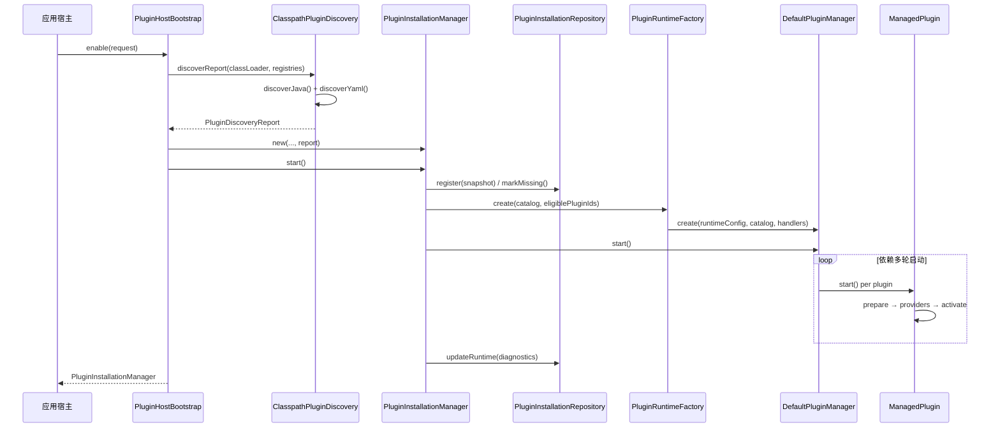

# 插件发现与系统启动

## 1. 两类入口

| 场景 | 入口类 | 是否写安装表 |
|------|--------|--------------|
| 生产（带安装管理） | `PluginHostBootstrap.enable` → `PluginInstallationManager` | 是 |
| 测试 / 纯运行时 | `DefaultPluginManager` / `PluginRuntimeFactory` | 否 |

生产路径由应用宿主在启动阶段组装；Core 只提供契约，不绑定具体 Spring Boot 启动类。

## 2. 核心类职责

```
classpath
├── ClasspathPluginDiscovery          # 扫描 SPI + 全部 plugin.yaml
│   ├── PluginDefinitionCompiler      # YAML → PluginDefinition
│   ├── JacksonPluginManifestParser   # 解析 YAML 文本
│   └── ManifestPlugin                # YAML 插件的 Plugin 适配器
├── PluginCatalog                     # 全局校验（pluginId 唯一等）
├── PluginDiscoveryReport             # validCatalog + rejectedDefinitions
│
安装层
├── PluginHostBootstrap             # 宿主统一启用入口（发现 → 对账 → 启动）
├── PluginInstallationManager         # 对账、启停命令、聚合查询
├── PluginInstallationRepository      # nx_plugin_installation 读写
├── PluginRuntimeFactory              # 创建 DefaultPluginManager
│
运行时
├── DefaultPluginManager              # JVM 内唯一运行态协调器
├── ManagedPlugin                     # 单插件启动/停止事务
├── CapabilityRegistry                # Provider 注册与查询（经 availability 门控）
└── PluginAvailabilityIndex           # 控制 Capability 对外可见时机
```

**发现资源位置**

| 类型 | 位置 |
|------|------|
| Java 插件 | `META-INF/services/com.innospots.nexus.core.plugin.contract.Plugin` |
| YAML 插件 | `META-INF/nexus/plugin.yaml`（可有多份，由 `ClasspathPluginDiscovery.MANIFEST_RESOURCE` 定义） |

发现阶段只调用 `Plugin.definition()` 或编译 YAML，**不**创建 `CapabilityProvider` 实例。

## 3. 生产启动序列

宿主推荐入口：

```java
PluginInstallationManager manager = PluginHostBootstrap.enable(request);
```

一次 `enable()` 按固定顺序完成下文步骤 1–12；宿主无需自行编排 `discover` / `reconcile` / `start` 的调用次序。

### 3.1 时序图



### 3.2 分步说明

| 步骤 | 执行者 | 做什么 | 产出 / 副作用 | 失败时 |
|------|--------|--------|---------------|--------|
| **0** | 应用宿主 | 组装 `PluginHostBootstrapRequest`：注入 DAO、运行时配置、安装策略、Capability/Contribution 注册表、Handler、快照器、类加载器 | 请求对象就绪 | 构造 `Request` 时校验失败即抛错 |
| **1** | `PluginHostBootstrap` | 解析类加载器（请求 → 运行时配置 → 当前线程 CL） | 用于 SPI / YAML 扫描的 `ClassLoader` | — |
| **2** | `ClasspathPluginDiscovery` | **Java 发现**：`ServiceLoader` 枚举 `Plugin` SPI，调用 `definition()` 读取元数据，不实例化 Provider | 候选 `DiscoveredPlugin` 列表 | 单条 SPI 失败进入 `rejectedDefinitions`，不阻断其他插件 |
| **3** | `ClasspathPluginDiscovery` | **YAML 发现**：枚举全部 `META-INF/nexus/plugin.yaml`，经 `PluginDefinitionCompiler` 编译为 `PluginDefinition`，包装为 `ManifestPlugin` | 同上 | 单文件 YAML 非法进入 `rejectedDefinitions` |
| **4** | `PluginCatalog` | **全局校验**：`pluginId` 唯一、`apiVersion` 兼容、同一 Capability 键不得绑定不同 API 类 | 不可变 `validCatalog` | 重复 ID / API 冲突 → 整次发现失败 |
| **5** | `PluginHostBootstrap` | 创建 `PluginInstallationRepository`、`PluginRuntimeFactory`、`PluginInstallationManager`，绑定发现报告 | 安装管理器实例（尚未写库、尚未启动） | 依赖为 null 时抛错 |
| **6** | `PluginInstallationManager` | **对账（reconcile）**：将 `validCatalog` 中每个插件转为 `PluginDefinitionSnapshot` 写入 `nx_plugin_installation`；历史记录保留管理员安装/启用意图 | 安装事实与 classpath 对齐 | 运行时已存在时不允许对账 |
| **6a** | `PluginInstallationRepository.register` | 新插件：按 `autoInstall` 设置 `installed` / `desiredEnabled`；已存在：更新版本、来源、定义快照，**不覆盖**历史意图 | 行级 upsert | 持久化失败抛 `PLUGIN_PERSISTENCE_FAILED` |
| **6b** | `PluginInstallationRepository.markMissing` | 库中存在但本次目录中不出现的插件标记为 `presence=MISSING` | 缺失列表；保留意图与快照 | — |
| **7** | `PluginInstallationManager` | 计算 **eligible** 集合：`PRESENT` 且 `installed=true` 且 `desiredEnabled=true` | `Set<String> eligiblePluginIds` | — |
| **8** | `PluginRuntimeFactory` | 合并宿主 `disabledPluginIds` 与非 eligible 插件，生成有效 `PluginRuntimeConfig`，校验 Contribution Handler / Snapshotter 齐全 | `DefaultPluginManager` 实例 | Handler 缺失或目录 Contribution 无对应处理器时抛错 |
| **9** | `DefaultPluginManager`（构造） | **运行时预检与装配**：校验 required 插件、默认路由、Contribution；为目录中每个插件创建 `ManagedPlugin`（状态 `DESCRIBED`） | 内存中的插件运行时骨架 | 配置/路由/Handler 不合法时构造失败 |
| **10** | `DefaultPluginManager.start` | **依赖感知多轮启动**：解析 Capability 依赖，满足条件的插件依次 `ManagedPlugin.start()`；不满足的标记 `WAITING` | 部分或全部插件 `ACTIVE` | 普通插件失败被隔离；`requiredPluginIds` 未全部 ACTIVE 则回滚本次已启动集合并抛错 |
| **10a** | `ManagedPlugin.start`（单插件） | 按阶段执行：`config-resolve` → `contribution-prepare` → `provider-create` → `plugin-initialize` → `provider-initialize` → `plugin-start` → `contribution-stage` → `capability-publish` → `contribution-commit` → `availability.activate` | 插件 `ACTIVE`；Capability 对外可见 | 任一阶段失败回滚 Provider / Contribution / 资源，状态 `FAILED` |
| **11** | `PluginInstallationManager` | **记录运行诊断**：将各插件 `state` / `lastError` 写回安装表 `runtimeState` / `runtimeError` | 持久化运行快照 | 诊断写入失败不掩盖启动异常 |
| **12** | `PluginHostBootstrap` | 返回 `PluginInstallationManager` 给宿主 | 宿主可调用 `capabilities()`、管理 API、`close()` | — |

### 3.3 关键策略说明

**eligible 条件**（步骤 7）：`presence=PRESENT` 且 `installed=true` 且 `desiredEnabled=true`。

- 首次发现默认 `installed=false`、`desiredEnabled=false`，除非 `nexus.plugin.auto-install=true`（步骤 6a）。
- 非 eligible 插件仍会进入 `DefaultPluginManager` 的目录（步骤 9），但通过 `disabledPluginIds` 在步骤 8 被排除在自动启动之外；状态保持 `DESCRIBED` 直至管理员 `installAndStart` / `enable`。

**发现与运行的边界**

- 步骤 2–4 只做**静态元数据**发现，不创建 `CapabilityProvider` 实例。
- 步骤 10a 才创建并初始化 Provider，并在 `capability-publish` 之后对外提供查询。

**Capability 可见性**

- Provider 注册后须经 `PluginAvailabilityIndex` 门控；仅 `ACTIVE` 插件的 Provider 可被 `CapabilityManager` 查询到。

**关闭顺序**

```java
installationManager.close();  // 按启动逆序停止插件，释放运行时
```

### 3.4 宿主启用后的典型用法

```java
// 业务查询 Capability
CapabilityManager capabilities = manager.capabilities();

// 管理面（Console REST 等）
manager.installAndStart("com.example.my-plugin");
manager.disable("com.example.my-plugin");

// 应用关闭
manager.close();
```

## 4. 纯运行时序列（无安装表）

测试与嵌入式场景在宿主侧完成发现后，直接装配运行时：

```java
PluginDiscoveryReport report = new ClasspathPluginDiscovery(
        classLoader, decoders).discoverReport();
PluginCatalog catalog = report.validCatalog();

PluginManager manager = new PluginRuntimeFactory(baseRuntimeConfig, handlers, snapshotters)
        .create(catalog, Set.of("com.example.my-plugin"));
manager.start();
// ...
manager.close();
```

或绕过安装层直接创建管理器：

```java
PluginManager manager = DefaultPluginManager.create(runtimeConfig, catalog, handlers);
manager.start();
```

## 5. 发现结果如何处理

| 结果 | 行为 |
|------|------|
| 单个 YAML/SPI 定义非法 | 进入 `rejectedDefinitions`，不阻断其他插件 |
| 重复 `pluginId` | 全局致命错误，Catalog 构建失败 |
| 拒绝列表中的插件 | **不**写入 `nx_plugin_installation` |

## 6. 相关测试

- `ClasspathPluginDiscoveryTest` — SPI 发现、重复 ID
- `PluginInstallationManagerTest` — 对账与启停
- `PluginHostBootstrapTest` — 统一入口完整启动链
- `PluginHostAssemblyTest` — 宿主最小装配
