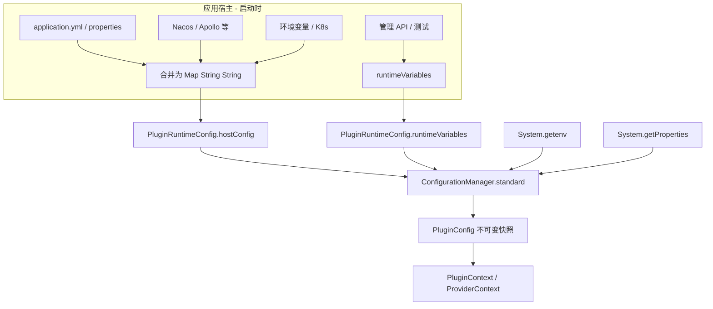

# 插件配置说明

## 1. 先理解两层配置

| 层次 | 定义在哪 | 值从哪来 | Core 类 |
|------|----------|----------|---------|
| **Schema（声明）** | 插件定义：`plugin.yaml` 的 `config` / Java `ConfigDefinition` | 插件 JAR 内，随发现加载 | `ConfigItemDefinition` |
| **值（运行时）** | 不在插件 JAR 中 | 宿主合并后传入 | `PluginRuntimeConfig` → `ConfigurationManager` |

```text
plugin.yaml / PluginDefinition     ← 只声明「有哪些键、什么类型、是否必填」
        +
application.yml / Nacos / 环境变量  ← 宿主汇总为 hostConfig
        ↓
ConfigurationManager.resolve()     ← 插件 start() 时生成 PluginConfig
        ↓
PluginContext.config()             ← 插件代码读取
```

**重要**：Core **不会**自动读取 `application.properties`、Nacos、K8s ConfigMap 或任意配置文件。这些必须由**应用宿主**在启动时读取并填入 `PluginRuntimeConfig.hostConfig()`（或 `runtimeVariables`）。

宿主如何把各来源汇总为 `hostConfig`，见 [10-host-extension-guide.md](10-host-extension-guide.md) §4。

---

## 2. 配置键命名空间

### 2.1 插件共享配置

| 概念 | 完整键格式 | 插件内 localKey |
|------|------------|-----------------|
| 插件级 | `plugins.<pluginId>.<localKey>` | `corpId` |

示例：`plugins.com.example.message-wecom.corpId`

### 2.2 Provider 私有配置

| 概念 | 完整键格式 |
|------|------------|
| Provider 级 | `plugins.<pluginId>.providers.<providerId>.<localKey>` |

示例：`plugins.com.example.message-wecom.providers.wecom.agentId`

### 2.3 安装策略（非插件配置）

| 键 | 用途 |
|----|------|
| `nexus.plugin.auto-install` | 首次发现是否自动安装（`PluginInstallationConfig`） |

不属于 `plugins.*` 命名空间，由宿主直接解析。

---

## 3. Schema 声明（插件侧）

### 3.1 YAML

```yaml
spec:
  config:
    - key: corpId
      type: STRING
      required: true
    - key: secret
      type: SECRET
      required: true
  capabilities:
    - type: message.sender
      majorVersion: 1
      providerId: wecom
      api: com.example.contract.MessageSender
      config:
        - key: agentId
          type: STRING
          required: true
      bind:
        kind: java
        class: com.example.WeComSender
```

### 3.2 Java

```java
.config(ConfigDefinition.builder()
        .string("corpId").required().end()
        .secret("secret").required().end()
        .build())
.provide(MESSAGE_SENDER, "wecom",
        ConfigDefinition.builder()
                .string("agentId").required().end()
                .build(),
        WeComSender::new)
```

### 3.3 规则

- 运行时**只接受 schema 中声明的键**；`hostConfig` 出现未声明键 → `PLUGIN_CONFIG_INVALID`
- `SECRET` 类型禁止在 schema 中写 `defaultValue`
- `plugin.yaml` **不写**生产密钥，只写 schema

---

## 4. 值从哪里来：合并管道

### 4.1 数据流



### 4.2 Core 内置五级来源（同一插件键）

对**每个已声明的 localKey**，`ConfigurationManager` 按以下顺序叠加（后者覆盖前者）：

| 优先级 | 来源 | 由谁提供 | 说明 |
|--------|------|----------|------|
| 1（最低） | Schema 默认值 | 插件定义 | `SECRET` 无默认值 |
| 2 | `hostConfig` | 宿主 `PluginRuntimeConfig` | 文件/Nacos 等应先合并到这里 |
| 3 | `ConfigSource` | 宿主 `PluginRuntimeConfig.configSources()` | **每次插件 start 时**调用 `values()`；见 [11-dynamic-plugin-configuration.md](11-dynamic-plugin-configuration.md) |
| 4 | 环境变量 | `NEXUS_PLUGIN_*` | 见 §5 |
| 5 | JVM 系统属性 | `-Dplugins....` 或 `System.setProperty` | 键名与 hostConfig 相同 |
| 6（最高） | `runtimeVariables` | 宿主 `PluginRuntimeConfig` | 测试/动态覆盖 |

实现见 `ConfigurationManager.resolveScope()`：

```text
default → hostConfig → configSources → environment → systemProperties → runtimeVariables
```

### 4.3 解析时机

- **发现阶段**：不解析配置值
- **插件 `start()` → `config-resolve` 阶段**：对每个插件调用 `configuration.resolve(definition)`，对每个 Provider 调用 `resolveProvider(...)`

每个插件启动周期解析一次；V1 **不支持**运行中热更新（需 `close()` 后重建运行时）。

---

## 5. 各来源如何「加入」hostConfig

### 5.1 本地配置文件（Spring Boot 为例）

**文件位置**：应用模块标准位置，与业务配置相同：

```text
src/main/resources/application.yml
src/main/resources/application-prod.yml
```

**示例**：

```yaml
nexus:
  plugin:
    auto-install: false

plugins:
  com.example.message-wecom:
    corpId: ww123456
    secret: ${WECOM_SECRET}   # Spring 解析占位符后，再传入 hostConfig
    providers:
      wecom:
        agentId: "1000002"
```

**加入方式**：宿主 `@ConfigurationProperties` 或 `Environment` 读取后，**扁平化**为 Core 需要的 Map：

```java
// 扁平化结果示例
Map.of(
    "plugins.com.example.message-wecom.corpId", "ww123456",
    "plugins.com.example.message-wecom.secret", resolvedSecret,
    "plugins.com.example.message-wecom.providers.wecom.agentId", "1000002");
```

传入 `new PluginRuntimeConfig(..., hostConfig, ...)`。

> Spring 的 `${...}` 由 Spring 在绑定阶段解析；Core 收到的应是**最终字符串**，不再做占位符替换。

### 5.2 环境变量

#### 方式 A：直接写完整键（进入 hostConfig 或 JVM 属性）

```bash
export plugins.com.example.message-wecom.corpId=ww123456
```

宿主启动时把 `System.getenv()` 中以 `plugins.` 开头的项并入 `hostConfig`（若采用此约定）。

#### 方式 B：Nexus 约定环境变量名（Core 自动读取）

Core 在合并时会读取 `NEXUS_PLUGIN_<NORMALIZED>` 形式的环境变量：

```text
NEXUS_PLUGIN_<PLUGINID_AND_KEY>
  pluginId 与 key 中的 . 和 - 替换为 _
  全大写
```

示例：

| 完整配置键 | 环境变量名 |
|------------|------------|
| `plugins.com.example.message-wecom.corpId` | `NEXUS_PLUGIN_COM_EXAMPLE_MESSAGE_WECOM_CORP_ID` |
| `plugins.com.example.message-wecom.providers.wecom.agentId` | `NEXUS_PLUGIN_COM_EXAMPLE_MESSAGE_WECOM_PROVIDERS_WECOM_AGENT_ID` |

生成 API：`ConfigurationManager.environmentName(pluginId, localKey)`（Provider 级传入带 `.providers.<id>` 后缀的 pluginId 路径）。

发现后 Core 会调用 `validateEnvironmentNames()` 检测不同插件是否映射到同一环境变量名。

### 5.3 Nacos / Apollo / 配置中心

Core **无** Nacos 客户端。标准做法：

```text
Nacos 配置变更
    → Spring Cloud @RefreshScope / NacosPropertySource
    → 应用汇总为 Map<String, String>
    → PluginRuntimeConfig.hostConfig()
    → （V1）重建 PluginInstallationManager / 重启插件运行时
```

**Nacos 配置示例**（`dataId: application.yaml`）：

```yaml
plugins:
  com.example.message-wecom:
    corpId: ww-from-nacos
```

**宿主代码示意**：

```java
@NacosValue("${plugins.com.example.message-wecom.corpId:}")
private String wecomCorpId;

// 或在 @PostConstruct 中从 Nacos ConfigService 拉取整段 YAML 并 flatMap
```

将结果写入 `hostConfig` 的 `plugins.com.example.message-wecom.corpId`。

### 5.4 JVM 系统属性

```bash
java -Dplugins.com.example.message-wecom.corpId=ww123456 ...
```

`ConfigurationManager.standard()` 自动读取 `System.getProperties()`，优先级高于环境变量、低于 `runtimeVariables`。

### 5.5 runtimeVariables（宿主显式覆盖）

用于测试或管理面临时覆盖，不经过文件/Nacos：

```java
new PluginRuntimeConfig(
        Set.of(),
        Set.of(),
        Map.of("plugins.com.example.message-wecom.corpId", "from-file"),
        Map.of("plugins.com.example.message-wecom.corpId", "override-for-test"), // 最高优先级
        Map.of(),
        null);
```

最终 `corpId` = `override-for-test`。

---

## 6. 优先级示例

插件 `com.example.config-fixture` 声明 `timeout`（INTEGER，默认 10）：

| 来源 | 值 |
|------|-----|
| schema default | 10 |
| hostConfig | 20 |
| env `NEXUS_PLUGIN_..._TIMEOUT` | 30 |
| JVM `-Dplugins....timeout` | 40 |
| runtimeVariables | 50 |

**结果**：`timeout = 50`（见 `ConfigurationManagerTest`）。

---

## 7. 代码中读取

### 7.1 插件级（`Plugin.initialize`）

```java
@Override
public void initialize(PluginContext context) {
    String corpId = context.config().require("corpId");
    int timeout = context.config().getInt("timeout", 30);
    Duration interval = context.config().getDuration("interval", Duration.ofMinutes(5));
}
```

### 7.2 Provider 级（`CapabilityProvider.initialize`）

```java
@Override
public void initialize(CapabilityProviderContext context) {
    String agentId = context.providerConfig().require("agentId");
}
```

### 7.3 密文

```java
try (SecretValue secret = context.config().requireSecret("secret")) {
    secret.use(chars -> callApi(chars));
}
```

`toString()` 与诊断 map 对 Secret 显示 `<secret>`，不输出明文。

---

## 8. 配置文件放在哪：对照表

| 配置种类 | 放在哪 | 谁读取 | 进入 Core 的路径 |
|----------|--------|--------|------------------|
| 插件 schema | 插件 JAR：`plugin.yaml` 或 Java 定义 | `ClasspathPluginDiscovery` | `PluginDefinition.config()` |
| 插件运行值 | **应用**配置：yml/properties/Nacos 等 | **宿主应用** | `PluginRuntimeConfig.hostConfig()` |
| 安装策略 | 应用配置 `nexus.plugin.auto-install` | 宿主 | `PluginInstallationConfig` |
| 环境变量 | 进程环境 / K8s `env` | Core `ConfigurationManager` | 自动（`NEXUS_PLUGIN_*`）或宿主并入 hostConfig |
| **数据库 / 配置中心** | 业务表 / Nacos 等 | **宿主 `ConfigSource` 实现** | `PluginRuntimeConfig.configSources()`；见 [11-dynamic-plugin-configuration.md](11-dynamic-plugin-configuration.md) |
| JVM 属性 | 启动参数 `-D` | Core `ConfigurationManager` | 自动 |
| 临时覆盖 | 测试代码 / 管理 API | 宿主 | `runtimeVariables` |

**不要**把生产密钥写进 `plugin.yaml`；**不要**期望 Core 直接连接 Nacos。

---

## 9. 校验与错误

| 错误 | 原因 |
|------|------|
| `unknown plugin config key` | hostConfig/runtimeVariables 中有 schema 未声明的键 |
| `required ... config is missing` | 合并后必填项仍为空 |
| `cannot convert plugin config` | 类型不匹配（如 INTEGER 写了非数字） |
| `environment name conflict` | 两个插件配置映射到同一 `NEXUS_PLUGIN_*` 名 |

---

## 10. 与安装快照

`PluginDefinitionSnapshot` 只保存 schema 摘要（键名、类型、required、secret 标志），**不**保存配置值。见 `PluginDefinitionSnapshotMapper`。

---

## 11. 相关文档

| 文档 | 内容 |
|------|------|
| [10-host-extension-guide.md](10-host-extension-guide.md) | 宿主如何实现 `PluginRuntimeConfig`、注册表 |
| [04-yaml-plugin.md](04-yaml-plugin.md) | YAML config 字段类型 |
| [03-java-plugin.md](03-java-plugin.md) | Java `ConfigDefinition` API |
