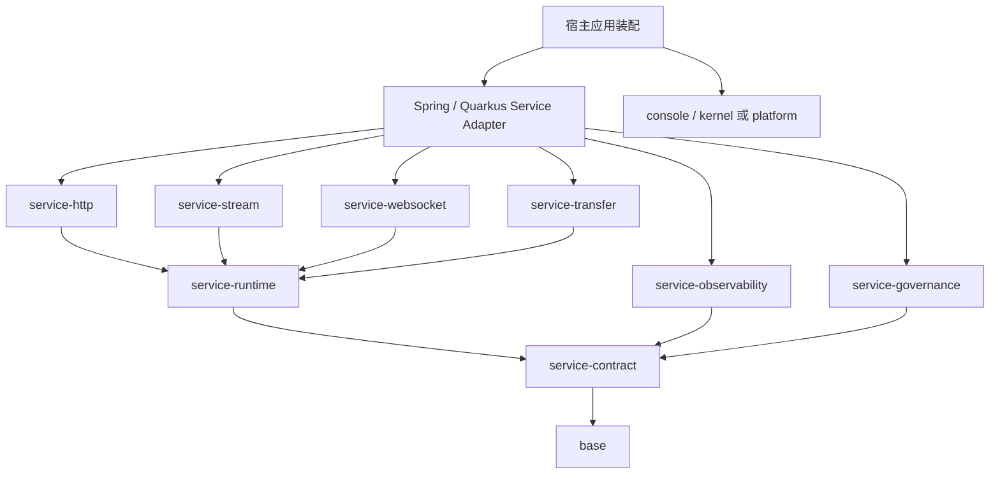

# Java 统一服务接入与运行框架技术设计

## 1. 文档定位

- 状态：可实施规格 v1.2（评审中）。模块拓扑已由开发者确认；D1–D15 作为本规格的实施默认锁定。覆盖本规格即可进入 `java:project`（仅 D7/D8）和 `java:develop`，不代表功能已经实现。
- 日期：2026-09-13。
- 级别：L2 完整方案 + 实施附录。
- 归属：`innospots-nexus-service` 的八个中立库，以及 `innospots-nexus-spring-service`、`innospots-nexus-quarkus-service`；M0 另增 `innospots-nexus-quarkus-service-deployment` 与 `innospots-nexus-service-adapter-test`。
- 功能输入：[Java 统一服务接入与运行框架需求说明书](/Users/mac/Downloads/Java%20统一服务接入与运行框架需求说明书.md)（§1–48）；开发实践与开发者体验规范（对话内文，§1–51）。
- 工程事实：[已建骨架说明](../README.md)、[仓库边界](../../AGENTS.md)、[BOM](../../innospots-nexus-bom/pom.xml)。上述相对链接以本文件位置解析。
- 本次只交付设计文件，不修改 Java、POM、全局规范或模块 API 参考索引。

本文与以下附录构成**同一份**实施规格；附录对签名、状态机、配置键、测试类名具有约束力。`java:develop` 不得另选异常体系、模块拓扑或异步模型。

| 文档 | 实现用途 |
|---|---|
| [开发体验](service-developer-experience-design.md) | 四级用法、注解落点、业务依赖、禁止项、DX 验收 |
| [契约与类型](service-contract-design.md) | 包、类型、接口签名、空值与所有权、状态码 |
| [运行时与协议](service-runtime-design.md) | 调用链、上下文、并发、SSE/WS/文件、安全、审计与治理算法 |
| [框架适配与配置](service-adapter-design.md) | MVC/WebFlux/Quarkus 集成、自动装配、依赖与配置 |
| [实施与验收](service-implementation-design.md) | 工程增量、源文件清单、测试类、里程碑、需求追踪与验收 |

本稿区分三种信息：需求书中的功能目标、已检查的仓库事实、本文锁定的实现决策。需求书中的模块示例及技术建议不自动覆盖仓库规则。

### 1.1 设计树（grill 结论）

交互式外部 grilling CLI 未执行。下列决策树依据已确认模块拓扑、`AGENTS.md`、需求书与仓库源码闭合；开发者评审可覆盖，未覆盖前按本表实施。

| 节点 | 锁定结论 |
|---|---|
| 模块拓扑 | 维持八个中立库 + 两个框架适配；不按需求示例再建 security/audit/file/BOM Maven 模块 |
| 异步模型 | 公共 API 仅 `T` / `CompletionStage<T>` / `Flow.Publisher<T>` |
| 流输出口 | StreamSink 为 Level 2；Channel 为 SPI；按 id emit 必须鉴权 |
| 注解 | 默认无 Enable*；差异用 RequiresPermission/Audited/治理注解；TimeoutProtected 为策略键 |
| 异常 | 只使用 `NexusException` + 类型化 `StatusCode`；不建 `ServiceException` |
| 状态码 module | 平台复用 `NEX`；服务专属失败使用 `SRV`，实施 M1 登记白名单 |
| 主体 ID | `ServicePrincipal.id` 为 String；不把 ULID 强转 `UserSnapshot.userId()` 的 Long |
| 安全 | 默认对接宿主 IAM Provider；不把 Spring Security 打进默认依赖 |
| 路由 | 适配器跟随宿主原生路由；既有 console/kernel 继续 Jakarta REST |
| 响应 | 默认 `legacy`（`R<T>`）；`problem` 需 operation 显式选择 |
| 文件读 | 不修改 `ResourceStore.read(byte[])`；大文件走 `ResourceContentReader` |
| 审计 | 技术事件/输出在 service；业务审计表与查询仍在 kernel/platform |
| 事件 | 不引入领域事件包；横切用拦截器与 SPI |
| 持久化 | 本框架无表、无 DAO |

## 2. 背景与目标

建设可嵌入既有 Web Runtime 的服务基础层。路由、Server、DI、JSON 编解码与网络 I/O 由宿主负责；业务只使用原有端点方式、意图注解、JDK 异步类型及少量标准接口。

实施成功标准：

1. 同一业务服务和同一套黑盒契约在 Spring MVC、Spring WebFlux、Quarkus REST 三种宿主通过。
2. `T`、`CompletionStage<T>`、`Flow.Publisher<T>` 覆盖同步、异步与多结果；公共类型不出现框架 Session、Reactor、Mutiny、Servlet、OTel 实现类型。
3. 生命周期闭合于真实完成、失败或取消，不能在方法返回 Publisher/Stage 时提前释放资源。
4. 每个队列、注册表、线程池和活跃会话均有上限；权限默认拒绝、取消传播、清理可观测。
5. 实现者可按本规格中的文件归属、接口、状态转移、配置和测试逐项构建，不再自行决定基本行为。

### 2.1 已查证的能力与缺口

| 仓库事实 | 对本设计的影响 |
|---|---|
| 新模块当前只有 POM 和包根 | 没有可复用的服务运行时；本规格全部新接口均属计划 |
| base 已有 `NexusException`、`StatusCode`、`R<T>` | 不再新建并行的 `ServiceException` 异常体系 |
| `NexusException` 只保存 code/display/message，不保存 StatusCode 对象 | 新建有限的 `ServiceErrorCatalog` 解析允许的完整码，不能假设存在 `exception.statusCode()` |
| `SessionContext` 使用 TLC；TLC 是线程本地可变 Map | 作为旧同步代码的桥接视图，不能直接当跨线程事实源 |
| `UserSnapshot.userId()` 是 Long，而 console 的 TokenClaims/AuthorizationSubject 使用 String | 新主体 ID 统一 String，不能将 ULID 强转 Long；旧快照桥接只用于确有数值 ID 的主体 |
| `ResourceStore.save(FileResource, ...)` 接受 InputStream，`read(id)` 返回 `Optional<byte[]>` | 写入可桥接；大文件读取必须补充能力端口，禁止把 read 的 byte[] 包成流冒充流式存储 |
| console TokenIssuer 签发 AES-GCM compact token | 不能声称当前系统已有 JWT/OIDC 验证；JWT/OIDC 由新 Provider 集成计划补齐 |
| console RequestAuthorizer 针对 page + datasource 目录授权 | 不能直接等价为通用 `model:invoke` 权限解析器；通过专用桥接保留原语义 |
| BOM 声明 JDK 25、Boot 4.1.1、Quarkus 3.33.3.1 | 是仓库锁定值，不是“最新版”声明；实现按 effective POM 校准版本与兼容性 |

### 2.2 方案选择

| 方案 | 评价 |
|---|---|
| 将全部能力并入 core | 增加中立数据库基础模块的服务接入职责和依赖，不采用 |
| 保留八个中立库，安全/审计按功能包划分 | 与已确认拓扑一致，独立可测，采用 |
| 按需求示例另建 security/audit/file/BOM/starter 全套模块 | 重复命名和版本管理，本期不采用 |
| 需求示例 → 仓库模块 | `service-core` = contract + runtime；`service-file` = transfer；`service-security`/`service-audit` = contract/runtime 功能包；`service-bom` = 根 BOM；Spring/Quarkus 适配已有独立 artifact |

## 3. 不在本方案中的能力

不重建路由、DI、Web Server、JSON 引擎、IAM 用户/角色表、审计查询管理台。第一、二阶段均不包含分布式 Session、跨节点推送、分布式限流、持久化 SSE 重放、STOMP/SockJS、断点续传上传、多段 Range 响应或通用重试引擎。

“可扩展”必须有已列出的 SPI 和失败语义，但不等于内置所有认证/病毒扫描/存储厂商。生产启用某 Provider 前需其实现通过契约测试；缺失 Provider 不能用放行实现填补。

## 4. 归属与词汇（四步法 ①②）

| 概念 | 英文名 | 归属 | 技术 ID / 稳定键 | 约束 |
|---|---|---|---|---|
| 请求上下文 | ServiceContext | contract.context | requestId：边缘验证或生成 | HTTP/流生命周期事实快照 |
| 一次执行 | Invocation | contract.invocation / runtime.invocation | invocationId；operationId 稳定 | HTTP、WS 消息、下游调用分开执行 |
| 主体 | ServicePrincipal | contract.security | id 字符串 + realm + type | 不包含凭据，不等于 UserEntity |
| 资源范围 | ServiceScope / ResourceRef | contract.security | tenant/workspace/project；资源类型与 ID | 作用域必须经过认证与成员关系校验 |
| 流会话 | StreamSession | stream.session | sessionId；不可据此授予权限 | 单 JVM、单订阅、不可重连复用 |
| 流输出口 | StreamSink | stream.session | 与 session 同一 sessionId | Level 2 业务主入口；Session extends Sink |
| 连接 | WebSocketSession | websocket.session | connectionId 物理；sessionId 业务 | 一个业务会话可有多个连接 |
| 服务策略 | OperationPolicy | contract.policy | operationId / policyKey | 声明与执行分离，启动时解析 |
| 取消 | CancellationToken | contract.cancellation | 与执行绑定 | 原因稳定、首次生效、可传播 |
| 截止时间 | Deadline | contract.time | 单调时钟剩余预算 | 不跨节点传递 nanoTime |
| 审计事实 | AuditEvent | contract.audit | eventId；action 稳定 | 明确提交结果和持久化确认 |
| 二进制源 | BinarySource | transfer.content | 可选 resourceId | 有限块、关闭责任明确 |

`state` 表示生命周期状态；`status` 表示 HTTP 或业务结果；`mode` 表示执行策略；`type` 表示消息/主体分类。requestId、traceId、sessionId、connectionId、invocationId 不得互用。

## 5. 边界与包结构（四步法 ③）

箭头表示“消费方依赖提供方”，不表示数据流。

- contract.security / contract.audit：只含中立认证、权限、审计契约和业务意图注解。
- runtime.security / runtime.audit：认证授权编排、审计生命周期、提交观察；不含 IAM 数据模型或 DAO。
- observability：实现追踪、指标和日志；审计持久化不能放进日志 appender。
- governance：本地限流、bulkhead、熔断实现。按契约向 runtime 注入拦截器，runtime 不引用实现。
- 协议库互不依赖；适配器把 stream 与 HTTP 媒体类型结合，把 transfer 与 HTTP Header 结合。
- 宿主应用的 `*.service.security`、`*.service.audit`、`*.service.resource` 桥接包可同时引用中立 SPI 和 console/core。中立库与通用框架适配库不得反向引用 console/core。
- 本方案没有新持久化实体；StreamSession/连接不选用持久化基类。审计宿主若需表，应在其业务模块单独实施实体/DAO/事务设计。
- 技术模块按功能分包，具体列表见契约附录；每包含 package-info 在内不超过 15 个 Java 文件。

## 6. API 与分层契约（四步法 ④）

### 6.1 端点边界

框架不注册业务 URL 或开放管理端点。原有业务 `endpoint → service/operator → dao` 分层不变。技术运行链为 `框架原生入口 → Adapter → InvocationEngine → 业务调用`。

| 表面 | 业务返回 | 适配职责 |
|---|---|---|
| 普通 API | T / R<T> | 保持选定 response profile，不双重包装 |
| 单次异步 | CompletionStage<T> | 框架异步响应，终态才计时结束 |
| SSE / NDJSON | Flow.Publisher<StreamEvent<T>> 或 StreamSession<T> | 编码、订阅、写完成回调、取消 |
| WebSocket | WebSocketHandler<I,O> / ReactiveWebSocketHandler<I,O> | 原生端点声明连接到标准 Handler |
| 上传 | UploadResource 或其列表 | 解析 multipart、限制、临时资源管理 |
| 下载 | DownloadResource | 条件请求、Range、按需读取与关闭 |

兼容性选择见 §9，接口骨架、泛型信息保留和资源所有权见[契约附录](service-contract-design.md)。所有类均为计划，没有在本次生成实现。

### 6.2 生命周期原则

一次请求有三个不同完成点：方法返回、业务执行终止、传输终止。三者不可合并。Stage 结果完成不代表客户端收到响应；流生产完成不代表缓冲区已写完；请求超时不代表不合作的后台任务已经停止。

InvocationEngine 记录业务结果，TransportCompletion 记录发送结果。计数器、许可、临时文件各绑定其真实所有者的完成点，原子终态保证只释放一次。详细时序见[运行时附录](service-runtime-design.md)。

### 6.3 扩展点

SecurityProvider、PermissionProvider、AuditStorage、RateLimitProvider、CircuitBreakerProvider、MetricsProvider、TraceProvider 位于 contract；StreamChannelFactory 位于 stream；WebSocketCodec 位于 websocket；BinarySource/ResourceContentReader 位于 transfer。

由 DI 装配和配置选择；无配置的多实现歧义导致启动失败。普通业务不需要实现 SPI。抽象只用于可替换的实现、异步协议或资源生命周期边界。

### 6.4 持久化意图

不新增表、不创建 DAO、不引入 JDBC。限流、幂等缓存、流和连接均为有容量及 TTL 的本地状态。审计的持久化保证由 AuditStorage/TransactionalAuditStorage 明确提供，不能把 JVM 内存队列等同于可靠存储。

## 7. 失败与状态码

保留 `NexusException + StatusCode`。`ServiceError` 是中立错误描述，`ProblemDetailVo` 是可选 HTTP 表示，不是新异常。已有语义复用 NEX，服务专属语义提议 SRV 三字母段并在实施门禁注册，详见契约附录状态码表。

HTTP 未提交时可映射真实状态与错误体；已提交时不得重写状态。SSE/NDJSON 尽力发送有限的 error 事件后终止，WS 发 error envelope 或关闭，二进制响应直接中止并记录传输失败。取消有独立结果，不默认计为服务端 500 或熔断失败。

## 8. 事务、幂等与并发

- 不在跨整个 SSE/WS 生命周期的事务中执行。业务事务保持短小，所属模块使用 Jakarta Transactional。
- 全局只有有界共享执行器/定时器；不为每请求分配无界线程，不在 event loop 执行存储、密码校验、病毒扫描或阻塞等待。
- CompletionStage/Publisher 由框架托管边界传播上下文；任意业务自建线程、commonPool、未包装回调不能自动保证，使用注入的 ContextExecutor 或 ContextPropagation 包装。
- 第二阶段幂等只承诺单 JVM、有限 TTL、限定普通 JSON 操作；不自动重试非幂等调用。超时后的在途任务不能被简单删除而允许重入。
- 审计成功取决于提交事实；响应写失败不会把已提交业务写入改成“回滚”。

## 9. 兼容与迁移

### 9.1 已锁定决策（D1–D15）

需求书与仓库规范的冲突按下表实施。实现阶段不得重新选择；若评审覆盖某条，必须先改本规格再改代码。

| 编号 | 冲突 | 锁定决策 | 实施影响 |
|---|---|---|---|
| D1 | 需求原生 MVC/WebFlux，规范 Jakarta REST | 已有管理端继续 Jakarta REST；`spring-service` / `quarkus-service` 及其测试夹具允许宿主原生路由注解。业务核心与中立库禁止 Spring MVC / Quarkus REST 类型 | 规范例外仅作用于适配模块与夹具，不改旧 console/kernel 端点 |
| D2 | 需求 Spring Security，规范禁止 | 默认 `SecurityProvider` 对接宿主已认证身份（console compact token / Quarkus SecurityIdentity）。Spring Security 不进入默认 POM；若未来需要，单独条件配置且不得创建第二条 FilterChain | 需求 §15 JWT/OIDC 由宿主 Provider 满足，不在中立库实现密码学 |
| D3 | 需求 Problem Details，规范 R\<T\> | 默认 `service.response-profile=legacy` 保持 `R<T>`；operation 显式 `problem` 才输出 RFC 9457。不按 Accept 暗中切换旧接口 | 旧错误码/字段保留；关联 ID 可同时放响应头 |
| D4 | 需求 ServiceException | 只使用 `NexusException` + `ServiceErrorCatalog` | 不另建异常类，不修改既有 `NexusException` API |
| D5 | 需求示例独立 security/audit/file/BOM 模块 | 映射到已确认八模块与根 BOM | 安全/审计是功能包，不是新 Maven 模块 |
| D6 | 大文件下载与 `ResourceStore.read` 返回 `byte[]` | transfer 定义 `ResourceContentReader`；宿主提供真实流读 | 不扩展 base 公共 API |
| D7 | 需求 Quarkus 零侵入注解 vs 仅 CDI runtime | M0 用 `java:project` 新增 `innospots-nexus-quarkus-service-deployment`。无该模块则不得宣称验收项 4/18 在 Quarkus 上完全满足 | runtime POM 不依赖 deployment JAR |
| D8 | 双适配器同一套契约测试 | M0 新增 `innospots-nexus-service-adapter-test`（测试夹具库，非生产）。Spring/Quarkus 测试依赖它跑同一黑盒场景 | 禁止两套分叉断言 |
| D9 | 实践文 StreamSink vs 原“不提供 Sink” | `StreamSession<T> extends StreamSink<T>`；业务默认只用 Sink；`StreamChannel` 仅 SPI | 示例代码使用 StreamSink |
| D10 | 实践文按 streamId emit vs 类型安全 | `StreamManager.emit/fail(sessionId, …)` 允许，但必须当前上下文 owner/scope 匹配且类型可赋给 open 时的 Type | 禁止未鉴权 Object emit |
| D11 | 实践文治理注解名 | `@BulkheadProtected`、`@TimeoutProtected`（策略键）；废弃草稿名 `@Bulkheaded`、`@Timed` | 时长只来自配置 |
| D12 | 实践文 ServiceException / 领域异常 | 只抛 `NexusException`（或 base.exception 批准子类型）；不建 ServiceException | Controller 禁止手写 ResponseEntity 处理业务失败 |
| D13 | 实践文默认观测注解 | 禁止 `@Tracing`/`@Logging`/`@Metrics`/`@Enable*`；可选 `@Traced` 仅用于子 Span | Level 0 无注解 |
| D14 | 实践文业务 Metrics | `ServiceMeters` 中立 API，名称须注册；业务禁止直接使用 Micrometer/OTel SDK | 高基数 tag 拒绝 |
| D15 | 实践文 Retry | 本期不实现重试引擎；原则写入 DX：仅幂等下游，禁止默认重试写操作 | 与 §3 排除项一致 |

若评审选择“严格需求模式”（例如默认 Problem Details 或默认 Spring Security），只调整适配与宿主桥接；中立接口、运行时和协议状态机不变。

### 9.2 接入顺序

先在独立宿主测试夹具启用，随后按应用配置启用 `service.enabled`。对已有管理端先接入 requestId/上下文/观测，再启用错误映射和治理。禁止仅添加依赖就改变旧系统鉴权结果或响应形状；初次启用必须选择 legacy profile。

公共兼容面包括 operationId、状态码、配置键、事件类型、枚举值、错误表示和 WS envelope。新增字段允许消费者忽略；删除或改义必须经过弃用周期。当前无数据库迁移、双写或旧服务模块代码搬迁。

## 10. 测试范围

完整范围见[实施与验收](service-implementation-design.md)。重点验证真实异步完成和真实连接断开、背压、拒绝路径、权限隔离、流式字节数、Audit 提交与丢失语义。测试不只断言类型形状，不复制实现算法作为期望值。

所有适配跑相同 HTTP/WS 黑盒场景；MVC/WebFlux 使用分离的宿主配置，Quarkus JVM 为一期必测，native 为正式扩展交付门禁。性能验收采用同机未启用框架的对照，不把未经测量的数字写成已经达到的能力。

## 11. 架构约束自检

### 11.1 四步法门禁

- [x] ① 定归属：八中立库 + 两适配；D7/D8 为 M0 新模块；无 kernel↔platform 互依；安全/审计不混入 console catalog 或 IAM 表
- [x] ② 建词汇：主概念中英文已对齐；技术 ID 与稳定键已区分；`state`/`status`/`mode`/`type` 已定义；SRV 三字母已选定
- [x] ③ 划边界：功能包而非 `endpoint/role`；单包规划 ≤15 文件；无 Session 实体基类；无空 service/event 包；分层为 Adapter → InvocationEngine → 业务
- [x] ④ 定契约：无业务 REST 端点；request/vo 为 record；失败均有 StatusCode；无表/DAO；配置键已给出；事务/幂等/并发已定义；无领域事件；测试范围见实施附录

### 11.2 设计评审门禁

- [x] 已确认模块拓扑保持，能力按功能包归属，中立库无业务模块依赖。
- [x] 上下文、流/连接 ID、主体/资源范围区分；没有 Session 持久化实体。
- [x] 公开异步模型为 JDK，协议对象/编解码在适配边界。
- [x] 所有业务可见失败列入已有或提议状态码；取消/致命错误区别处理。
- [x] 资源关闭、背压、审计提交、框架差异和测试场景已定义。
- [x] 不创建 API 索引、业务表、全局规范或占位实现。
- [x] D1–D15 已作为本规格实施默认锁定；SRV 在 M1 登记并写契约测试。
- [x] 开发体验四级、注解落点、禁止项与实践规范 §49 对齐。

## 12. 开放问题与决策截止

| 问题 | 本规格默认 | 截止点 | 未配置时的安全边界 |
|---|---|---|---|
| 生产认证来源及 issuer/audience/key rotation | 宿主配置可信 Provider；旧 compact token 独立模式 | 各环境上线前 | 未配置则受保护操作启动失败 |
| 审计业务事实与事务落盘归属 | kernel/platform 各自实现，REQUIRED 模式用同库事务 | 二期审计上线前 | 不宣称内存队列可提供可靠审计 |
| 性能数字 | 实施附录的对照测量预算 | M0 夹具可用后实测 | 数字是目标，不是已达到的能力 |
| D1–D15 是否由开发者改判 | 按 §9.1 实施 | 评审接受本规格时 | 改判必须先改文档 |

未决项不阻塞 M1 中立契约与运行时。它们不允许实现者自行采用另一套异常、身份或模块结构。先按 M0 登记依赖与测试夹具，再按 M1–M8 完成代码。
