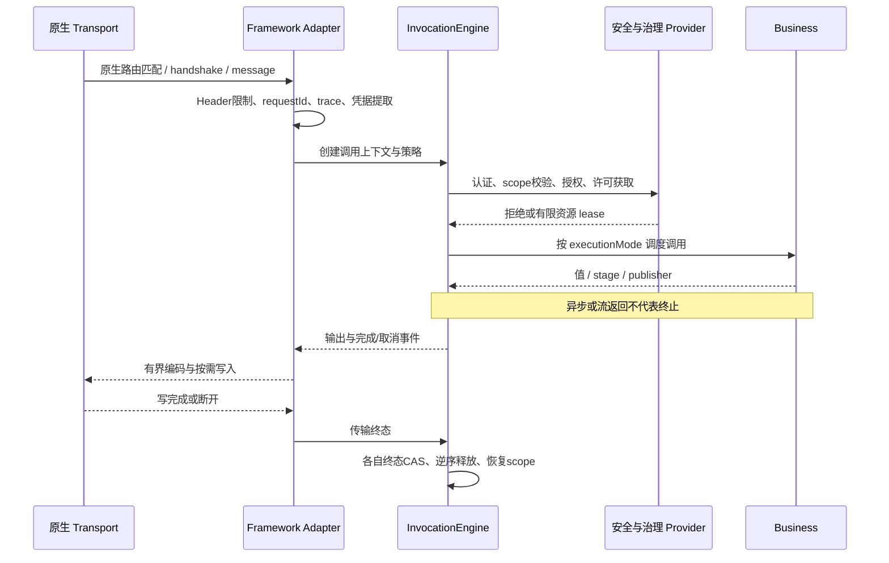
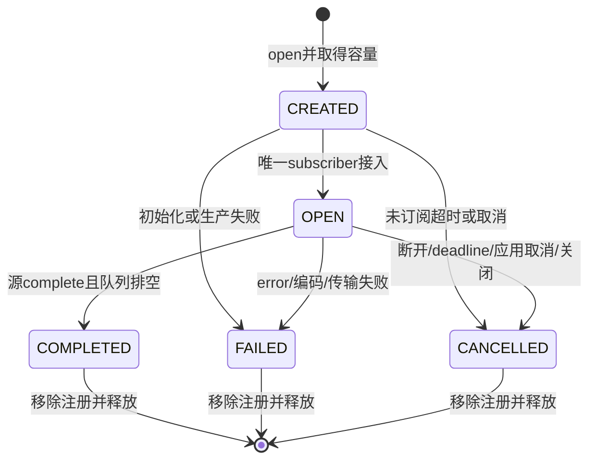

# 服务框架运行时与协议设计

状态：可实施规格 v1.2，2026-09-13。依赖[主方案](service-framework-design.md)、[开发体验](service-developer-experience-design.md)和[契约附录](service-contract-design.md)。本文件中的默认值是工程初始策略，不是性能测试结果。拦截器 id/order 以契约附录 `InterceptorIds` / `InterceptorOrders` 为准。

## 1. 入口处理与执行顺序

Transport 前置顺序：容器 byte/header/frame 上限 → 明确的 CORS preflight → 创建 requestId/trace → 基础 Header 与 Content-Type 校验 → IP/握手速率粗限 → 路由静态 metadata → 身份转换。404/405/解析失败也须进入观测及错误处理，不依赖业务方法被调用。

Invocation 层固定顺序：

| order | 行为 | 失败处理 |
|---|---|---|
| 0 `runtime.control` | `ControlInterceptor` 创建 InvocationControl、结果统计与清理域 | 初始化失败拒绝进入业务 |
| 10 `runtime.deadline` | `DeadlineInterceptor` 检查/收紧 deadline，关联 cancellation | 到期 TIMED_OUT；不进入业务 |
| 20 `runtime.authn` | `AuthenticationCoordinator` 与 scope 校验 | 401；不查敏感业务资源 |
| 30 `runtime.authz` | 解析已注册 ResourceRef、`AuthorizationInterceptor` | 403；资源解析不得先执行受保护变更 |
| 40 `runtime.audit` | `AuditInterceptor` 意图及可用性检查 | REQUIRED 不可用时 503，业务未执行 |
| 50 `runtime.idempotency` | `IdempotencyCoordinator` 准入与重复检测 | 冲突 409；复用结果仍需要当前授权 |
| 60 `governance.ratelimit` | `RateLimitInterceptor` 主体/操作/资源复合限流 | 429 + Retry-After，不取 bulkhead |
| 70 `governance.bulkhead` | `BulkheadInterceptor` 本地 bulkhead / 活跃会话容量许可 | 503；零等待默认 |
| 80 `governance.circuit` | `CircuitBreakerInterceptor` 指定下游 operation 的 circuit permit | OPEN 拒绝，释放之前许可 |
| 90 | 调度业务执行 | 调度队列满 503，不执行 supplier |

顺序 id+order 唯一；未知重复拦截器启动失败。PolicyCatalog 不做运行时路由，只保存原生框架已决定的 operationId→策略。用户可替换 SPI，不允许凭数字 order 把业务执行提前到授权前。

### 1.1 三种执行终态

InvocationControl 分别记录：

- `logicalOutcome`：调用方可见的成功/失败/取消/超时，CAS 一次。
- `workTermination`：真实任务/订阅是否停止，决定执行器及 bulkhead 许可可否释放。
- `transportCompletion`：实际写出成功/失败/客户端断开，决定 access log 与活动请求归零。

`invokeSync` 在 worker 上执行并以调用结束完成 workTermination。`invokeAsync` 等待原始 stage；取消 wrapper 不证明原始 stage 停止。`invokeStream` 等待源终态与取消确认；额外会话/缓冲许可等传输 drain 或强制关闭后释放。

超时先完成 logicalOutcome、停止继续对外输出、发取消信号；不合作任务仍占 bulkhead，直到原始任务 finally。记录 `service.work.orphaned`，容器容量不足时拒绝新任务，而非伪释放许可。Java 不能安全强杀任意线程，硬资源隔离由进程/容器负责。

正常退出逆序 finish 已取得 lease。一个清理异常不得阻止其他清理；主要失败保留，后续失败作为安全日志或 suppressed 原因。致命 JVM Error 不包装成正常成功。

## 2. 上下文传播与执行模型

### 2.1 事实源与线程视图

ServiceContext 是调用事实源；runtime.context 创建 ContextSnapshot 包含该不可变上下文及各桥接器捕获的安全状态。跨线程传 snapshot，不传 ThreadLocal Map 的活引用。

每次业务回调、subscriber 信号、取消监听都执行：保存线程原上下文 → 安装当前 ServiceContext 与经过白名单的 TLC/MDC → 执行 → finally 恢复原值。最外层恢复为无上下文时 remove；不能无条件 clear 掉嵌套外层请求。

既有 TLC.scope 会合并前态，服务桥接应先替换属于 service 的完整键集合，并显式移除本调用没有的 tenant/project/user 键，防止平台请求继承旧租户。Application 的 AuthorizationScope 有独立 ThreadLocal，宿主专用桥接还需打开/关闭它，TLC 不能代替。

Spring Reactor Context、Quarkus/SmallRye Context 接入由适配器完成。CompletionStage 回调、Publisher.request/cancel/onNext/onError/onComplete 都在捕获的上下文中运行。框架不能自动控制业务自行创建的 executor/commonPool；提供 `ContextPropagation.wrap(Runnable/Callable/Executor)`、`ContextExecutor` 及注入的 accessor。

### 2.2 执行模式

| 模式 | 执行位置 | 约束 |
|---|---|---|
| NON_BLOCKING | 原生 event loop/订阅调度 | 只允许不阻塞 callback；不得 join stage、InputStream.read、JDBC |
| BLOCKING | Spring 有界 AsyncTaskExecutor / Quarkus worker；可配置虚拟线程 | 每操作有准入上限；虚拟线程不等于无限并发 |
| CPU_INTENSIVE | 专用固定 executor | 默认 max(1, availableProcessors-1) 线程，队列 256，拒绝策略为失败 |

同步返回类型默认 BLOCKING；stage/publisher 默认为 NON_BLOCKING 的候选，但注解是显式承诺，不能根据返回类型保证函数体不阻塞。Quarkus 原生资源/WS callback 的 `@Blocking/@NonBlocking` 必须与策略一致，启动检查拒绝矛盾组合。不能等到函数已经阻塞 event loop 后才切 worker。

ContextExecutor 的任务排队时间计入 deadline。取消尚未开始的任务移出队列；已开始任务传 token 并在允许时 interrupt，最终仍以真实终止清理。所有任务拒绝和上下文回调异常均纳入契约测试。

### 2.3 认证与上下文有效期

长连接不永久继承握手凭据的有效性。expiresAt 到期后关闭连接或取消流；撤销通知可触发相同动作。每 WS 消息创建新 InvocationContext 和 message deadline；不使用握手请求的 30 秒 deadline 限定整个 30 分钟连接。scope 不允许在同连接中任意变更，需重新认证/重连。

## 3. HTTP 与错误

Header 基线：X-Request-Id 最长 128 个 ASCII 可打印字符，允许字母数字与 `._:-`，非法生成新 ID；重复不一致 Authorization/Content-Length 等安全敏感头由容器/适配器拒绝，不能逗号合并。X-Client-Id 最长 128，只有认证后与凭据绑定才参与 AppKey 限流。

只信任明确配置的反向代理 CIDR 提供的 Forwarded/X-Forwarded-For；默认 remoteAddress 为 socket peer。W3C traceparent/tracestate/baggage 使用 SDK propagator 校验，baggage 默认不向日志和权限模型暴露，限制长度与数量。

- 普通 JSON profile：成功保持 T 或 legacy R；失败统一 HttpErrorMapper。已有 R 不再次包裹。
- 下载、SSE、NDJSON 不套 R；无 body 的 HEAD/204/304 不生成 JSON。
- HTTP 429 返回 `Retry-After=ceil(retryAfter seconds)`，至少 1；跨源访问时由 CORS 显式 expose。
- Body header 宣称长度小于实际时，边读边限；压缩请求还需解压后上限，默认未配置不接受压缩 request body。
- 读请求 body 超时与已进入服务的执行 deadline 分开：容器 request-read timeout 返回 408，执行超时按 SRV100002/504；断开只记录取消，不发送错误。
- HEAD/OPTIONS 不执行需有业务副作用的 handler。CORS 预检由宿主处理，不为其分配业务执行许可。

错误消息清洗、未知码处理和状态表见[契约附录](service-contract-design.md)。所有出口都只能有一个“异常最终记录者”；已处理标记以 InvocationControl 为依据，不重复打印 stacktrace。

## 4. Streaming / SSE / NDJSON

### 4.1 会话状态机

CREATED 允许有界 emit，以支持创建后返回前生产；订阅前 complete 只设置内部 `producerClosed` 标记，待订阅后排空才进入 COMPLETED。未在 subscribe-timeout（默认 30s）订阅则取消，即使已调用 complete。公共状态不增加 DRAINING；内部标志记录 producerClosed/terminalError/drain 状态。

每会话单订阅，第二次订阅必须先 onSubscribe(empty subscription) 再 onError(LIFECYCLE_CLOSED)。会话从注册表移除后不可恢复；Last-Event-ID 不启用隐式重放，有此头的普通新请求建立新会话并标记 resumeUnsupported，不把旧 sessionId 当恢复句柄。业务希望重连必须提供新的业务请求。

业务默认通过 `StreamSink` emit；`StreamChannel` 仅 SPI。按 `sessionId` 的 `StreamManager.emit/fail` 必须在进入队列前完成 owner/scope 与类型校验，失败不得改变会话状态。

### 4.2 有界背压与并发

BoundedStreamChannel 使用有限队列 + demand 计数 + 单 drain 执行标志。producer 可以并发 emit，按成功入队原子顺序分配 sequence；所有 subscriber 信号串行发送且不得持锁回调。request(n) 累加饱和到 Long.MAX_VALUE；n<=0 按 Flow 协议失败。官方 [JDK Flow](https://docs.oracle.com/en/java/javase/25/docs/api/java.base/java/util/concurrent/Flow.html) 定义需求控制；本文额外规定单订阅和资源上限。

默认每会话 256 项、1MiB 数据预算、单事件 64KiB；三者同时生效。编码大小无法预估时由适配器使用原生 JSON codec 做有界编码/估算后入队；禁止将未知大小大对象以 0 字节入队。中立 manager 的默认创建需注入 EventSizer，缺失时启动失败。全局 encoded buffer 默认 64MiB，应用可调。

- REJECT：emit stage 失败但原队列不变，会话继续；生产者必须处理，记录拒绝。
- DROP_LATEST：新事件不入队；返回丢弃结果。
- DROP_OLDEST：只移除最老可丢弃业务事件；不得丢授权、错误和终态控制事件；无可丢弃项则拒绝。
- CLOSE：立即 fail、取消上游、清空队列并关闭传输。

控制终态保留一项独立有界槽，不受普通数据队列耗尽影响；heartbeat 只保留一个待发送标志，不积压。默认文本增量使用 REJECT，不能默认丢 token。失败/取消清空待发送普通数据并尽力发送 error/cancelled 控制事件；最多等待 terminal-write-timeout=2s，随后强制关闭。complete 正常排空受 idle/deadline 约束，不无限等待无 demand 的客户端。

### 4.3 Wire format

SSE：`Content-Type: text/event-stream`，UTF-8；`id` 为 sessionId+sequence 的 opaque 字符串，`event` 为 type，`data` 是完整 StreamEvent JSON，空行结束。JSON 保证换行正确转义，id/type 禁止 CR/LF。type 字符串为 stream.open/message/message.delta/progress/status/error/stream.completed/stream.cancelled/heartbeat。

heartbeat 默认以 SSE comment `: heartbeat\n\n` 表达，不占业务 sequence、不创建业务审计；StreamEventType.HEARTBEAT 可用于显式事件模式，仍不计业务 outputCount。首事件延迟只统计首个业务事件，stream.open 不算。

NDJSON（二期）：每行一个完整 StreamEvent JSON，`application/x-ndjson`，不能包含未转义物理换行。客户端应按流解析，不把整个 body 拼接后再 parse。共享同一 StreamSession 和错误/取消语义。

响应首字节前失败走普通 HTTP 错误；提交后失败使用 `error` event（data 为安全 ServiceError），再关闭。完成使用 stream.completed，只有成功写完它才能记录传输成功；客户端断开时取消通知本地上游，不保证把 stream.cancelled 发给已离线客户端。

MVC 通过有界 worker 写入且等待写完成才 request 下一批，WebFlux/Quarkus 对接原生需求与取消；任何额外适配队列都计入全局容量，不使用默认无界 emitter。

## 5. WebSocket

### 5.1 连接与消息状态

物理连接内部状态：CONNECTING → OPEN → CLOSING → CLOSED，任一失败都最终 CLOSED。握手过程先取短期 pending-handshake 许可再认证，成功后取全局和每主体连接许可；失败回滚所有许可。连接完成创建后注册，再 onOpen；onOpen 失败立即注销并 close 1011。

业务 sessionId 由应用的 SessionResolver 验证所有权后提供；缺省生成新 ID，不能接受客户端任意 sessionId 并加入该会话。Registry 索引键为 `(realm,scope,sessionId)` 与 `(realm,scope,principalType,principalId)`，不按裸字符串做跨租户查找。

每消息依次：帧/完整消息大小限制 → Codec 形状验证 → 已注册 message type → 当前身份有效性 → resource resolver → message permission → message rate/bulkhead → onMessage → 有界发送。需求把细粒度 WS 权限放二期，但一期也必须实施 message type allowlist 与独立消息权限判定，禁止“握手通过则所有消息放行”。二期增加动态资源约束表达能力。

### 5.2 顺序与流模式

默认每连接一次只调用一个 onMessage，上一 stage 完成才派发下一消息。跨连接可并发；同一业务 session 多连接之间不保证全局顺序。sequence 默认仅为各物理连接方向上的连续计数，不能宣称跨重连/跨节点全局唯一。

Reactive 模式 inbound 单订阅，由 adapter 在授权后发布。outbound 按 demand 消费，send stage 在容器写完成时结束，不代表对端业务确认；需要确认用业务消息的 correlationId 实现，框架不自动重发。

输入和输出各有独立上限：默认每连接 256 项、1MiB，单消息 1MiB；全局 inbound/outbound 各 64MiB。10,000 最大连接数不是同时每连接填满 1MiB 的承诺。无法暂停原生入站读取时只能按策略拒绝/关闭，不能假装 TCP 流控能替代应用队列。

### 5.3 Ping / 安全 / 关闭

默认 ping 30s、pong 10s、业务 idle 30m；pong 只更新连通性，不刷新业务 idle。认证到期 close 1008。Origin 必须校验，Cookie 身份在浏览器 WS 握手需要同源/CSRF 策略；不在 URL 查询串传长期 token。使用短期一次性握手票据时，其签发与回收由 IAM Provider 负责。

关闭码：1000 正常，1001 服务下线，1008 权限/策略，1009 大小超限，1011 内部错误，1013 容量/过载。reason UTF-8 字节不超过 123，不含内部错误详情。消息授权拒绝默认返回关联 error envelope，不关闭连接；连续 3 次授权/协议拒绝触发 1008，可配置。

close、onError、网络断开可能竞争；CAS 选唯一终态。onError 可至多通知一次，onClose 在最终释放路径通知一次；某一回调失败不能阻止 registry 移除、permit 释放和取消任务。发送中的 stage 在断开后必须结束为失败/取消，不能悬挂。

Registry 使用单一短临界区原子维护连接主索引和两个次索引，拿出快照后回调；定期一致性检查仅诊断，不依赖后台扫表修正正常并发错误。

## 6. 文件传输

### 6.1 上传

multipart 的单文件/总大小/数量在容器解析层配置，application validator 再做实时字节计数。只在 Controller 参数绑定之后校验太晚，容器可能已先写爆临时目录。

默认：单文件 100MiB、最多 10 文件、单请求总量 200MiB、每次读取 64KiB；总临时磁盘预算 1GiB。缺省允许类型由应用白名单配置，未配置的上传入口启动失败；不能 MIME 任意。

处理步骤：认证/上传许可 → 随机内部文件键 → 流读取与计数/摘要 → 文件名/扩展名/MIME 签名复核 → 扫描隔离区 → 提交到业务存储 → 响应 → 删除临时资源。对 MIME 验证需比较申报、扩展和内容探测结果；仅信任文件名后缀不合格。

去掉客户端路径段、规范化 Unicode、拒绝控制字符/路径穿越/绝对路径；展示文件名与存储键分离。根路径 resolve+normalize 并检查边界；文件系统适配使用不跟随符号链接的创建策略，防止 normalize 后链接逃逸。Content-Disposition 采用安全 ASCII fallback + UTF-8 filename*。

摘要默认 SHA-256，边读边算；客户端给定摘要仅用于校验，不能作为信任来源。启用 mandatory malware scan 时 CLEAN 才可提交；INFECTED 返回 UPLOAD_UNSAFE；UNAVAILABLE 返回 SCANNER_UNAVAILABLE 并隔离/删除，不当作干净文件。存储失败或取消回滚未发布对象，清理失败进入有界重试清单并报警，不无限留临时文件。

ResourceStore.save 可接收由有界 Publisher→InputStream 桥接产生的流，但桥接只能在 worker 上消费，缓存块数有限且取消关闭。不能在 event loop 上 read。

### 6.2 下载与存储能力补齐

现有 ResourceStore.read 只适合显式小对象兼容，兼容阈值默认 1MiB，且必须在有可信元数据长度时先判断；未知大小禁止先 read 再判断。大文件使用 transfer 的 ResourceContentReader，由宿主绑定实际文件/S3/OSS 实现。现有 core ResourceStorageRegistry 仍按 storeMode 查旧存储；宿主组合保存 reader 对照表，缺失则返回 CONTENT_CAPABILITY_MISSING。

传输只负责字节与 HTTP，不负责资源权限所有权判定。metadata 与 open 之间需保持同一 ETag/version；变化则重新评估或失败，不能用旧 Content-Length 发送新内容。

### 6.3 条件请求与 Range

使用 [RFC 9110](https://www.rfc-editor.org/rfc/rfc9110.html) 的条件与范围规则，具体本期策略如下：

1. 先做身份与资源授权，再读取 metadata，避免 ETag 探测泄露。
2. If-Match 强比较失败、If-Unmodified-Since 有效且失败 → 412；If-Match 存在时忽略 If-Unmodified-Since。
3. If-None-Match 优先于 If-Modified-Since；GET/HEAD 匹配 → 304，无 body。弱 ETag 可用于 If-None-Match，但不用于 If-Match/If-Range 强校验。
4. HEAD 与 GET 同 metadata 头，但不打开 BinarySource；忽略 Range，返回 200/304/412。
5. GET 无 Range → 200；单合法范围支持 `start-end`、`start-`、`-suffix`，可满足返回 206；越界/零长度资源不可满足 → 416 + `Content-Range: bytes */size`。
6. 未知单位或不支持的多范围请求忽略 Range，返回 200 全量，不错误标为 206。语法损坏返回 400。不支持随机读取的源忽略 Range 并不声明 Accept-Ranges: bytes。
7. If-Range 不匹配或为弱 ETag → 忽略 Range，200 全量；匹配才返回 206。长度未知时不支持 Range，Content-Length 省略，由容器决定分帧。
8. 206 Content-Length = end-start+1；写入字节数严格匹配计划，少读/多读都终止并记录读取失败。

ETag 必须来自可信版本或内容摘要，不在每次 HEAD/GET 为求 ETag 全量读文件。Last-Modified 按 HTTP 秒精度。streaming/download checksum 可作为预先已知元数据输出；未知摘要不能为了先设头而缓存整个大文件。

## 7. 本地治理

### 7.1 限流

本地 token bucket：容量 burst、每秒 refillRate、每请求 cost；使用单调时钟，按 elapsed 补充且不超过容量。key = policyKey + realm + scope + 所选维度。维度可为全局/operation/principal/appKey/IP/resource/messageType。主体 ID 和 API Key 元数据用认证结果，绝不以原始凭据作为 key。

复合维度使用稳定排序的 striped locks 检查全部 bucket 后一次扣减，任何维度不足都不扣；锁内不执行用户回调。retryAfter 为各不足 bucket 补足所需时间的最大值。配置上限默认 100,000 keys，idle TTL=15m；达到容量时淘汰过期项，仍满则 CAPACITY_EXHAUSTED，不创建无界 Map。

这是每 JVM 的配额；部署 N 节点不会自动得到全局相同 QPS，不在文档中把本地计数当集群限流。此处不新增 Redis。

### 7.2 Bulkhead 与超时

SemaphoreBulkheadProvider 默认无排队，permit 幂等 close。普通 operation 的 permit 覆盖业务 workTermination；昂贵流资源（模型 token 生成）覆盖源真正停止；独立 stream/connection 容量覆盖传输清理。

TimeoutInterceptor 使用 `min(operationTimeout,context.deadline.remaining())`；请求 30s、stream 60m、WS 消息 30s 为默认上限，分别配置。超时取消 token、尝试中断/关闭可取消 I/O，不依靠 `CompletableFuture.cancel(true)` 假设底层操作一定停止。

### 7.3 熔断

Resilience4j core（不引 framework starter）实现 CircuitBreakerProvider。每个高风险下游有稳定 circuitKey，不能按每 requestId 建实例，也不默认给全部入站 HTTP 开熔断。CLOSED/OPEN/HALF_OPEN 使用有限滑动窗口，初始化建议 window=100、minimumCalls=20、failureRate=50%、slowCallRate=50%、slowDuration=2s、openDuration=30s、halfOpenPermits=5。

仅记录已执行的下游失败/超时；参数、权限、本地限流、bulkhead 拒绝、客户端主动取消不计失败。慢调用按真实 workTermination 时间采样，不按返回 stage 对象耗时。OPEN 到 HALF_OPEN 的探测由调用驱动，支持成功恢复与失败重开。

机制依照 [Resilience4j CircuitBreaker](https://resilience4j.readme.io/docs/circuitbreaker)；上述数值是本项目提议默认，需在 M0 验证版本 API，不声称适合所有业务。治理失败不自动触发请求重试或文件上传重放。

## 8. 身份、安全与权限

SecurityProvider 将宿主认证映射为 ServicePrincipal；通用 runtime 不签发 token、不存密码、不建认证数据库。旧 console compact token Bridge 必须额外校验 purpose=ACCESS、expiry、realm、scope 和主体状态，不能仅解密成功即放行。

JWT/OIDC Provider 验证签名、算法白名单、issuer、audience、exp/nbf，JWK 轮换有缓存上限与刷新限流；unknown kid 刷新失败拒绝。API Key/Service Credential 通过宿主目录验证，审计/log 不保存 key 原文；mTLS 只信任容器已验证证书或可信代理证明。不得自己实现 JWT 密码学。

PermissionProvider 接口承载 RBAC+permission+resource scope。现有 RequestAuthorizer 的 page/datasource 调用单独桥接；通用权限不能伪造 pageKey 去借用其目录。平台管理员也不能自动跨 tenant/workspace 数据边界，需 explicit provider 决策。

CORS 默认 origin 空白名单；带 credentials 不允许 `*`。CSRF 按身份来源：Cookie/Session 必须启用宿主 CSRF/token 或同源防护；纯 Authorization Bearer 可按应用无 Cookie 模式关闭，不能全局无条件关闭。TLS 由容器/受信反代终止，secure scheme 只信任代理配置。Security headers 默认 nosniff、适当 referrer-policy；HSTS 仅确认 HTTPS 部署时启用。

Input Validation 使用宿主 Jakarta Validation 实现，异常转 INVALID_PARAMETER，不引入 base。配置 body/header/frame/file 上限。回放防护是二期 SPI，与幂等不同：签名时间戳/nonce 是安全验证，Idempotency-Key 是业务重复执行控制。

## 9. 日志、Tracing 与 Metrics

默认 Access Log 一请求/流一次终态，WS 连接记录生命周期，消息按操作观察；业务日志通过 SLF4J/MDC 自动包含 service/requestId/traceId/spanId/principalId/operation/duration/result。敏感字段由统一 mask 白名单处理，不日志化 body、凭据、Cookie、JWT、API key、query string 或完整文件名。

Tracing 使用 OTel，适配器配置 instrumentation-owner=`host` 或 `service`，默认 host。host 模式复用原生 server span；service 模式在无宿主 instrumentation 时创建一个 server span，不能同时开两套。下游已有自动 CLIENT span 则仅加属性，不创建重复 span。W3C propagator 管标准头，日志与指标不传播不可信 baggage。

每 stream 记录总时长、首业务事件、事件数、输出字节、取消；不默认每 token 一个 span。WS handshake span 在握手结束关闭，连接本身使用 metrics/events；消息 receive/handle/send 可各建短 span，显式 correlation/link；普通业务不直接操作 Tracer。[OTel Java](https://opentelemetry.io/docs/languages/java/)提供 SDK/API，本文规定其唯一所有者与事件粒度。

| 指标名 | 类型/单位 | 允许 label |
|---|---|---|
| service.http.requests | counter | method、route模板、status、result |
| service.http.duration | timer / s | method、route模板 |
| service.http.active | gauge | transport |
| service.stream.active / events / cancelled | gauge / counter | operation、result |
| service.stream.duration / first_event | timer / s | operation |
| service.websocket.connections / messages | gauge / counter | endpoint模板、direction、messageType白名单 |
| service.websocket.duration / errors | timer / counter | endpoint模板、result |
| service.governance.rejects | counter | policyKey、reason枚举 |
| service.circuit.state | gauge | circuitKey、state |
| service.file.bytes | counter / bytes | direction、operation |
| service.work.orphaned | gauge | operation |
| service.audit.queue / dropped / failures | gauge / counter | mode、reason枚举 |

禁止 principalId/resourceId/requestId/traceId/sessionId/IP/实际 path 为指标 label。未注册 route 统一 `unmatched`，未知消息 type 统一 `unknown`。counter、timer 和底层 host HTTP 指标名称分开或关闭其一，避免仪表盘双计。

## 10. 审计与提交语义

审计是业务事实记录，普通日志是诊断。@Audited 只描述意图，runtime 自动补 eventId、principal、scope、关联 ID、时间、结果；before/after 由显式 AuditSnapshotProvider 选字段，默认不抓全参、全结果。

两种模式：

- BEST_EFFORT：业务完成/事务提交后进入有限审计队列，异步 AuditStorage.append。队列满明确计数 dropped + 安全告警，不阻塞 event loop。进程崩溃可能丢失，禁止宣传为可靠审计。
- REQUIRED：要求宿主提供 TransactionalAuditStorage 并在相同本地事务中写入事实或 outbox。若没有活动事务/提供方能力，启动策略校验或调用准入拒绝；普通网络 AuditStorage ACK 不能原子替代同库事务。

事务顺序：Transactional advice 开始 → business 执行 → 成功快照抽取 + 事务内 audit append → commit → afterCompletion 发布成功观测。事务回滚不得留成功事实；拒绝/失败尝试可由独立非事务 audit sink 记录，不伪装成功。启动必须验证审计与事务拦截顺序，不能假设任意 AOP/CDI 优先级自动正确。

无事务写或外部 API 已执行但结果未知时记录 UNKNOWN/调用尝试；严格审计保障需业务提供自己的原子/outbox边界。响应已发或业务已提交后 audit sink 失败不把响应改成 500 引导客户端重复写，只告警并用同 eventId 有界重试。

队列默认 4096 项、16MiB，单事件 64KiB、JSON 最大深度 8；append timeout=3s、最多 3 次重试，总预算 10s。重试只针对幂等 append(eventId)，不重试业务。关闭 flush 受应用统一 30s deadline，不为每项再等 30s。

## 11. 二期幂等

仅显式启用的有限 JSON 写请求。key = realm+scope+principal+operationId+Idempotency-Key，fingerprint=规范化输入的 SHA-256，不包含原始凭据。最大 key 128 字符，entry=10,000、完成结果总缓存=32MiB、单结果=64KiB、TTL=10m。

状态：IN_FLIGHT → SUCCEEDED/FAILED/UNKNOWN。首次原子 put-if-absent；相同 key 不同指纹 409；同指纹在途默认 409+Retry-After；SUCCEEDED 重放安全状态/体但用当前 requestId/traceId，不重放 Set-Cookie。失败请求是否可再执行由策略明示，默认返回原安全失败，不自动重试。

超时而任务未停止为 UNKNOWN，占住 key 至真实 workTermination 或更长安全租约；不能按普通 TTL 删除在途记录让第二次写进入。进程重启失去本地状态，不承诺跨重启 exactly-once。SSE、WS、文件/大结果暂不支持 Idempotency-Key 重放。

## 12. 启动与关闭

启动顺序：配置解析/验证 → operation metadata → error catalog/SPI唯一性 → context执行器 → security → observability → governance → stream/WS managers → audit → ready。任一步失败逆序清理已创建资源；借用的容器 executor/OTel SDK 不归本模块 shutdown。

停止顺序：ready=false、停止新准入 → 禁止新 session/connection/任务 → 在共同 deadline 内允许在途完成 → 取消剩余 stream、WS close 1001、取消任务 → flush audit/metrics/traces → 关闭自建执行器/定时器 → 清理索引。ServiceRuntime.start/stop/close 明确幂等；close 后不允许重启同一实例。

默认 shutdown grace=30s，强制阶段后记录未停任务/未确认 audit 数；清理回调不能把停止流程无限延长。需要进程级强制结束由宿主管理。启动失败、取消、异常和重复关闭均须通过自动测试，不靠手工运维清理。
