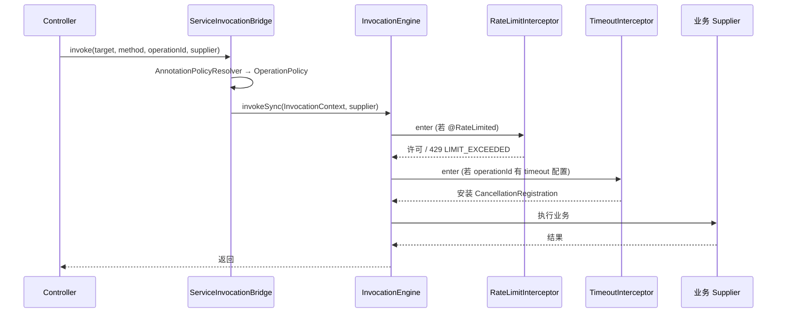

# innospots-nexus-service-governance

## 模块简介

治理**中立库**：限流、舱壁、熔断、超时拦截器，以及本地 Token Bucket / Semaphore / Resilience4j 等 Provider 实现。  
通过 **contract 注解**声明意图，通过 **`GovernanceConfig`** 定义策略数值，由 **`InvocationEngine` 拦截器链**执行。

---

## 框架无关 vs 框架相关：先看这张表

| 层级 | 是否框架无关 | 内容 |
|---|---|---|
| **契约注解** | 是 | `@RateLimited`、`@TimeoutProtected`、`@BulkheadProtected`、`@CircuitProtected` |
| **策略配置** | 是 | `GovernanceConfig`、`RateLimitPolicy`、`CircuitBreakerPolicy` … |
| **拦截器与 Provider** | 是 | `RateLimitInterceptor`、`TimeoutInterceptor`、`LocalTokenBucketProvider` … |
| **执行入口** | 是 | `InvocationEngine.invokeSync` / `invokeAsync` |
| **Adapter 桥接** | **否（API 相同）** | `ServiceInvocationBridge` — Spring 与 Quarkus **用法一致**，包名不同 |
| **Bean 注册位置** | **否** | Spring `ServiceCoreConfiguration` / Quarkus `ServiceRuntimeHolder` |

结论：

- **治理规则、注解语义、拦截器实现 — 完全框架无关**。
- **Spring 与 Quarkus 业务写法相同**：在方法上加注解 + 通过 `ServiceInvocationBridge.invoke(...)` 执行。
- **差异仅在 adapter 如何注册** `GovernanceConfig`、Provider、Interceptor 到 `ServiceRuntime`。
- **Spring**：默认通过 `GovernedInvocationAspect` 在 `@RestController` 上织入注解策略，**无需** `ServiceInvocationBridge`（见 [Spring 注解式治理](../../innospots-nexus-spring/innospots-nexus-spring-service/docs/governance-annotation-advice.md)）。
- **Quarkus / 非 Spring**：须在边界显式调用 `ServiceInvocationBridge`（或等价入口）进入 `InvocationEngine`。



---

## 如何使用（三步）

### 第 1 步：在方法上声明策略键（contract 注解）

注解的 `value()` 是**配置键名**，不是 `"10/min"` 或 `"5s"`：

```java
@RateLimited("promo.claim")           // ✓ 键名
@BulkheadProtected("report.export")   // ✓
@CircuitProtected("payment.client")   // ✓
@TimeoutProtected("payment.client")  // ✓ 键名（解析见下方说明）

@RateLimited("10 per minute")         // ✗ 错误
```

权限与治理可组合（须走 Bridge）：

```java
@GetMapping("/secure")
@RequiresPermission("adapter.secure")
public Map<String, String> secure() throws NoSuchMethodException {
    Method m = getClass().getMethod("secure");
    return bridge.invoke(this, m, "adapter.secure", () -> Map.of("status", "ok"));
}
```

### 第 2 步：在 `GovernanceConfig` 中定义策略数值

**Spring** — 覆盖 `serviceGovernanceConfig` Bean：

```java
@Bean
GovernanceConfig serviceGovernanceConfig() {
    return new GovernanceConfig(
            Map.of("promo.claim", new RateLimitPolicy(10, 1.0)),      // burst=10, 每秒补 1
            Map.of("report.export", new BulkheadPolicy(4)),           // 4 并发
            Map.of("payment.client", CircuitBreakerPolicy.defaults()),
            Map.of("payment.client", Duration.ofSeconds(5)),          // 超时键 → Duration
            100_000,
            Duration.ofMinutes(15),
            Duration.ofSeconds(30),    // defaultHttpTimeout
            Duration.ofMinutes(60),    // defaultStreamTimeout
            Duration.ofSeconds(30));   // defaultWebSocketTimeout
}
```

**Quarkus** — 当前默认配置在 `ServiceRuntimeHolder` 常量中；生产环境应 `@Produces` 自定义 `GovernanceConfig` 并重构 Holder 注入（或等价配置类）。

adapter-test 内置示例（两框架相同数值）：

```text
rateLimits:     adapter-rate-limit → burst=1, refill=1/s
timeouts:       adapter.governance.timeout → 200ms
```

### 第 3 步：经 `ServiceInvocationBridge` 执行

```java
@RestController
public class PromoResource {
    private final ServiceInvocationBridge bridge;

    @GetMapping("/promo/claim")
    @RateLimited("adapter-rate-limit")
    public Map<String, String> claim() throws NoSuchMethodException {
        Method method = PromoResource.class.getMethod("claim");
        return bridge.invoke(this, method, "adapter.governance.rate-limit", () -> Map.of("status", "ok"));
    }
}
```

`operationId` 字符串用于：

- 日志 / 指标 / 审计中的稳定操作名
- **`GovernanceConfig.timeouts()` 的查找键**（见超时一节）

**Spring 与 Quarkus 的 `invoke` 签名完全相同**，仅注入的 Bridge 类包名不同：

| 框架 | Bridge 类 |
|---|---|
| Spring | `com.innospots.nexus.spring.service.http.invocation.ServiceInvocationBridge` |
| Quarkus | `com.innospots.nexus.quarkus.service.invocation.ServiceInvocationBridge` |

---

## 各治理能力说明

### 限流 `@RateLimited`

| 项目 | 说明 |
|---|---|
| 默认 Provider | `LocalTokenBucketProvider`（**每 JVM**）；`store=redis` → `RedisTokenBucketRateLimitProvider` |
| 维度 | `RateLimitDimensions`（operation/principal/realm/tenant/customer 等，见 [rate-limit.md](docs/rate-limit.md)） |
| 拒绝 | HTTP **429**，带 `Retry-After` |
| 配置 | `GovernanceConfig.rateLimits()` → `RateLimitPolicy(burst, refillPerSecond)` |

本地 Token Bucket 算法见 [runtime §7.1](../../docs/service-runtime-design.md#71-限流)。

### 超时

两种方式（当前实现）：

| 方式 | 用法 | 现状 |
|---|---|---|
| **`operationId` 映射** | `bridge.invoke(..., "adapter.governance.timeout", ...)` + `timeouts` 表中同键 | ✅ adapter-test 使用 |
| **`@TimeoutProtected("key")`** | 注解键映射 `GovernanceConfig.timeouts()`（`OperationPolicy.timeoutPolicyKey`） | ✅ |

超时生效时安装 `CancellationRegistration`；业务应检查 `context.cancellation().isCancelled()`。  
有效超时 = `min(策略超时, context.deadline.remaining())`。拒绝映射 **504** / `DEADLINE_EXCEEDED`。

### 舱壁 `@BulkheadProtected`

| 项目 | 说明 |
|---|---|
| 实现 | `SemaphoreBulkheadProvider` + `BulkheadInterceptor` |
| 默认 | 无排队（tryAcquire 失败即 503） |
| Spring 默认装配 | ✅ `ServiceCoreConfiguration` 已注册 |
| Quarkus 默认装配 | ❌ 须自行 `addInterceptor` |

### 熔断 `@CircuitProtected`

| 项目 | 说明 |
|---|---|
| 实现 | `Resilience4jCircuitBreakerProvider` + `CircuitBreakerInterceptor` |
| 适用 | **下游 Client 调用**，不是给所有入站 HTTP 默认开启 |
| Quarkus 默认装配 | ❌ 须手动 `addInterceptor` |

---

## 拦截器链顺序（框架无关）

`ServiceRuntime` 内置 + adapter 追加（见 [runtime 设计 §2](../../docs/service-runtime-design.md)）：

```text
Control → Deadline → Authentication → Authorization → Audit → Idempotency
  → [RateLimit] → [Timeout] → [Bulkhead] → [Circuit]  ← governance 模块
```

Spring / Quarkus adapter **当前仅注册**：

- `RateLimitInterceptor`
- `TimeoutInterceptor`

---

## 配置项（`GovernanceConfig`）

| 字段 | 默认值 | 说明 |
|---|---|---|
| `rateLimits` | `{}` | 键 → `RateLimitPolicy` |
| `bulkheads` | `{}` | 键 → `BulkheadPolicy` |
| `circuits` | `{}` | 键 → `CircuitBreakerPolicy` |
| `timeouts` | `{}` | 键 → `Duration`（常与 operationId 或 `@TimeoutProtected` 键对应） |
| `maxRateLimitKeys` | `100000` | **仅本地**桶 Map 上限（Redis 路径靠 `bucket-ttl-seconds`） |
| `rateLimitIdleTtl` | `15m` | 闲置桶淘汰 |
| `defaultHttpTimeout` | `30s` | HTTP 请求 deadline 默认上限 |
| `defaultStreamTimeout` | `60m` | 流会话默认上限 |
| `defaultWebSocketTimeout` | `30s` | WS 单消息处理默认上限 |

YAML 契约：`service.governance.*`（见 [adapter 设计 §7](../../docs/service-adapter-design.md#7-配置契约)）。

### 启用 / 关闭

| 动作 | 方式 |
|---|---|
| 关闭整个框架 | `service.enabled: false` |
| 关闭治理（设计） | `service.governance.enabled: false` |
| 有 `@RateLimited` 等注解但关闭治理 | **启动失败**（设计约束：不能静默忽略注解） |
| 替换限流后端 | `store=redis` 或实现 `RateLimitProvider` 并注册 Bean |

---

## Spring vs Quarkus 对照

| 项目 | Spring | Quarkus |
|---|---|---|
| Bridge | `@Component ServiceInvocationBridge` | `@ApplicationScoped ServiceInvocationBridge` |
| Runtime 启动 | `ServiceCoreConfiguration.serviceRuntime()` `@Bean` | `ServiceRuntimeHolder.@PostConstruct` |
| 默认 GovernanceConfig | `ServiceCoreConfiguration` Bean | `ServiceRuntimeHolder` 常量 |
| 超时 armer | `DeadlineOperationTimeoutArmer` + `ServiceRequestLifecycleAccessor` | 同名 Quarkus 包实现 |
| 业务注解与 invoke 写法 | **相同** | **相同** |
| 429 / 504 错误映射 | `HttpErrorMapper`（共享 http 模块） | **相同** |

---

## 包结构

```text
com.innospots.nexus.service.governance
├── ratelimit          # RateLimitInterceptor、LocalTokenBucketProvider
├── bulkhead           # BulkheadInterceptor、SemaphoreBulkheadProvider
├── circuit            # CircuitBreakerInterceptor、Resilience4jCircuitBreakerProvider
├── timeout            # TimeoutInterceptor、OperationTimeoutArmer
└── config             # GovernanceConfig、RateLimitPolicy、CircuitBreakerPolicy …
```

## Maven 依赖

```xml
<dependency>
    <groupId>com.innospots</groupId>
    <artifactId>innospots-nexus-service-governance</artifactId>
</dependency>
```

---

## 常见误区

| 误区 | 事实 |
|---|---|
| 贴了 `@RateLimited` Controller 就会自动限流 | **Spring 默认会**（`GovernedInvocationAspect`）；Quarkus 等仍须 Bridge |
| Spring AOP `@Aspect` 与 Quarkus 拦截器写法不同所以治理不同 | **治理逻辑相同**；只是入口 Bridge 的 DI 方式不同 |
| 注解里写 `"100/min"` | 只允许**策略键**；数值在 `GovernanceConfig` |
| 本地限流 = 集群限流 | `LocalTokenBucketProvider` 仅 **单 JVM**；多副本 QPS 相加 |
| 熔断默认保护所有 REST 接口 | 仅应对**命名下游**；默认不全局开启 |
| Domain 层加 `@RateLimited` | **禁止** — 放在 Application Service / Client 边界 |

---

## 测试参考

adapter-test 场景（Spring MVC/WebFlux + Quarkus 同源）：

| 场景 | 验证 |
|---|---|
| `GovernanceRateLimitScenario` | 第二次请求 **429** + `Retry-After` |
| `GovernanceTimeoutScenario` | 超时 **504** + `DEADLINE_EXCEEDED` |
| `HttpSecurityScenario` | `@RequiresPermission` + Bridge + `PermissionProvider` |

---

## 相关文档

- [治理实现设计（限流 / 舱壁 / 熔断 / 超时）](docs/README.md)
- [Contract · 治理 SPI](../../docs/service-contract-design.md#10-治理-spi)
- [Runtime · 本地治理 §7](../../docs/service-runtime-design.md#7-本地治理)
- [开发者体验 · 治理使用面](../../docs/service-developer-experience-design.md#8-观测与治理使用面)
- [Observability README](../innospots-nexus-service-observability/README.md)
- [Spring adapter · 治理](../../innospots-nexus-spring/innospots-nexus-spring-service/README.md#治理)
- [adapter-test · 治理场景](../innospots-nexus-service-adapter-test/README.md)
