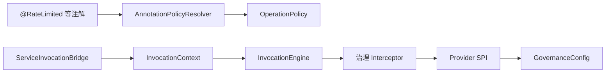

# innospots-nexus-service-governance 设计文档

本目录描述治理中立库四类能力的**设计、实现与调用链路**。实现代码位于 `src/main/java/com/innospots/nexus/service/governance/`。

| 文档 | 能力 | 拦截器 id | 默认 order |
|------|------|-----------|------------|
| [rate-limit.md](rate-limit.md) | 限流 | `governance.ratelimit` | 60 |
| [bulkhead.md](bulkhead.md) | 舱壁 | `governance.bulkhead` | 70 |
| [circuit-breaker.md](circuit-breaker.md) | 熔断 | `governance.circuit` | 80 |
| [timeout.md](timeout.md) | 超时 | `governance.timeout` | 15 |
| [websocket-governance.md](websocket-governance.md) | WebSocket 入站 | 同上（经 `MessageDescriptor`） | 与 HTTP 相同 |

## 共性架构

治理不依赖 Spring / Quarkus / Servlet，通过 **contract 注解声明意图**、**`GovernanceConfig` 承载数值**、**`ServiceInterceptor` 在 `InvocationEngine` 链上执行**。

- 注解 `value()` 是**策略键名**，不是 `"10/min"` 或 `"5s"`。
- 仅在 Controller 上贴注解**不会生效**；须经 `ServiceInvocationBridge.invoke(...)` 或 AOP 进入 `InvocationEngine`。
- WebSocket 入站经 `MessageDescriptor` 治理键 + `WebSocketInboundMessageHandler`（见 [websocket-governance.md](websocket-governance.md)）。
- Spring / Quarkus adapter **默认注册**限流与超时拦截器；舱壁与熔断须自行 `addInterceptor` 并注册 Provider Bean。

上级设计参考：[service-runtime-design.md §7](../../docs/service-runtime-design.md#7-本地治理)、[模块 README](../README.md)。

**Spring 注解入口**（无需 `ServiceInvocationBridge`）：[governance-annotation-advice.md](../../../innospots-nexus-spring/innospots-nexus-spring-service/docs/governance-annotation-advice.md)。
