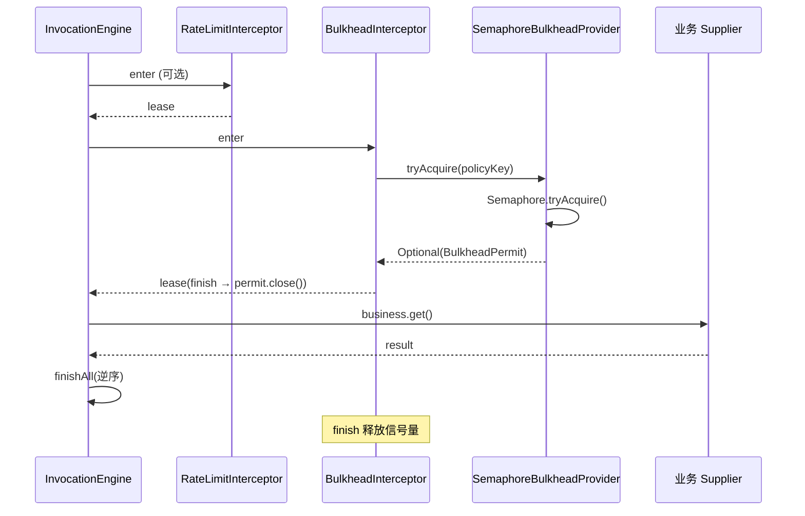
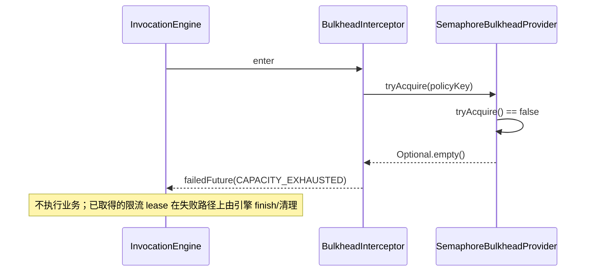

# 舱壁（Bulkhead）

## 1. 目标与边界

限制**同一策略键**下的最大并发执行数，防止慢调用或资源耗尽拖垮整个进程。默认实现为**无排队**：许可不可用时立即失败，不阻塞等待。

典型用途：报表导出、重型计算、占用连接池的下游调用等，在 Application Service 或 Client 边界通过 `@BulkheadProtected` + Bridge 声明。

**与限流区别**：限流控制**速率**（令牌/秒）；舱壁控制**同时进行的调用数**（信号量）。

## 2. 组件分层

| 层级 | 类型 | 类 / 接口 |
|------|------|-----------|
| 声明 | 注解 | `contract.policy.annotation.BulkheadProtected` |
| 策略解析 | runtime | `AnnotationPolicyResolver` → `OperationPolicy.bulkheadKey()` |
| 配置 | governance.config | `GovernanceConfig.bulkheads()` → `BulkheadPolicy(maxConcurrent)` |
| SPI | contract.governance | `BulkheadProvider`、`BulkheadPermit`（`AutoCloseable` 语义 via `close()`) |
| 默认实现 | governance.bulkhead | `SemaphoreBulkheadProvider` |
| 拦截 | governance.bulkhead | `BulkheadInterceptor`（id `governance.bulkhead`，order **70**） |

## 3. SemaphoreBulkheadProvider 行为

1. 根据 `policyKey` 从 `config.bulkheads()` 读取 `BulkheadPolicy`；缺失 → `CONFIG_ERROR`。
2. `ConcurrentHashMap<String, Semaphore>` 按策略键懒创建 `Semaphore(maxConcurrent)`。
3. `tryAcquire()`：**非阻塞**；失败返回 `Optional.empty()`。
4. 成功时返回 `BulkheadPermit`：`close()` 使用 `AtomicBoolean` 保证**幂等** `release()`。

**当前未实现**：等待队列、公平性、按 tenant 分池、跨 JVM 协调（均为可替换 Provider 的扩展点）。

## 4. BulkheadInterceptor 与 InvocationLease

`enter` 阶段：

- `bulkheadKey == null` → 透传空 lease。
- `tryAcquire` 失败 → `failedFuture(CAPACITY_EXHAUSTED)`（`ServiceStatusCode`，HTTP **503**）。
- 成功 → lease 的 `finish(outcome)` 在调用结束时**逆序**执行，调用 `permit.close()` 释放信号量。

与 runtime 终态模型一致：普通 operation 的 permit 应在 `workTermination` 时释放；若业务不协作导致任务孤儿化，许可可能延迟释放（见 [service-runtime-design.md §1](../../docs/service-runtime-design.md)）。

## 5. 失败分类

| 场景 | 状态码 | 熔断是否计失败 |
|------|--------|----------------|
| 舱壁满 | `CAPACITY_EXHAUSTED` | **否**（`shouldRecordFailure` 排除） |
| 策略未配置 | `CONFIG_ERROR` | 视 outcome 类型 |

`InvocationEngine` 将 `CAPACITY_EXHAUSTED` 映射为 `OutcomeType.FAILED`（非 `REJECTED`），与限流 `REJECTED` 区分。

## 6. 装配说明

类已实现，但 **Spring / Quarkus 默认 `ServiceRuntime` 未注册** `BulkheadInterceptor`。启用步骤（框架无关逻辑，adapter 负责 Bean）：

1. 在 `GovernanceConfig.bulkheads()` 中定义策略键与 `maxConcurrent`。
2. 创建 `SemaphoreBulkheadProvider`（或自定义 `BulkheadProvider`）。
3. 创建 `BulkheadInterceptor` 并 `ServiceRuntime.builder().addInterceptor(...)`，order 须为 **70**，id 须为 `governance.bulkhead`（与 `InterceptorIds` 一致）。

链顺序：限流(60) → **舱壁(70)** → 熔断(80) → 业务调度。舱壁满时不会进入熔断 acquire。

## 7. 关键调用链路

### 7.1 获取许可并执行业务



### 7.2 舱壁已满（503）



### 7.3 与熔断的协作

舱壁拒绝不计入断路器失败率；仅实际执行且以 `FAILED` / `TIMED_OUT` 结束的下游调用才会 `onError` 计入 Resilience4j 窗口。

## 8. 配置与用法示例

```java
GovernanceConfig config = new GovernanceConfig(
    Map.of(),
    Map.of("report.export", new BulkheadPolicy(4)),
    Map.of(),
    Map.of(),
    ...
);
```

```java
@BulkheadProtected("report.export")
public void export() {
    bridge.invoke(this, method, "report.export", () -> { ... });
}
```

## 9. 测试参考

- `SemaphoreBulkheadProviderTest`：并发上限与 `close` 幂等。
