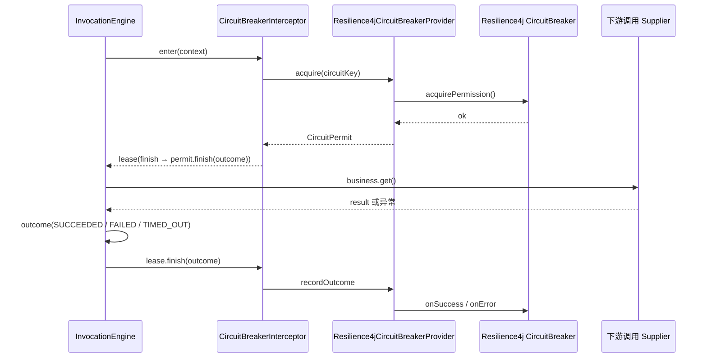
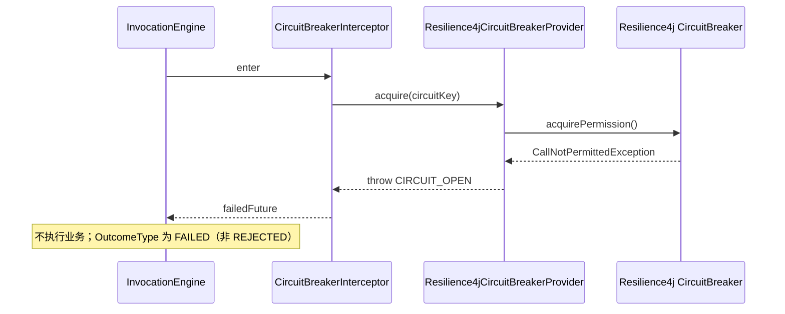
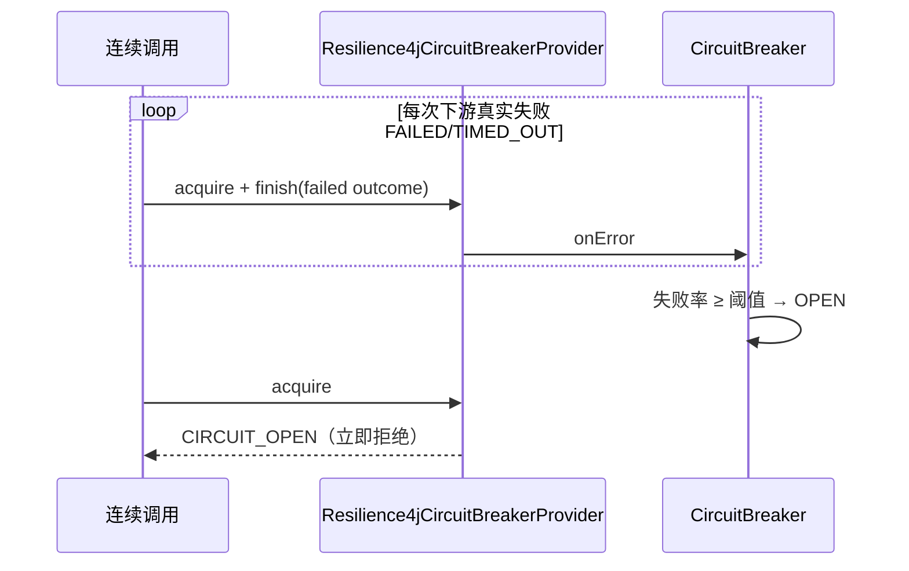

# 熔断（Circuit Breaker）

## 1. 目标与边界

对**命名下游**（稳定 `circuitKey`）在持续失败或慢调用比例过高时打开断路器，快速失败以保护调用方与下游。适用于 Client 边界、支付网关、外部 API 等，**不**默认保护所有入站 HTTP。

实现基于 **Resilience4j CircuitBreaker**（仅 core 库，无 Spring Boot starter），通过 `CircuitBreakerProvider` SPI 与 `CircuitBreakerInterceptor` 接入 `InvocationEngine`。

## 2. 组件分层

| 层级 | 类型 | 类 / 接口 |
|------|------|-----------|
| 声明 | 注解 | `contract.policy.annotation.CircuitProtected` |
| 策略解析 | runtime | `AnnotationPolicyResolver` → `OperationPolicy.circuitKey()` |
| 配置 | governance.config | `GovernanceConfig.circuits()` → `CircuitBreakerPolicy` |
| SPI | contract.governance | `CircuitBreakerProvider`、`CircuitPermit` |
| 默认实现 | governance.circuit | `Resilience4jCircuitBreakerProvider` |
| 拦截 | governance.circuit | `CircuitBreakerInterceptor`（id `governance.circuit`，order **80**） |

`CircuitBreakerPolicy` 字段与 Resilience4j 配置一一映射：

| 字段 | 含义 | 默认值（`defaults()`） |
|------|------|------------------------|
| `slidingWindowSize` | 滑动窗口采样数 | 100 |
| `minimumNumberOfCalls` | 达到后才计算比率 | 20 |
| `failureRateThreshold` | 失败率 % | 50 |
| `slowCallRateThreshold` | 慢调用率 % | 50 |
| `slowCallDurationThreshold` | 慢调用阈值 | 2s |
| `waitDurationInOpenState` | OPEN 持续时间 | 30s |
| `permittedNumberOfCallsInHalfOpenState` | 半开试探次数 | 5 |

## 3. 生命周期（Resilience4j）

每个 `policyKey` 对应单例 `CircuitBreaker`（`ConcurrentHashMap` 懒创建）。状态机：**CLOSED → OPEN → HALF_OPEN → CLOSED**（或再次 OPEN）。

- **enter**：`breaker.acquirePermission()`；若 `CallNotPermittedException` → `NexusException(CIRCUIT_OPEN)`，HTTP **503**，`ServiceStatusCode` `SRV060005`。
- **exit**：`InvocationEngine.finishAll` 逆序调用 lease → `CircuitPermit.finish(InvocationOutcome)` → `recordOutcome`。

`recordOutcome` 逻辑（`Resilience4jCircuitBreakerProvider`）：

- 成功：`outcome.type == SUCCEEDED` → `breaker.onSuccess(duration)`。
- 失败：`shouldRecordFailure(outcome)` 为 true → `breaker.onError(duration, CircuitFailure)`。
- 不计失败（不调用 `onError`）：
  - `CANCELLED`、`REJECTED`
  - `SUCCEEDED`
  - 错误码为 `NO_PERMISSION`、`LIMIT_EXCEEDED`、`CAPACITY_EXHAUSTED`
- 计入失败：`FAILED` 或 `TIMED_OUT`（且非上述排除码）。

慢调用统计使用 `InvocationOutcome.duration()`（引擎在 `finishAll` 时按 `Instant` 计算），与「仅返回 CompletionStage 尚未完成」的墙钟时间无关。

OPEN → HALF_OPEN 的探测由**后续调用**驱动（Resilience4j 标准语义），非后台定时单独探测线程（取决于 Resilience4j 内部调度）。

## 4. CircuitBreakerInterceptor

与舱壁不同，熔断在 **enter** 阶段同步 `acquire`（可能抛 `CIRCUIT_OPEN`）。成功则返回 lease，在 `finish` 时将 **完整** `InvocationOutcome` 交给 Provider。

若 enter 失败，引擎不执行业务，且**不会**取得熔断 permit（无 finish 回调）。

## 5. 装配说明

与舱壁相同：**默认 adapter 未注册**。启用：

1. `GovernanceConfig.circuits()` 配置各 `circuitKey`。
2. `new Resilience4jCircuitBreakerProvider(config)`。
3. `new CircuitBreakerInterceptor(provider)` 且 `addInterceptor`，order **80**。

建议：`circuitKey` 与下游系统名稳定绑定，**禁止**按 `requestId` 建实例。

## 6. 关键调用链路

### 6.1 CLOSED：许可通过并记录结果



### 6.2 OPEN：快速拒绝



### 6.3 失败累积导致 OPEN（概念序列）



## 7. 配置示例

```java
Map.of(
    "payment.client",
    CircuitBreakerPolicy.defaults()
);

@CircuitProtected("payment.client")
public PaymentResult charge() {
    return bridge.invoke(this, method, "payment.client.charge", () -> client.charge(...));
}
```

`operationId` 可与 `circuitKey` 不同：熔断键来自注解；`operationId` 用于指标、超时表、审计等。

## 8. 观测

设计指标：`service.circuit.state`（gauge，label `circuitKey`、`state`）、`service.governance.rejects`（含断路打开原因）。Provider 暴露 `state(policyKey)` 便于测试与健康检查集成。

## 9. 测试参考

- `Resilience4jCircuitBreakerProviderTest`：排除权限/限流失败；小窗口下两次下游失败触发 `CIRCUIT_OPEN`。
