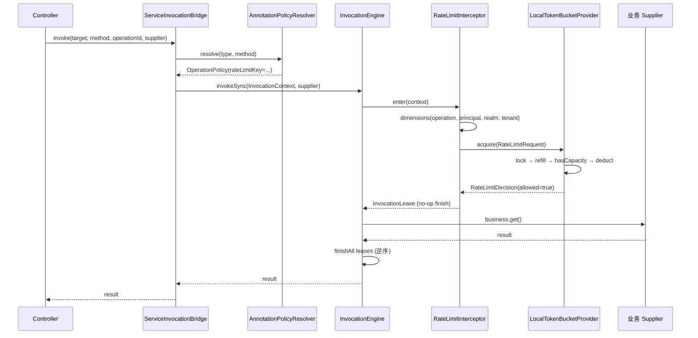
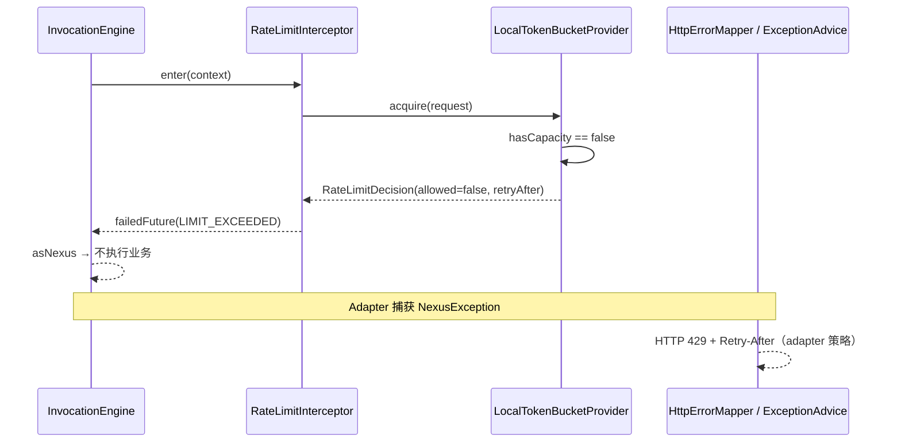

# 限流（Rate Limit）

## 1. 目标与边界

对进入 `InvocationEngine` 的调用按**策略键 + 多维度身份**做非阻塞令牌桶限流。拒绝时不等待、不占用业务线程；通过 `LIMIT_EXCEEDED`（HTTP 429 / WS error envelope）告知客户端。

**存储后端：**

| 模式 | 配置 | 实现 | 适用 |
|------|------|------|------|
| 本地（默认） | `service.governance.rate-limit.store=local` | `LocalTokenBucketProvider` | 单 JVM、开发/压测 |
| Redis 集群 | `service.governance.rate-limit.store=redis` | `RedisTokenBucketRateLimitProvider`（模块 `innospots-nexus-service-governance-redis`） | 多副本、跨服务共享配额 |

**明确不做：**

- 在授权之前以外的 transport 粗限（IP 握手限流属于 adapter 前置层，见 runtime 设计）。
- 阻塞等待令牌（不排队、不降速，仅快失败）。

## 2. 组件分层

| 层级 | 类型 | 类 / 接口 |
|------|------|-----------|
| 声明 | 注解 | `contract.policy.annotation.RateLimited` |
| 策略解析 | runtime | `AnnotationPolicyResolver` → `OperationPolicy.rateLimitKey()` |
| 配置 | governance.config | `GovernanceConfig.rateLimits()` → `RateLimitPolicy(burst, refillPerSecond)` |
| SPI | contract.governance | `RateLimitProvider`、`RateLimitRequest`、`RateLimitDecision` |
| 本地实现 | governance.ratelimit | `LocalTokenBucketProvider` |
| Redis 实现 | governance-redis.ratelimit | `RedisTokenBucketRateLimitProvider` + Lettuce |
| 维度解析 | governance.ratelimit | `RateLimitDimensions` |
| 拦截 | governance.ratelimit | `RateLimitInterceptor`（id `governance.ratelimit`，order **60**） |

`RateLimitPolicy` 语义：

- `burst`：桶容量（初始满桶）。
- `refillPerSecond`：按单调时钟每秒补充令牌，补充后不超过 `burst`。
- `dimensionMode`：`COMPOSITE`（默认，多维度 AND）或 `CUSTOMER`（仅 `customer:{id}` 桶，见下）。

## 3. 维度与复合扣减

`RateLimitInterceptor` 为每次调用构造 `RateLimitRequest`（经 `RateLimitDimensions.resolve`）：

- `policyKey`：来自 `invocation.policy().rateLimitKey()`（注解键或 WS `MessageDescriptor`）。
- `cost`：固定为 `1`。
- `dimensions`（`COMPOSITE` 模式，顺序稳定）：
  - `operation:{operationId}`
  - `principal:{security.id}`
  - `realm:{security.realm}`
  - `tenant:{tenantId}`（仅当 scope 中 tenant 非 null）
  - `customer:{customerId}`（当 `ServicePrincipal.attributes` 含 `PrincipalAttributeKeys.CUSTOMER_ID`）

`CUSTOMER` 模式：仅使用 `customer:{id}` 维度；无客户 id 时 dimensions 为空（仅 `policyKey` 单桶）。适用于「按客户总 QPS」策略。

`LocalTokenBucketProvider` 将每个维度映射为独立桶键：`{policyKey}|{dimension}`。若 dimensions 为空，则仅使用 `policyKey` 单桶。

**复合语义（AND）**：对所有相关桶先 `refill`，再检查**每一个**桶是否都有足够 `cost`；任一不足则**整次请求拒绝且不扣减**任何桶。扣减时在同一锁内对所有桶同时减去 `cost`。

锁粒度：对本次涉及桶键做字典序拼接后 `intern()`，避免多桶死锁并与稳定排序一致。

## 4. 令牌桶算法（进程内）

对每个 `BucketState`：

1. 使用 `Ticker.readNanos()` 单调时间。
2. `elapsed = now - lastRefillNanos`，`added = elapsed_seconds * refillPerSecond`，`tokens = min(burst, tokens + added)`。
3. 拒绝时 `retryAfter` = 各不足桶所需等待时间的**最大值**（按 deficit / refillPerSecond 估算纳秒）。

容量保护：

- `GovernanceConfig.maxRateLimitKeys`（默认 100_000）：新建桶前若将超限，先按 `rateLimitIdleTtl`（默认 15m）淘汰闲置桶；仍满则 `CAPACITY_EXHAUSTED`（`ServiceStatusCode`），非 429。
- 策略键在 `rateLimits` 中不存在 → `CONFIG_ERROR`。

## 5. 失败与 HTTP 映射

| 场景 | 状态码 | OutcomeType（引擎） |
|------|--------|---------------------|
| 令牌不足 | `NexusStatusCode.LIMIT_EXCEEDED` | `REJECTED` |
| 策略未配置 | `CONFIG_ERROR` | `FAILED` |
| 桶 Map 满且无法淘汰 | `CAPACITY_EXHAUSTED` | `FAILED` |

`RateLimitDecision.retryAfter` 由 Provider 计算；当前 `RateLimitInterceptor` 拒绝时仅抛出 `LIMIT_EXCEEDED`，**未**把 `retryAfter` 写入异常。Adapter 层（如 Spring `ServiceExceptionAdvice`）对 429 目前使用固定 `Retry-After: 1` 秒；精确 retryAfter 需后续在异常上下文或拦截器层传递决策值。

熔断模块在统计失败时会**排除** `LIMIT_EXCEEDED`，避免限流拒绝误打开断路器。

## 6. 装配与扩展

**Spring**（`ServiceCoreConfiguration`）：注册 `LocalTokenBucketProvider`、`RateLimitInterceptor`，并 `addInterceptor` 到 `ServiceRuntime`。

替换后端：实现 `RateLimitProvider`，保持 `acquire` 非阻塞；在 adapter 用自定义 Bean 替换默认 Provider 即可，拦截器不变。

## 7. 关键调用链路

### 7.1 成功路径（令牌充足）



### 7.2 拒绝路径（429）



### 7.3 与全链顺序的关系

限流位于幂等（50）之后、舱壁（70）之前。被拒绝时**不会**获取舱壁许可或熔断许可，符合 runtime 设计「429 不取 bulkhead」。

## 8. 配置示例

```java
new GovernanceConfig(
    Map.of("promo.claim", new RateLimitPolicy(10, 1.0)), // burst=10, 每秒补 1
    Map.of(),
    Map.of(),
    Map.of(),
    100_000,
    Duration.ofMinutes(15),
    /* defaultHttp/Stream/WebSocket timeouts */
    ...
);
```

方法声明：

```java
@RateLimited("promo.claim")
public Response claim() {
    return bridge.invoke(this, method, "promo.claim", () -> { ... });
}
```

## 9. Redis 集群限流（Spring）

```yaml
service:
  governance:
    rate-limit:
      store: redis
      redis:
        uri: redis://127.0.0.1:6379/0
        key-prefix: "nexus:ratelimit:"
        bucket-ttl-seconds: 86400
```

- Bean：`ServiceGovernanceRateLimitRedisConfiguration`（`store=redis` 时注册 `RedisTokenBucketRateLimitProvider`）。
- Redis 键：`{keyPrefix}{policyKey|dimension}`，Hash 字段 `tokens`、`ts`；Lua 脚本保证多桶 AND 原子性。
- 时间基准：`ts` 与脚本 `now` 使用 **墙钟毫秒**（`System.currentTimeMillis()`），多 JVM 可共享同一桶状态。
- 键数量：`maxRateLimitKeys` / `rateLimitIdleTtl` **不适用** Redis 路径；靠 `bucket-ttl-seconds` 过期 Hash。
- 故障策略：Lettuce/脚本失败 → `NexusStatusCode.SYSTEM_ERROR`（失败关闭，不 fail-open）。
- `retryAfter`：拒绝时为 `cost/refillPerSecond` 粗估，精度低于本地多桶取 max。
- WebSocket / HTTP 共用同一 Provider；客户维度在认证层写入 `customerId` 后即可跨节点累计。

按客户限流策略示例：

```java
Map.of(
    "ws.customer",
    new RateLimitPolicy(100, 10.0, RateLimitDimensionMode.CUSTOMER));
```

## 10. 测试参考

- `LocalTokenBucketProviderTest`：复合扣减、键上限、`retryAfter`。
- `RateLimitDimensionsTest`：客户维度与 `CUSTOMER` 模式。
- `RedisTokenBucketRateLimitProviderTest`：Redis 语义（内存模拟）。
- `GovernanceRateLimitScenario`（adapter-test）：HTTP 连续第二次 429。
- `WebSocketGovernanceRateLimitScenario`（adapter-test）：WS 第二条 `LIMIT_EXCEEDED` error envelope。
