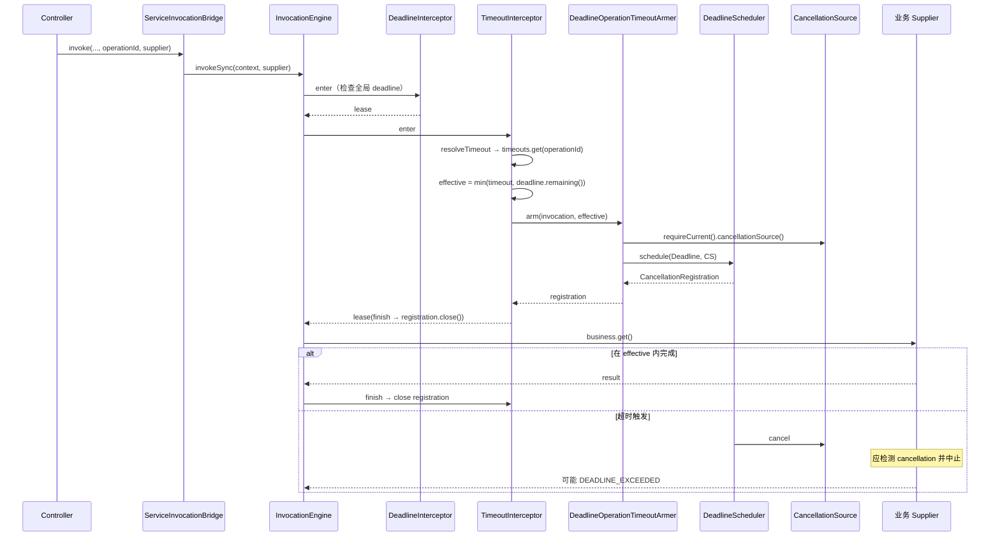
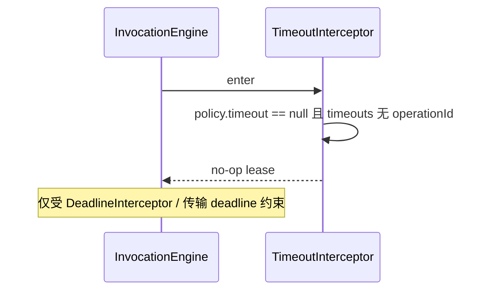

# 超时（Timeout）

## 1. 目标与边界

为单次 `InvocationEngine` 调用安装**操作级超时**，并与请求级 **deadline** 取最小值，到期时通过取消源通知业务协作退出。与容器「读 body 超时」分离：执行超时映射 **504** / `DEADLINE_EXCEEDED`（`ServiceStatusCode`）。

超时模块分两层：

- **框架无关**：`TimeoutInterceptor` + `GovernanceConfig.timeouts()` + `OperationTimeoutArmer` 接口。
- **框架相关**：`DeadlineOperationTimeoutArmer`（Spring / Quarkus 各一份）把超时绑定到请求级 `CancellationSource` 与 `DeadlineScheduler`。

## 2. 组件分层

| 层级 | 类型 | 类 / 接口 |
|------|------|-----------|
| 声明（预留） | 注解 | `@TimeoutProtected`（contract 已定义；`AnnotationPolicyResolver` **尚未**解析到 `OperationPolicy.timeout()`） |
| 配置 | governance.config | `GovernanceConfig.timeouts()`：`Map<String, Duration>` |
| 拦截 | governance.timeout | `TimeoutInterceptor`（id `governance.timeout`，order **15**） |
| 安装取消 | governance.timeout | `OperationTimeoutArmer` |
| Adapter | spring/quarkus | `DeadlineOperationTimeoutArmer` |

**注意 order**：`TimeoutInterceptor` 的 order 为 **15**，位于 `DeadlineInterceptor`(10) 之后、认证(20) 之前；与限流(60) 不同，超时在**安全拦截器之前**安装，以便长认证链仍受操作超时约束（若配置了超时）。

## 3. 超时解析优先级

`TimeoutInterceptor.resolveTimeout`：

1. 若 `invocation.policy().timeout() != null` → 使用固定 `Duration`。
2. 否则 `config.timeouts().get(invocation.policy().timeoutPolicyKey())`（来自 `@TimeoutProtected`）。
3. 否则 `config.timeouts().get(invocation.operationId())`（常与 `@ServiceOperation` 一致）。

adapter-test 示例：`operationId = "adapter.governance.timeout"` 且 `timeouts` 表同键 `200ms`。

若解析结果为 `null`，拦截器透传，不安装额外取消。

## 4. 有效超时与 deadline

```text
effectiveTimeout = min(policyOrConfigTimeout, context.service().deadline().remaining())
```

- `effective` 为零或负 → 立即 `failedFuture(DEADLINE_EXCEEDED)`，不执行业务。
- 否则 `armer.arm(invocation, effective)` 返回 `CancellationRegistration`。
- lease 的 `finish` 在任何 outcome 下 `registration.close()`，撤销定时任务。

默认 deadline 上限（未单独配置时由 adapter 设置）见 `GovernanceConfig`：`defaultHttpTimeout` 30s、`defaultStreamTimeout` 60m、`defaultWebSocketTimeout` 30s。

业务应周期性检查 `context.cancellation().isCancelled()` 或可取消 I/O；引擎**不**假设 `Future.cancel(true)` 能停止所有阻塞调用。

## 5. DeadlineOperationTimeoutArmer（Adapter）

```java
CancellationSource cancellationSource = lifecycleAccessor.requireCurrent().cancellationSource();
Deadline deadline = Deadline.of(Ticker.system(), timeout);
return scheduler.schedule(deadline, cancellationSource);
```

- 从当前 HTTP 请求生命周期取得 `CancellationSource`。
- `DeadlineScheduler` 在超时到达时向该源发送取消（原因由 runtime cancellation 模块定义，如 `CancellationReason`）。

与 `DeadlineInterceptor` 关系：deadline 收紧剩余时间；操作超时是**更细粒度**的命名策略，二者取 min 防止操作超时超过传输 deadline。

## 6. 失败与 Outcome 映射

| 场景 | 状态码 | InvocationEngine OutcomeType |
|------|--------|------------------------------|
| 已超时 / 无剩余 deadline | `DEADLINE_EXCEEDED` | `TIMED_OUT` |
| 业务因取消退出 | `OPERATION_CANCELLED` 等 | `CANCELLED` |

熔断将 `TIMED_OUT` 计为失败；`CANCELLED` 不计入。

## 7. 关键调用链路

### 7.1 配置 operationId 超时并执行



### 7.2 无配置超时（透传）



### 7.3 与限流、舱壁、熔断的顺序

全链片段（仅治理相关）：

```text
order 10  DeadlineInterceptor
order 15  TimeoutInterceptor（安装操作取消）
...
order 60  RateLimitInterceptor
order 70  BulkheadInterceptor
order 80  CircuitBreakerInterceptor
→ 业务执行
```

超时定时器在认证前启动；若认证耗时过长，可能在校验权限前触发取消（当 effective 很小且认证阻塞时）。生产环境应保证认证路径轻量，或把操作超时键仅用于已通过 transport 准入的 Bridge 调用。

## 8. 配置示例

```java
@Bean
GovernanceConfig serviceGovernanceConfig() {
    return new GovernanceConfig(
            Map.of(),
            Map.of(),
            Map.of(),
            Map.of("adapter.governance.timeout", Duration.ofMillis(200)),
            100_000,
            Duration.ofMinutes(15),
            Duration.ofSeconds(30),
            Duration.ofMinutes(60),
            Duration.ofSeconds(30));
}
```

```java
public Map<String, String> slow() throws NoSuchMethodException {
    Method method = getClass().getMethod("slow");
    return bridge.invoke(this, method, "adapter.governance.timeout", () -> {
        Thread.sleep(500); // 超过 200ms → 504
        return Map.of("status", "ok");
    });
}
```

## 9. 测试参考

- `GovernanceTimeoutScenario`（adapter-test）：超时响应 **504** + `DEADLINE_EXCEEDED`。

## 10. 后续演进

- `AnnotationPolicyResolver` 解析 `@TimeoutProtected("key")` → `OperationPolicy.timeout()` 从 `timeouts` 表取 `Duration`。
- 将 `retryAfter` / 精确限流决策等上下文经 `NexusException` 或 `ServiceContext` 属性传递到 HTTP 层（与限流文档所述改进一致）。
