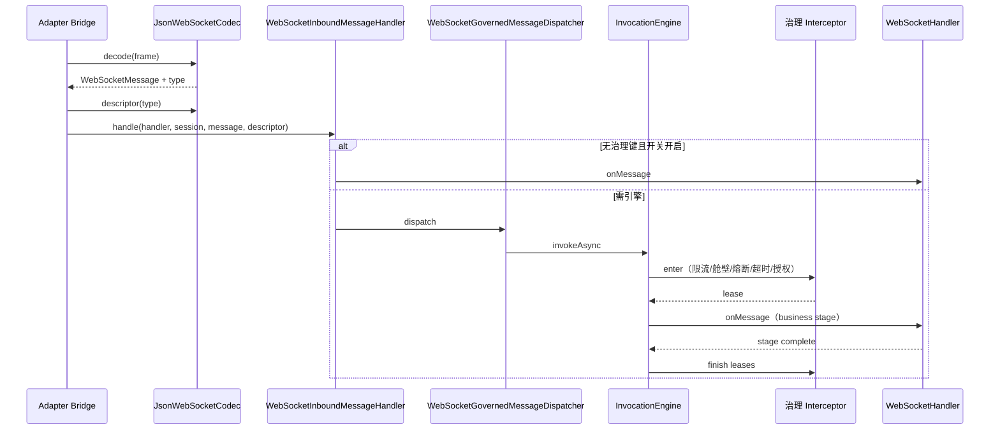

# WebSocket 入站治理

## 1. 目标与边界

对 **已解码的入站 WebSocket 消息** 接入与 HTTP 相同的 `InvocationEngine` 拦截链：限流、舱壁、熔断、超时，以及（当描述符声明权限时）授权拦截器。

**与 HTTP 的差异：**

| 项 | HTTP | WebSocket |
|----|------|-----------|
| 声明方式 | Controller 方法上的 `@RateLimited` 等 | `MessageDescriptor` 上的策略键字段 |
| 操作 id | `ServiceOperationIdResolver` | `ws.message.{type}`（见 `WebSocketOperationIds`） |
| 派发 API | `GovernedInvocationExecutor` / AOP | `WebSocketInboundMessageHandler` + `invokeAsync` |
| 拒绝形态 | HTTP 429/503 | JSON **error envelope**（桥接器发送），默认不关连接 |

**明确不做：**

- 在 `onMessage` 内对下游 Client 的自动熔断（须在出站调用处单独经引擎或 Client 注解）。

**跨节点限流**：与 HTTP 相同，由 `service.governance.rate-limit.store` 选择本地或 Redis Provider（见下文 §2）；默认仍为每 JVM `LocalTokenBucketProvider`。

设计对齐：[service-runtime-design.md §5.1](../../docs/service-runtime-design.md)。

## 2. 组件分层

| 层级 | 模块 | 类 |
|------|------|-----|
| 声明 | `service-websocket` | `MessageDescriptor.rateLimitKey` / `bulkheadKey` / `circuitKey` / `timeoutPolicyKey` |
| 策略物化 | `service-websocket` | `WebSocketMessagePolicies.fromDescriptor` |
| 操作 id | `service-websocket` | `WebSocketOperationIds.forMessageType` |
| 引擎派发 | `service-websocket` | `WebSocketGovernedMessageDispatcher` |
| 桥接入口 | `service-websocket` | `WebSocketInboundMessageHandler` |
| 配置开关 | `service-websocket` | `WebSocketRuntimeConfig.inboundGovernanceEnabled`（默认 `true`） |
| Adapter | Spring / Quarkus | `SpringWebSocketEndpointBridge` 等在 decode 后调用 `WebSocketInboundMessageHandler` |

数值仍来自 `GovernanceConfig` 表（与 [rate-limit.md](rate-limit.md) 等一致）。

**跨节点限流**：配置 `service.governance.rate-limit.store=redis` 后，WS 与 HTTP 共享 Redis 令牌桶。认证层在 `ServicePrincipal.attributes` 写入
`PrincipalAttributeKeys.CUSTOMER_ID` 时，复合维度包含 `customer:{id}`；若策略 `dimensionMode=CUSTOMER`，则按客户总 QPS 限流。

## 3. 何时进入 InvocationEngine

`WebSocketMessagePolicies.usesInvocationEngine(descriptor)` 在以下任一为真时返回 `true`：

- `permissionKeys` 非空
- `rateLimitKey` / `bulkheadKey` / `circuitKey` / `timeoutPolicyKey` 非空

否则桥接器 **直接** 调用 `WebSocketHandler.onMessage`，避免无策略消息的开销。

若需关闭入站**限流/舱壁/熔断/超时**（调试或压测），将 `WebSocketRuntimeConfig.inboundGovernanceEnabled` 设为 `false`。
声明了 `permissionKeys` 的消息**仍**经 `InvocationEngine` 做授权。

`resourceResolverKey` 为保留字段，当前固定 `ResourceRef("websocket.message", type, scope)`（见 `service-future-work.md` §3）。

## 4. Lease 与异步完成

`WebSocketGovernedMessageDispatcher` **仅** 使用 `InvocationEngine.invokeAsync`：

- 舱壁许可在 `onMessage` 返回的 `CompletionStage` **完成** 时释放。
- 熔断根据最终 `InvocationOutcome` 记录成功/失败（治理拒绝码不计入失败，见 [circuit-breaker.md](circuit-breaker.md)）。

与「每连接串行派发」一致：桥接器在 stage 完成前不会处理同连接下一条消息。

## 5. 注册示例

```java
MessageDescriptor chatSend = new MessageDescriptor(
        "chat.send",
        ChatInbound.class,
        ChatOutbound.class,
        Set.of("ws.chat.send"),
        null,
        ExecutionMode.BLOCKING,
        FrameType.TEXT,
        "ws-chat-send-rate",   // GovernanceConfig.rateLimits
        "ws-chat-send-pool",   // bulkheads
        null,                  // circuits（可选）
        "ws-chat-timeout");    // timeouts
```

`GovernanceConfig` 中需存在同名键；缺失策略键会在 enter 阶段返回 `CONFIG_ERROR`。

## 6. 序列图（单条入站消息）



## 7. Spring / Quarkus Bean

- Spring：`ServiceWebSocketConfiguration` 注册 `WebSocketGovernedMessageDispatcher`、`WebSocketInboundMessageHandler`（依赖 `InvocationEngine`）。
- Quarkus：`QuarkusWebSocketBeans` 同等注册；`ServiceRuntimeHolder` 与 Spring 对齐注册限流/舱壁/熔断/超时拦截器。

应用只需在 `JsonWebSocketCodec` 注册带治理键的 `MessageDescriptor`；无需在 Handler 上贴 HTTP 注解。

## 8. 相关文档

- [rate-limit.md](rate-limit.md)、[bulkhead.md](bulkhead.md)、[circuit-breaker.md](circuit-breaker.md)、[timeout.md](timeout.md)
- 模块 README：[innospots-nexus-service-websocket/README.md](../../innospots-nexus-service-websocket/README.md)
- Spring 接入：[websocket-integration.md](../../../innospots-nexus-spring/innospots-nexus-spring-service/docs/websocket-integration.md)
