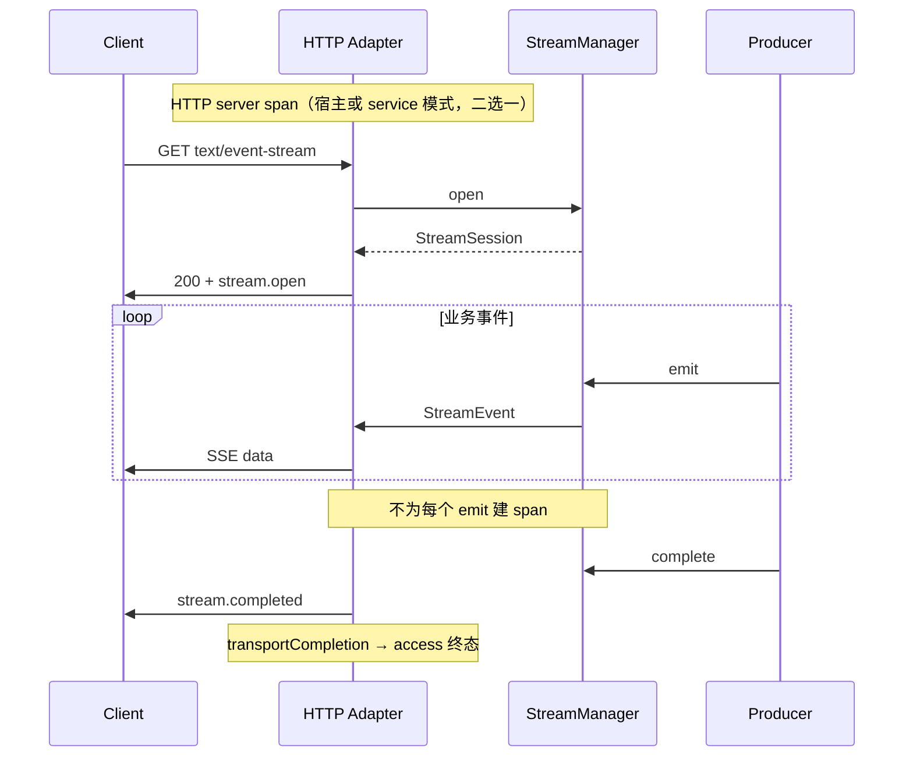

# 流式 Stream 与 WebSocket 观测

本文说明 Nexus 对 **长连接 / 长响应** 的可观测性**设计思路**、**与 HTTP 的差异**、**本模块提供的机制**，以及 **adapter + stream/websocket 运行时** 上的实践方式。规范来源：[Runtime 设计 §9](../../docs/service-runtime-design.md#9-日志tracing-与-metrics)、[三种执行终态](../../docs/service-runtime-design.md#11-三种执行终态)。

---

## 1. 设计目标

| 目标 | 说明 |
|------|------|
| **一条逻辑传输一条终态** | 一次 SSE 会话、一次 WS 物理连接，在**传输真正结束**时产出一条 access 终态（成功 / 客户端断开 / 错误），而不是每个 chunk 一条 access |
| **追踪粒度克制** | Stream 不按每个 token/chunk 建 Span；WS 握手可建短 Span，消息 handle 可选短 Span，用 `correlationId` 串联 |
| **日志与指标分离** | 诊断走 SLF4J + MDC；聚合走 `ServiceMeters`；**禁止**把 body、JWT、完整文件名写入日志 |
| **上下文可传播** | 生产者线程、Subscriber 回调、`onMessage` 须在 `ServiceContext`（及 MDC）快照内执行 |
| **与治理一致** | Stream / WS 有独立默认超时（`GovernanceConfig.defaultStreamTimeout` / `defaultWebSocketTimeout`），取消原因进入 logical/transport 终态 |

本模块（`innospots-nexus-service-observability`）提供 **Access Log、MDC 桥接、Trace/Metrics SPI 实现**；**何时写日志、何时记指标** 由 runtime + adapter + stream/websocket 边界协作完成，业务不直接依赖 Servlet/Reactor API。

---

## 2. 三种终态：观测挂在哪一层

Runtime 对每次「执行边界」区分三种终态（见 runtime 设计 §1.1）：

```text
logicalOutcome      → 调用方可见成功/失败/取消/超时（错误映射、Invocation 结果）
workTermination     → 业务任务 / 上游订阅是否停止（释放 bulkhead、停止生产）
transportCompletion → 字节是否写完、连接是否关闭（access log、HTTP active 归零）
```

### 2.1 对 Stream 的含义

| 阶段 | 观测关注点 |
|------|------------|
| `GET` 进入 Filter | 分配 `requestId`、`ServiceContext`、`CancellationToken`；可选与宿主 OTel **HTTP server span** 关联 |
| `streamManager.open` | 逻辑会话创建；平台指标 `service.stream.active` +1（设计） |
| 首包 `stream.open` / 首业务事件 | 记录 `service.stream.first_event`（设计）；**首事件延迟不含** `stream.open` |
| 持续 `emit` | 计数 `service.stream.events`；累加输出字节；**不**为每事件写 access log |
| `complete` / `fail` / `cancel` / 客户端断开 | `workTermination` + `transportCompletion`；`service.stream.duration`、`cancelled`；**一条** access 终态 |

客户端刷新页面 → `CLIENT_DISCONNECTED` → 应停止生产；**不保证**离线客户端收到 `stream.cancelled` 事件，但服务端仍应完成 transport 终态记录。

### 2.2 对 WebSocket 的含义

| 阶段 | 观测关注点 |
|------|------------|
| HTTP Upgrade 请求 | 可走与普通 HTTP 相同的 Filter（requestId、握手 access 仅覆盖升级阶段——**完整连接生命周期**另记，见下） |
| `onOpen` | 连接注册；`service.websocket.connections` +1（设计）；握手 Span 结束（设计） |
| `onMessage` / `send` | `service.websocket.messages`（direction、**白名单内** messageType）；可选 receive/handle/send 短 Span |
| `onClose` / idle / 错误 | connections -1；`service.websocket.duration`；连接级 access / 事件终态 |

消息 envelope 的 `id`、`correlationId` 用于**业务日志串联**，**不能**作为 Prometheus label（高基数）。

---

## 3. 日志采集

### 3.1 Access Log（`service.access`）

实现类：`AccessLogWriter`（本模块）。

字段：`requestId`、`method`、`route`、`status`、`result`、`durationMs`、`principalId`（脱敏）、`traceId`（脱敏）。

**设计语义**（runtime §9）：

- **普通 HTTP**：请求处理结束写 **一条** 终态。
- **Stream**：在 **transportCompletion**（连接关闭或终态帧写完）写 **一条**，`durationMs` 为整段流传输时长；`status` 反映最终 HTTP 状态（提交流后错误多为 200 + SSE `error` 事件，access 的 `result` 仍按传输是否成功分类）。
- **WebSocket**：**连接生命周期**一条（或升级 + 连接分拆两条，由 adapter 统一）；**不按每条 WS 帧**写 access。

**当前 Spring adapter 行为（阅读代码时请以此为准）**：

| 场景 | 行为 | 与设计差异 |
|------|------|------------|
| 普通同步 REST | `ServiceServletFilter` / `ServiceWebFilter` 在 filter 完成时写 access | 符合 |
| SSE / 异步 MVC | Filter 在 `chain.doFilter` 返回时写 access；长流可能 **早于** 传输结束 | 待 adapter 挂接 `transportCompletion`（AsyncListener / 流 writer 完成回调） |
| WebFlux SSE | `doFinally` 在响应 Mono 终止时写 access | 较接近 transport 结束 |
| WebSocket | Upgrade 若经 HTTP Filter 会写 **握手阶段** access；`SpringWebSocketEndpointBridge` **未**单独写连接级 access | 连接级 access / 指标待补齐 |

关闭 access log：`ObservabilityConfig.accessLogEnabled = false`。

### 3.2 业务诊断日志（SLF4J + MDC）

实现类：`MdcContextBridge`（本模块）。

安装后 MDC 键：`requestId`、`traceId`、`spanId`、`principalId`、`operation`（当前为请求 path 模板或 WS path）。

**Stream 生产线程**：

- 在 **打开流的 HTTP 请求线程** 内启动的生产者，应继承该请求的 `ServiceContext`。
- 使用 `CompletableFuture.runAsync` **裸线程** 会丢失 MDC：须通过 `ServiceRuntime.propagation()` / `ContextExecutor` 包装任务（runtime `ContextPropagation`）。

```java
ContextPropagation propagation = serviceRuntime.propagation();
propagation.wrap(() -> {
    log.info("stream produce, sessionId={}", session.sessionId());
    session.emit("progress", payload);
}).run();
```

**WebSocket 回调**：

- 设计：每次 `onOpen` / `onMessage` / `onClose` 在 adapter 内安装上下文 **并** 安装 MDC。
- Spring `SpringWebSocketEndpointBridge` 当前对 handler 调用 `ThreadBoundServiceContext.install`，**未**调用 `MdcContextBridge.install` — 业务日志若依赖 MDC，应使用 `ServiceContextAccessor.requireCurrent()` 显式字段，或自行在 handler 入口用 `MdcContextBridge` 包装（Web 模块）；后续 adapter 版本应对齐设计。

**禁止**：`MDC.put/clear`；禁止日志打印消息 payload、token、完整文件路径。

### 3.3 协议内错误 vs 日志

| 通道 | 用途 |
|------|------|
| Stream SSE `event: error` | 客户端可见的安全 `ServiceError` JSON |
| WS error envelope | 协议级错误，默认不断开连接 |
| `service.access` | 传输级终态 |
| SLF4J | 服务端诊断；仅记录 sessionId、connectionId、operation、result 等低敏字段 |

`StreamEventType` 中 `error` / `stream.completed` / `stream.cancelled` 是**协议事件**，不是 SLF4J 的替代。

---

## 4. 分布式追踪（Tracing）

### 4.1 所有权与 SPI

- 契约：`TraceProvider`、`TraceSnapshot`（`service-contract`）
- 实现：`OpenTelemetryTraceProvider`、`NoOpTraceProvider`（本模块）
- 装配：adapter 注册 Bean；默认 **NoOp**（不伪造 traceId）

`ServiceContext.trace()` 供 MDC 与 access log 使用；与 OTel 对齐时由 `OpenTelemetryTraceProvider` 写入 context。

### 4.2 Stream 追踪粒度（设计）



- **可选**：对 `open` 或整段流建 **一个** 长 Span（低频率）。
- **推荐**：复杂子步骤用 `@Traced` + `InvocationEngine`（须 Bridge），不要 per-chunk。

### 4.3 WebSocket 追踪粒度（设计）

- **Handshake**：Upgrade 结束关闭短 Span。
- **连接**：用 **metrics + 连接日志**，不默认整连接一个无限 Span。
- **单条消息**：`onMessage` / `send` 可各建短 Span，用 `WebSocketMessage.correlationId()` 与 `id` 做 link。
- 传播：遵循 W3C `traceparent`；Upgrade 请求若带 trace 上下文，应写入握手建立的 `ServiceContext`。

---

## 5. 指标（Metrics）

平台指标名与 label 白名单见 runtime §9。本模块通过 `MicrometerMetricsProvider` 对接 `ServiceMeters`（须应用注册 Bean）。

### 5.1 Stream（设计）

| 指标 | 类型 | 允许 label |
|------|------|------------|
| `service.stream.active` | gauge | `operation` |
| `service.stream.events` | counter | `operation` |
| `service.stream.cancelled` | counter | `operation`、`result` |
| `service.stream.duration` | timer | `operation` |
| `service.stream.first_event` | timer | `operation` |

**禁止** label：`sessionId`、`requestId`、`principalId`、原始 path。

`operation` 来自稳定 operationId（如 `jobs.events.stream`），不是 URL 字面量。

### 5.2 WebSocket（设计）

| 指标 | 类型 | 允许 label |
|------|------|------------|
| `service.websocket.connections` | gauge | endpoint **模板** |
| `service.websocket.messages` | counter | endpoint 模板、`direction`、`messageType`（白名单） |
| `service.websocket.duration` | timer | endpoint 模板 |
| `service.websocket.errors` | counter | endpoint 模板、`result` |

未知 message type 聚合为 `unknown`。

### 5.3 实现状态

| 能力 | 状态 |
|------|------|
| 指标类 `MicrometerMetricsProvider` | 已实现 |
| adapter 默认注册 `ServiceMeters` | 未默认装配 |
| stream/websocket 模块内自动上报上述指标 | **设计已定**；runtime/adapter 接线按版本推进 |
| 业务自定义指标 | `ServiceMeters` + `ObservabilityConfig.businessMeterNames` |

业务侧可先行注册指标名，在流/WS handler 内显式打点（label 仍须白名单）：

```java
meters.increment("chat.message.handled");  // 须预先注册
```

---

## 6. 实践机制（按角色）

### 6.1 本模块（observability）

| 组件 | Stream / WS 中的作用 |
|------|----------------------|
| `AccessLogWriter` | 接收 adapter 组装的 `AccessLogEntry` 终态 |
| `MdcContextBridge` | HTTP Filter 内安装；长任务须 `ContextPropagation` 延续 |
| `SensitiveValueMasker` | access 中 principal/trace 脱敏 |
| `ObservabilityConfig` | 开关 access、注册业务指标名 |
| `OpenTelemetryTraceProvider` | 将 OTel 当前 span 写入 `ServiceContext.trace()` |

### 6.2 Runtime（`service-runtime`）

| 组件 | 作用 |
|------|------|
| `ContextPropagation` / `ContextExecutor` | 异步 emit、WS 线程池回调携带 `ServiceContext` |
| `InvocationEngine` + `invokeStream` | 流式调用的 logical/work 终态（与 HTTP 拦截器链配合） |
| `CancellationToken` | 客户端断开 → 生产者退出 → 影响 `result` 与 `cancelled` 指标 |

### 6.3 Stream 模块（`service-stream`）

| 组件 | 观测相关 |
|------|----------|
| `DefaultStreamManager` / `DefaultStreamSession` | 会话 owner、scope 校验；`StreamSnapshot` 供运维查询缓冲与状态 |
| `StreamEvent` / `StreamEventType` | 协议级进度与错误；`heartbeat` 不计业务 sequence |
| `StreamConfig` | `idleTimeout`、`heartbeat` 影响连接存活与探测断开时机 |

### 6.4 WebSocket 模块（`service-websocket`）

| 组件 | 观测相关 |
|------|----------|
| `LocalWebSocketRegistry` | 连接数、广播结果 |
| `WebSocketMessage` | `id`、`correlationId` 用于日志关联 |
| `WebSocketRuntimeConfig` | `idleTimeout`、`messageTimeout` 触发关闭与错误计数 |

### 6.5 Adapter（Spring 示例）

| 入口 | 机制 |
|------|------|
| `ServiceServletFilter` / `ServiceWebFilter` | 建立 `requestId`、`ServiceContext`、MDC；流式 GET 的取消源 |
| `ServiceServletFilter.cancelIfClientDisconnected` | SSE 生产循环协作取消 |
| `ServiceWebFilter.cancelIfClientDisconnected` | WebFlux 流 `doOnCancel` |
| `SpringWebSocketEndpointBridge` | 握手时 `transportSupport.buildContext`；handler 回调 `contexts.install` |

---

## 7. 业务开发检查清单

### Stream

- [ ] 生产者循环检查 `session.isCancelled()` 或 `cancellation().isCancelled()`
- [ ] 异步生产使用 `ContextPropagation.wrap` / `ContextExecutor`
- [ ] 日志带 `sessionId` 时用 **参数** 输出，不做 metrics label
- [ ] 失败用 `session.fail(NexusException)`，不向 SSE 写非安全堆栈
- [ ] 需要治理超时：长流 operationId 映射 `GovernanceConfig.defaultStreamTimeout` 或 `timeouts` 表

### WebSocket

- [ ] 入站/出站消息设置 `correlationId` 便于追踪与日志
- [ ] `onMessage` 内避免阻塞；超时受 `messageTimeout` 约束
- [ ] 连接关闭在 `onClose` 释放资源；不假设刷新后同一 `connectionId`
- [ ] 消息 type 纳入指标白名单后再用 `ServiceMeters` 分 type 计数

---

## 8. 与 HTTP 观测的对比

| 维度 | 普通 HTTP | Stream (SSE) | WebSocket |
|------|-----------|--------------|-----------|
| Access log 条数 | 1 / 请求 | 1 / **传输**（设计） | 1 / **连接**（设计） |
| MDC 默认安装点 | Filter | 开流请求 + 传播到生产线程 | 每回调（设计）；Spring 部分待对齐 MDC |
| Trace 默认粒度 | 请求级 server span | 整流或子步骤 `@Traced` | 握手 + 可选消息短 span |
| 客户端断开 | 请求结束 | `CancellationToken` | TCP/WS close + registry 注销 |
| 指标核心 | `service.http.*` | `service.stream.*` | `service.websocket.*` |

---

## 9. 相关文档

- [Observability 模块 README](../README.md)
- [Runtime §9 日志/Tracing/Metrics](../../docs/service-runtime-design.md#9-日志tracing-与-metrics)
- [Stream 模块 README](../../innospots-nexus-service-stream/README.md)
- [WebSocket 模块 README](../../innospots-nexus-service-websocket/README.md)
- [Spring adapter · 观测](../../../innospots-nexus-spring/innospots-nexus-spring-service/docs/observability-integration.md)
