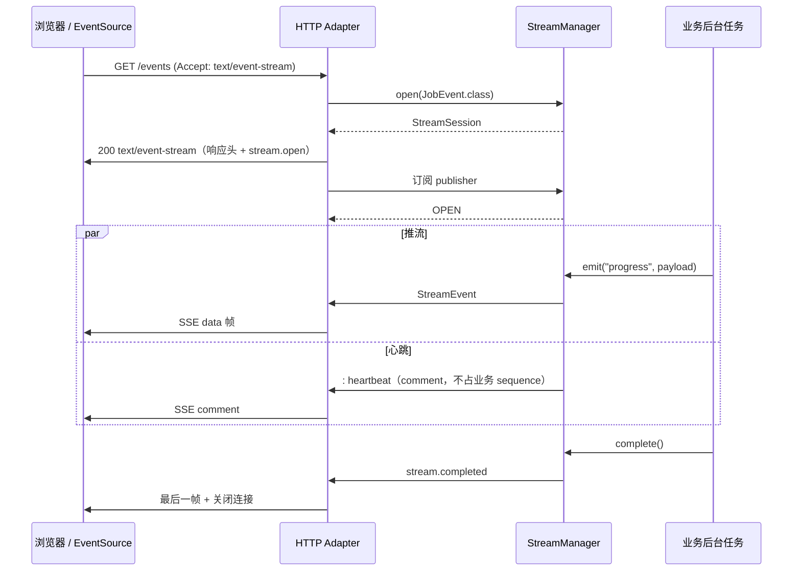
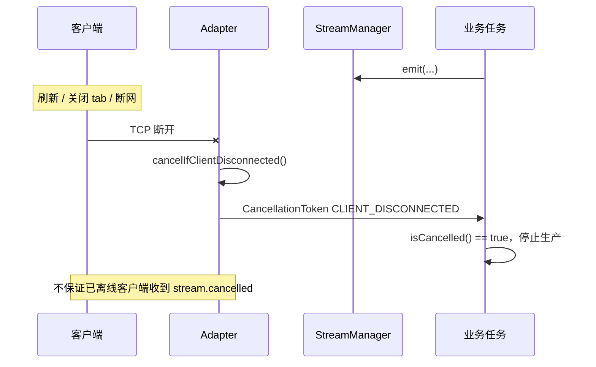

# innospots-nexus-service-stream

## 模块简介

流式传输中立库：SSE/NDJSON 会话、有界通道、背压与取消。  
业务通过 `StreamManager` / `StreamSink` 推事件，adapter 负责把 `StreamSession` 写到 HTTP 响应。

## 何时使用

| 场景 | API |
|---|---|
| Controller 返回 SSE/流 | `StreamSession<T>` / `StreamSink<T>` |
| 长任务进度推送 | `stream.emit(type, payload)` |
| 跨组件向已有会话推事件 | `streamManager.emit(sessionId, …)` |
| 直接使用 `StreamChannelFactory` | 仅 Level 3 基础设施 |

## 包结构

```text
com.innospots.nexus.service.stream
├── session            # StreamManager、StreamSession、DefaultStreamManager
├── channel            # StreamChannel、BoundedStreamChannel（OverflowPolicy 在 contract.channel）
├── event              # StreamEvent、StreamEventType
├── encode             # NdjsonStreamEncoder
└── config             # StreamConfig
```

## Maven 依赖

```xml
<dependency>
    <groupId>com.innospots</groupId>
    <artifactId>innospots-nexus-service-stream</artifactId>
</dependency>
```

---

## 如何打开与关闭

### 打开（创建会话）

业务在 HTTP 入口方法里调用 `streamManager.open(...)`，把返回的 `StreamSession` 作为 Controller 返回值交给 adapter：

```java
@GetMapping(value = "/jobs/{id}/events", produces = MediaType.TEXT_EVENT_STREAM_VALUE)
public StreamSession<JobEvent> stream(@PathVariable String id) {
    StreamSession<JobEvent> session = streamManager.open(JobEvent.class);
    startBackgroundWork(session, id);
    return session;
}
```

`open` 之后会话状态为 `CREATED`；客户端开始消费（adapter 订阅 `publisher`）后变为 `OPEN`。

跨组件向**已存在**的会话推送（须 principal/scope 与会话 owner 一致）：

```java
streamManager.emit(sessionId, "progress", event);
```

### 正常关闭

| 方法 | 含义 | 客户端可见 |
|---|---|---|
| `session.complete()` | 业务完成，排空队列后发送 `stream.completed` | SSE `event: stream.completed` |
| `session.fail(NexusException)` | 业务失败，发送 `error` 后关闭 | SSE `event: error`（安全 `ServiceError` JSON） |
| `session.cancel(reason)` | 主动取消（如用户点「停止」） | 尽力发送 `stream.cancelled` |
| `streamManager.close()` | 进程关闭，排空所有会话 | 各连接按 `SERVER_SHUTDOWN` 取消 |

`complete` / `fail` / `cancel` 在通道终态后会**立刻**从 `DefaultStreamManager` 注册表摘除（`find` / `emit(sessionId)` 不再可见）。  
注册表另由 Caffeine 按 `ttl`、`idleTimeout` 与 `maxSessions` 做泄漏兜底；被动驱逐时若会话仍未终态会先 `cancel(SERVER_SHUTDOWN)`。

### 被动关闭（客户端/网络）

客户端关闭 tab、刷新页面、断网时，adapter 检测到断连后会触发 `ServiceContext.cancellation()`，取消原因为 `CLIENT_DISCONNECTED`。  
业务循环中应检查：

```java
if (session.isCancelled()) {
    return;
}
```

或通过 `contextAccessor.requireCurrent().cancellation().isCancelled()` 协作（adapter-test 夹具用法）。

**不会**在旧 HTTP 连接上自动续流；刷新后是一次**新的 GET 请求**，需要重新 `open` 新会话。

---

## 与调用端的交互流程

### SSE 典型时序（推荐 API：`StreamSession`）



### 客户端断开时序



### 浏览器端示例（EventSource）

```javascript
const source = new EventSource("/api/jobs/123/events", { withCredentials: true });

source.addEventListener("progress", (event) => {
    const payload = JSON.parse(event.data);
    console.log("progress", payload);
});

source.addEventListener("error", (event) => {
    console.error("stream error", event.data);
    source.close();
});

source.addEventListener("stream.completed", () => {
    source.close();
});

// 用户主动停止：关闭 EventSource 即可，服务端会在下次写或 heartbeat 时发现断连
function stop() {
    source.close();
}
```

使用 `fetch` + `ReadableStream` 解析 NDJSON 时，取消应 `AbortController.abort()`，效果等同于 SSE 断连。

---

## 页面刷新 / 断连 FAQ

| 问题 | 结论 |
|---|---|
| 刷新页面后旧流会继续吗？ | **不会**。旧 HTTP 连接已关闭，服务端取消旧会话上游；刷新发起的是新请求。 |
| 刷新后能否接着上次的进度推？ | **框架不自动续接**。若业务需要「断点续看」，须自行设计：例如客户端带 `Last-Event-ID` / job cursor，新请求从 checkpoint 重放或补发。 |
| 断连后服务端何时知道？ | **不保证即时**。Servlet 往往在下一次写或 heartbeat 时才探测；WebFlux 在 subscription cancel 时更快。 |
| 断连后还会往旧连接写吗？ | adapter 会取消上游；**不保证**把 `stream.cancelled` 发给已离线客户端。 |
| `subscribe-timeout` 是什么？ | 会话 `open` 后若长时间无人订阅 publisher（例如 adapter 未绑定），超时自动取消。 |
| heartbeat 会刷新 idle 吗？ | **不会**。`idle-timeout` 只看**业务事件**时间戳；heartbeat 仅保活传输层。 |

---

## 配置说明

### 配置项（`StreamConfig`）

| 字段 | 默认值 | 说明 |
|---|---|---|
| `maxSessions` | `1000` | 进程内最大并发会话数，超出拒绝新 `open` |
| `bufferSize` | `256` | 每会话队列事件数上限 |
| `bufferBytes` | `1 MiB` | 每会话字节预算 |
| `globalBufferBytes` | `64 MiB` | 全局编码缓冲预算 |
| `maxEventBytes` | `64 KiB` | 单事件编码上限 |
| `overflow` | `REJECT` | 队列满时策略：`REJECT` / `DROP_LATEST` / `DROP_OLDEST` / `CLOSE` |
| `subscribeTimeout` | `30s` | 创建后未订阅超时 |
| `ttl` | `60m` | 会话最大存活时间 |
| `idleTimeout` | `10m` | 无业务 emit 超时（heartbeat 不计入） |
| `heartbeat` | `15s` | SSE comment 心跳间隔 |
| `terminalWriteTimeout` | `2s` | 终态事件（error/completed/cancelled）写出等待上限 |

设计文档中的 YAML 绑定（`service.stream.*`）见 [adapter 配置契约](../../docs/service-adapter-design.md#7-配置契约)；当前实现以 **Java Bean** 注入为主。

### 如何启用 / 关闭

| 层级 | 方式 |
|---|---|
| 整个 Nexus adapter | `service.enabled: false`（关闭 HTTP 上下文、取消、流/WS 一并不可用） |
| 流能力（设计契约） | `service.stream.enabled: false` |
| 仅调整参数 | 注册自定义 `StreamConfig` + `DefaultStreamManager` bean |

```java
@Bean
StreamConfig streamConfig() {
    return StreamConfig.defaults(); // 或 new StreamConfig(...自定义...)
}

@Bean
StreamManager streamManager(StreamConfig config, ThreadBoundServiceContext contexts) {
    return DefaultStreamManager.builder()
            .config(config)
            .contexts(contexts)
            .build();
}
```

未注册 `StreamManager` 时，只能使用宿主原生 SSE（如 Spring `SseEmitter` / `Flux<ServerSentEvent>`），须自行接入 `CancellationToken`（见 adapter-test 夹具）。

---

## 快速接入

### 场景 1：SSE 进度流（最常见）

```java
@GetMapping(value = "/jobs/{id}/events", produces = MediaType.TEXT_EVENT_STREAM_VALUE)
public StreamSession<JobEvent> stream(@PathVariable String id) {
    StreamSession<JobEvent> session = streamManager.open(JobEvent.class);
    CompletableFuture.runAsync(() -> {
        for (int i = 0; i <= 100; i += 10) {
            if (session.isCancelled()) {
                return;
            }
            session.emit("progress", new JobEvent(i));
            sleep(200);
        }
        session.complete();
    });
    return session;
}
```

Spring adapter 的 `ServiceReturnValueHandler` / WebFlux `HandlerResultHandler` 识别 `StreamSession` 并写 SSE（设计目标；完整 return handler 按 adapter 版本为准）。

### 场景 2：NDJSON 流

```java
@GetMapping(value = "/export", produces = "application/x-ndjson")
public Flow.Publisher<ByteBuffer> export() {
    NdjsonStreamEncoder encoder = new NdjsonStreamEncoder();
    return encoder.encode(recordsPublisher);
}
```

每行一个完整 `StreamEvent` JSON；客户端须按行解析，不能等 body 结束再一次性 `JSON.parse`。

### 场景 3：取消协作

```java
while (running) {
    if (session.isCancelled()) {
        return;
    }
    session.emit("tick", tick);
}
```

---

## 线格式（SSE）

- `Content-Type: text/event-stream`，UTF-8
- `id`：`sessionId:sequence` 不透明字符串，可用于客户端 `Last-Event-ID`（续接仍须新 HTTP 请求 + 业务 checkpoint）
- `event`：业务 type 或框架类型（`stream.open` / `message` / `error` / `stream.completed` / `stream.cancelled` / `heartbeat`）
- `data`：完整 `StreamEvent` JSON
- heartbeat：SSE comment `: heartbeat\n\n`，不占业务 sequence

---

## 注意事项

- `StreamSession` **extends** `StreamSink`；业务优先只用 Sink 方法（`emit` / `complete` / `fail` / `cancel` / `isCancelled`）。
- `fail(sessionId, …)` 只接受 `NexusException`；领域异常先在边界翻译。
- 跨组件 `emit` 必须 principal/scope 与会话 owner 一致，且事件类型可赋给 `open` 时的 `Type`，否则 `AIO040006` / `AIO010001`。
- MVC adapter 每次 native send 成功后才 request 下一批；高负载下注意 `overflow` 与 `REJECT` 时生产者必须处理 `EmitResult`。
- 禁止在业务里直接写 `HttpServletResponse` / `OutputStream`；统一走 `StreamSession` 或 adapter 认可的返回类型。

---

## 相关文档

- [Runtime · 流式语义](../../docs/service-runtime-design.md#4-流式传输)
- [Adapter · 断连探测](../../docs/service-adapter-design.md)
- [开发者体验 · StreamSink](../../docs/service-developer-experience-design.md#61-streamsinklevel-2-主入口)
- [Spring adapter · 流式](../../innospots-nexus-spring/innospots-nexus-spring-service/README.md#流式响应)
