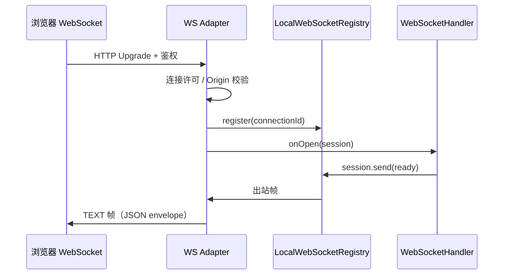
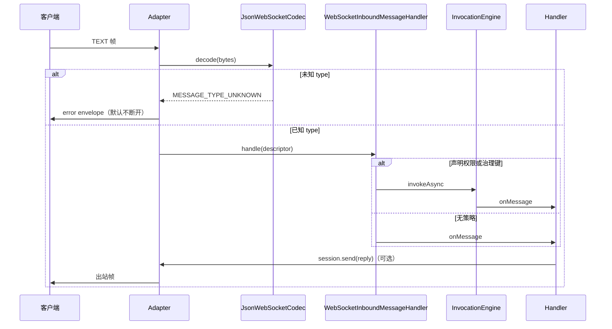

# innospots-nexus-service-websocket

## 模块简介

WebSocket **中立运行时**：连接注册表、消息 envelope/编解码、Handler 生命周期、入站治理与消息级权限（经 `InvocationEngine`）。  
业务实现 `WebSocketHandler`，由 Spring/Quarkus adapter 把原生 WS 回调桥接进来。

## 何时使用

| 场景 | 入口 |
|---|---|
| 实现 WS 业务逻辑 | `WebSocketHandler` / `AbstractWebSocketHandler` |
| 主动向连接发消息 | 注入 `WebSocketService` |
| 注册消息类型、权限与入站治理 | `JsonWebSocketCodec` + `MessageDescriptor` |
| 直接操作 Spring `WebSocketSession` | 否 — 使用中立 `WebSocketSession` |

## 包结构

```text
com.innospots.nexus.service.websocket
├── handler            # WebSocketHandler、AbstractWebSocketHandler、ReactiveWebSocketHandler
├── session            # WebSocketSession、WebSocketContext、WebSocketClose
├── message            # WebSocketMessage、JsonWebSocketCodec、MessageDescriptor
├── registry           # WebSocketRegistry、LocalWebSocketRegistry、WebSocketService
├── governance         # 入站消息与 InvocationEngine 衔接
└── config             # WebSocketRuntimeConfig
```

## Maven 依赖

```xml
<dependency>
    <groupId>com.innospots</groupId>
    <artifactId>innospots-nexus-service-websocket</artifactId>
</dependency>
```

---

## 如何打开与关闭

### 打开（建立连接）

1. **客户端**发起 WebSocket 握手（浏览器 `new WebSocket(url)` 或等价库）。
2. **Adapter** 完成 HTTP Upgrade、身份校验、连接许可（全局 + 每用户上限）。
3. **Registry** 注册物理连接，分配 `connectionId`。
4. 调用业务 **`onOpen`**；失败则注销并 `close 1011`。

业务在 `onOpen` 中可立即 `session.send(...)` 下发就绪消息：

```java
@Override
public CompletionStage<Void> onOpen(WebSocketSession<Object, Object> session) {
    return session.send(readyEnvelope);
}
```

`sessionId`（业务会话）由应用的 `SessionResolver` 解析；**不能**信任客户端任意传入的 sessionId 直接加入他人会话。

### 正常关闭

| 方向 | API / 行为 | 关闭码（常见） |
|---|---|---|
| 服务端主动 | `session.close(WebSocketClose.normal())` | `1000` |
| 服务下线 | runtime shutdown | `1001` |
| 权限/策略 | 认证过期、连续协议违规 | `1008` |
| 消息过大 | 超过 `maxMessageBytes` | `1009` |
| 内部错误 | `onOpen` / 未捕获异常 | `1011` |
| 过载 | 连接/缓冲耗尽 | `1013` |

客户端主动关闭：浏览器 `ws.close()` → adapter **`onClose`** → Registry 移除连接、释放许可。

### 跨连接推送（连接已打开后）

```java
webSocketService.send(connectionId, message);
webSocketService.sendToSession(sessionId, message);  // 同 scope 下所有物理连接
```

---

## 与调用端的交互流程

### 连接与首包



### 入站消息



默认 **每连接串行** 派发 `onMessage`：上一则处理完才处理下一则；不同物理连接可并发。

### 浏览器端示例

```javascript
const ws = new WebSocket("wss://api.example.com/ws/chat", ["v1"]);

ws.onopen = () => {
    ws.send(JSON.stringify({
        id: crypto.randomUUID(),
        type: "chat.send",
        correlationId: null,
        sequence: 0,
        timestamp: new Date().toISOString(),
        payload: { text: "hello" },
        headers: {}
    }));
};

ws.onmessage = (event) => {
    const envelope = JSON.parse(event.data);
    console.log(envelope.type, envelope.payload);
};

ws.onclose = (event) => {
    console.log("closed", event.code, event.reason);
};

function disconnect() {
    ws.close(1000, "user logout");
}
```

---

## 页面刷新 / 断连 FAQ

| 问题 | 结论 |
|---|---|
| 刷新页面后 WebSocket 还在吗？ | **不会**。浏览器会关闭旧连接；新页面加载后须 **重新握手** 建立新 `connectionId`。 |
| 刷新后会自动继续收之前的推送吗？ | **不会**。旧连接上的 outbound 队列随连接释放；新连接需重新 `onOpen`，业务自行恢复状态（如重发 snapshot / 订阅 topic）。 |
| `connectionId` 会变吗？ | **会变**（每次新物理连接）。 |
| `sessionId` 会变吗？ | 取决于 `SessionResolver`：可设计为同一用户固定 business session，但**仍须在新连接上重新注册**；不能假设旧 connectionId 仍有效。 |
| 断网后重连算续流吗？ | **不算**。TCP/WebSocket 层是新连接；框架 **不** 自动重放未确认消息。需要业务层 correlationId / ack 协议。 |
| Ping/Pong 与 idle | 默认 ping 30s；pong 只证明链路存活，**不刷新**业务 idle（30m 无业务消息可 idle 关闭）。 |

---

## 配置说明

### 配置项（`WebSocketRuntimeConfig`）

| 字段 | 默认值 | 说明 |
|---|---|---|
| `maxConnections` | `10000` | 进程最大物理连接数 |
| `maxConnectionsPerUser` | `64` | 每主体（principal）连接上限 |
| `maxMessageBytes` | `1 MiB` | 单帧/单消息大小上限 |
| `inboundBufferSize` | `256` | 每连接入站队列项 |
| `outboundBufferSize` | `256` | 每连接出站队列项 |
| `inboundBufferBytes` | `1 MiB` | 每连接入站字节预算 |
| `outboundBufferBytes` | `1 MiB` | 每连接出站字节预算 |
| `globalInboundBufferBytes` | `64 MiB` | 全局入站预算 |
| `globalOutboundBufferBytes` | `64 MiB` | 全局出站预算 |
| `overflow` | `REJECT` | 队列满：`REJECT` / `DROP_*` / `CLOSE` |
| `pingInterval` | `30s` | 协议 ping 间隔 |
| `pongTimeout` | `10s` | 等待 pong 超时 |
| `idleTimeout` | `30m` | 无业务消息 idle 关闭 |
| `messageTimeout` | `30s` | 单条 `onMessage` 处理超时 |

YAML 契约见 [adapter 配置](../../docs/service-adapter-design.md#7-配置契约)（`service.websocket.*`）。

### 如何启用 / 关闭

| 层级 | 方式 |
|---|---|
| 整个 Nexus adapter | `service.enabled: false` |
| WebSocket（设计契约） | `service.websocket.enabled: false` |
| Spring MVC | 引入 `spring-boot-starter-websocket`，注册 `@EnableWebSocket` + bridge |
| Spring WebFlux | 映射 `SpringReactiveWebSocketEndpointBridge` |
| Quarkus | `quarkus-websockets-next` + `QuarkusWebSocketEndpointBridge` |
| 调整参数 | 覆盖 `WebSocketRuntimeConfig` bean |

```java
@Bean
WebSocketRuntimeConfig serviceWebSocketRuntimeConfig() {
    return WebSocketRuntimeConfig.defaults();
}
```

不注册 bridge / 不暴露 WS 路径即等于应用层「关闭」该端点；registry bean 存在但无连接时不消耗连接许可。

---

## 快速接入

### 场景 1：实现 Handler（推荐继承抽象基类）

```java
public final class ChatHandler extends AbstractWebSocketHandler<Object, Object> {

    @Override
    public CompletionStage<Void> onOpen(WebSocketSession<Object, Object> session) {
        WebSocketMessage<Object> ready = new WebSocketMessage<>(
                "1", "chat.ready", null, 0L, Instant.now(), Map.of("status", "ok"), Map.of());
        return session.send(ready);
    }

    @Override
    public CompletionStage<Void> onMessage(
            WebSocketSession<Object, Object> session,
            WebSocketMessage<Object> message) {
        return session.send(message);   // 回显
    }
}
```

`AbstractWebSocketHandler` 为 `onClose` / `onError` 提供默认空实现。

### 场景 2：注册消息类型（JSON codec）

```java
JsonWebSocketCodec codec = JsonWebSocketCodec.builder()
        .maxMessageBytes(64 * 1024)
        .descriptors(Map.of(
                "chat.message",
                new MessageDescriptor(
                        "chat.message",
                        String.class, String.class,
                        Set.of("chat.send"),
                        null,
                        ExecutionMode.BLOCKING,
                        FrameType.TEXT,
                        "chat-message-rate",
                        null,
                        null,
                        null)))
        .build();
```

治理键为 `null` 时该消息不经 `InvocationEngine`；非空键须在 `GovernanceConfig` 中配置。完整说明见 [websocket-governance.md](../innospots-nexus-service-governance/docs/websocket-governance.md)。

未知 `type` → `MESSAGE_TYPE_UNKNOWN`；adapter 返回 error envelope，**默认不断开**（连续 3 次协议/授权拒绝可配置为 `1008`）。

### 场景 3：跨组件推送

```java
@Inject WebSocketService webSocketService;

webSocketService.send(connectionId, outboundMessage);
webSocketService.sendToSession(sessionId, broadcastMessage);
```

---

## Adapter 桥接（应用侧）

| 框架 | 桥接类 | 你要做的 |
|---|---|---|
| Spring MVC | `SpringWebSocketEndpointBridge` | 注册 WS 路径 + 注入 Handler/Codec |
| Spring WebFlux | `SpringReactiveWebSocketEndpointBridge` | 同上 |
| Quarkus | `QuarkusWebSocketEndpointBridge` | 薄 `@WebSocket` 端点委托 bridge |

参考：`innospots-nexus-service-adapter-test` 中 `AdapterSampleWebSocketHandler`。

---

## 使用注意

- Handler 内**禁止**手写 `if (user.hasPermission)`；权限写在 `MessageDescriptor.permissionKeys`。
- `connectionId` ≠ `sessionId`：前者物理连接，后者业务会话；跨刷新/重连只保留后者（若 resolver 如此设计）。
- Registry 为**进程内** `LocalWebSocketRegistry`，无 Redis；多实例须 sticky session 或业务层 fan-out。
- Origin 必须校验；Cookie 身份在浏览器 WS 需同源/CSRF 策略；**勿**在 URL 查询串传长期 token。
- Reactive 模式：`send` 完成仅表示容器写完成，**不等于**对端业务 ack；需用 `correlationId` 自建确认。
- `close` / `onError` / 网络断开可能竞争；框架 CAS 选唯一终态，保证 registry 与许可释放。

---

## 相关文档

- [Runtime · WebSocket](../../docs/service-runtime-design.md#5-websocket)
- [WebSocket 契约](../../docs/service-contract-design.md#7-websocket-api)
- [Spring adapter WS 节](../../innospots-nexus-spring/innospots-nexus-spring-service/README.md#websocket)
- [Quarkus adapter WS 节](../../innospots-nexus-quarkus/innospots-nexus-quarkus-service/README.md#websocket)
