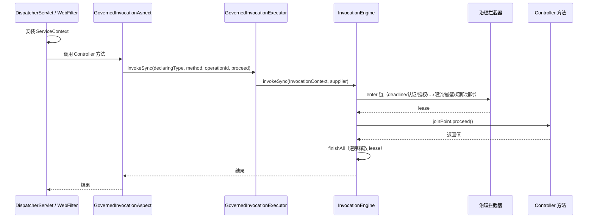

# Spring 注解式治理（无需 ServiceInvocationBridge）

## 目标

在 `@RestController` 方法上声明 contract 治理/安全注解后，由 **Spring AOP** 自动进入中立 `InvocationEngine` 拦截器链，无需手写 `ServiceInvocationBridge.invoke(...)`。

仍使用同一套：

- 注解策略键 + `GovernanceConfig` 数值
- `RateLimitInterceptor` / `BulkheadInterceptor` / `CircuitBreakerInterceptor` / `TimeoutInterceptor`
- HTTP 错误映射（429 / 503 / 504 等）

## 启用条件

1. 应用已 `@EnableNexusServiceHttp`（或 `@EnableNexusService`）。
2. `service.enabled=true`（默认）。
3. `service.governance.annotation-advice-enabled=true`（默认 **开启**）。设为 `false` 时仅保留手动 `ServiceInvocationBridge` 路径。

依赖：`spring-aop` + `aspectjweaver`（本模块已引入，与 `spring-boot-starter-web` 一并使用）。

## 写法示例

```java
@RestController
public class PromoResource {

    @GetMapping("/promo/claim")
    @ServiceOperation("promo.claim")          // 稳定 operationId（指标/超时表/审计）
    @RateLimited("promo.claim")             // GovernanceConfig.rateLimits 键
    public Map<String, String> claim() {
        return Map.of("status", "ok");
    }

    @GetMapping("/report/export")
    @ServiceOperation("report.export")
    @BulkheadProtected("report.export")
    public void export() {
        // ...
    }

    @GetMapping("/pay")
    @ServiceOperation("payment.client.charge")
    @CircuitProtected("payment.client")
    public PayResult pay() {
        return client.charge();
    }

    @GetMapping("/slow")
    @ServiceOperation("adapter.governance.timeout")
    @TimeoutProtected("adapter.governance.timeout")   // GovernanceConfig.timeouts 键
    public Map<String, String> slow() {
        // 协作取消：检查 contextAccessor.requireCurrent().cancellation()
        return Map.of("status", "ok");
    }

    @GetMapping("/secure")
    @ServiceOperation("adapter.secure")
    @RequiresPermission("adapter.secure")
    public Map<String, String> secure() {
        return Map.of("status", "ok");
    }
}
```

### 操作标识 `operationId`

| 来源 | 说明 |
|------|------|
| `@ServiceOperation("id")` | **推荐**；用于 `timeouts` 表查找、日志/指标 |
| 无注解 | 默认 `类简单名.方法名`（如 `PromoResource.claim`） |

`@TimeoutProtected` 的 `value()` 是 **配置键**，映射 `GovernanceConfig.timeouts()`，与 `@RateLimited` 相同语义（不是 `5s` 字面量）。

## 架构



实现类：

| 类 | 职责 |
|----|------|
| `GovernedInvocationAspect` | `@Around` 匹配带契约注解的 `@RestController` 方法 |
| `GovernedInvocationExecutor` | 构建 `InvocationContext` 并调用引擎 |
| `ServiceOperationIdResolver` | 解析 `operationId` |
| `GovernedInvocationGuard` | 避免 Aspect 与 `ServiceInvocationBridge` 双重进入引擎 |

`ServiceInvocationBridge` 仍可用于需要 **显式 operationId** 与方法体不一致、或 `invokeStream` 等场景；内部已委托 `GovernedInvocationExecutor`。

## 拦截器装配（Spring 默认）

`ServiceCoreConfiguration` 向 `ServiceRuntime` 注册：

- 限流、**舱壁**、**熔断**、超时（Quarkus 默认仍可能仅限流+超时，以各自 adapter 为准）

## 限制与注意

| 项 | 说明 |
|----|------|
| 仅 `@RestController` | 普通 `@Service` Bean 不会自动织入（可后续扩展 pointcut） |
| 同类自调用 | 无代理，注解不生效 |
| `Mono` / `Flux` 返回 | 切面在 **subscribe 之前** 结束 `invokeSync` 时，超时/舱壁 lease 会提前释放；长异步链请继续用 `Bridge` 或在 boundedElastic 内使用 **同步返回** |
| 配置键缺失 | 与 Bridge 路径相同：`CONFIG_ERROR` 或策略不生效 |
| 关闭注解 Advice | `service.governance.annotation-advice-enabled=false` |

## 配置示例

```yaml
service:
  enabled: true
  governance:
    annotation-advice-enabled: true
```

```java
@Bean
GovernanceConfig serviceGovernanceConfig() {
    return new GovernanceConfig(
            Map.of("promo.claim", new RateLimitPolicy(10, 1.0)),
            Map.of("report.export", new BulkheadPolicy(4)),
            Map.of("payment.client", CircuitBreakerPolicy.defaults()),
            Map.of("adapter.governance.timeout", Duration.ofMillis(200)),
            100_000,
            Duration.ofMinutes(15),
            Duration.ofSeconds(30),
            Duration.ofMinutes(60),
            Duration.ofSeconds(30));
}
```

## 相关文档

- [innospots-nexus-service-governance/docs](../../../innospots-nexus-service/innospots-nexus-service-governance/docs/README.md)
- [模块 README](../README.md)
